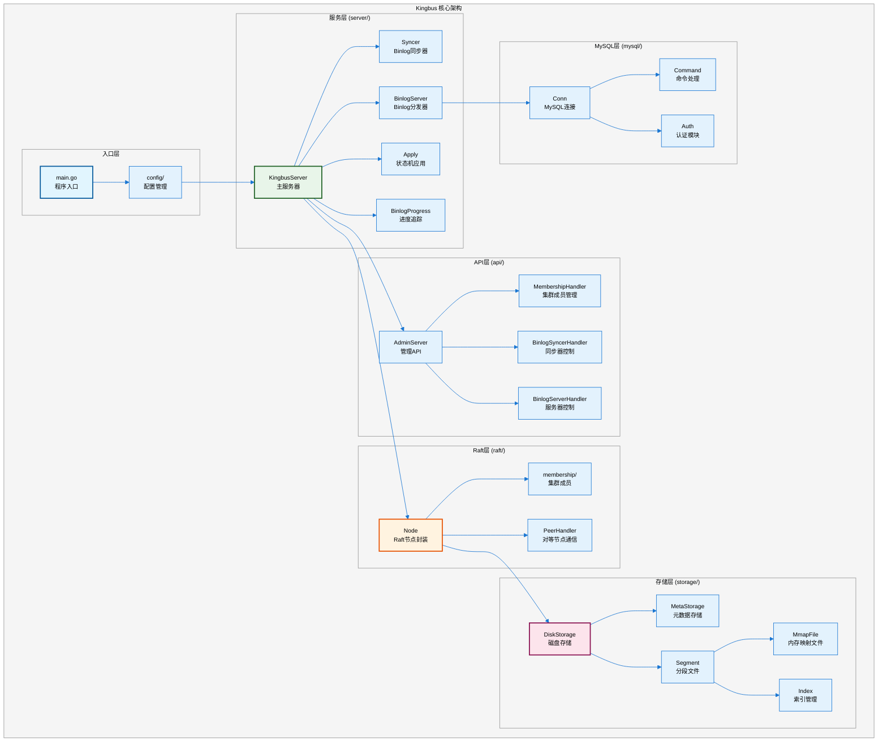
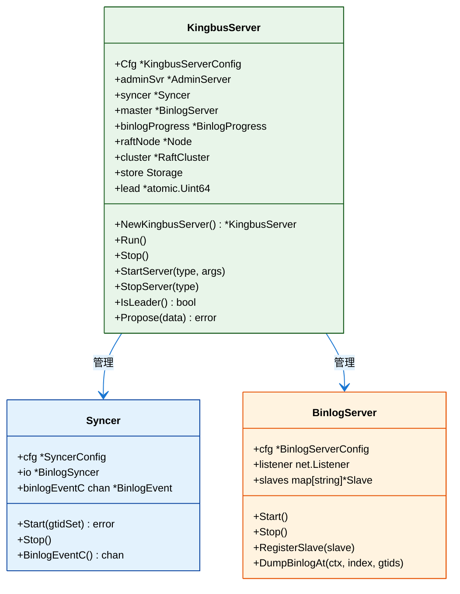
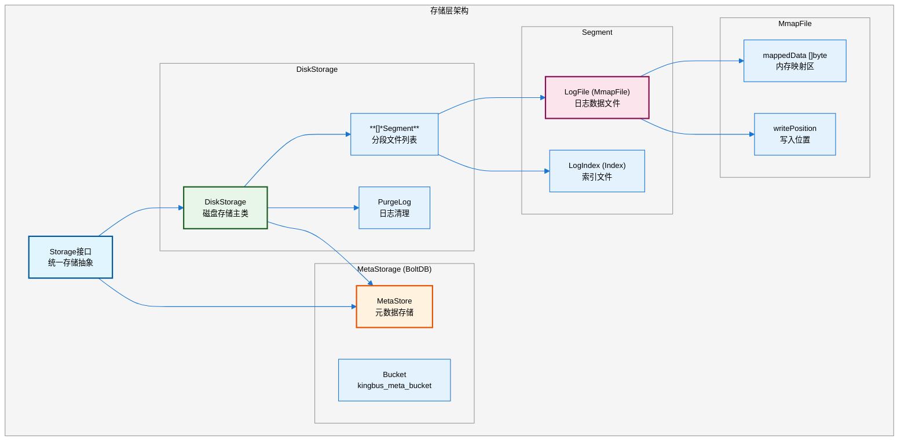
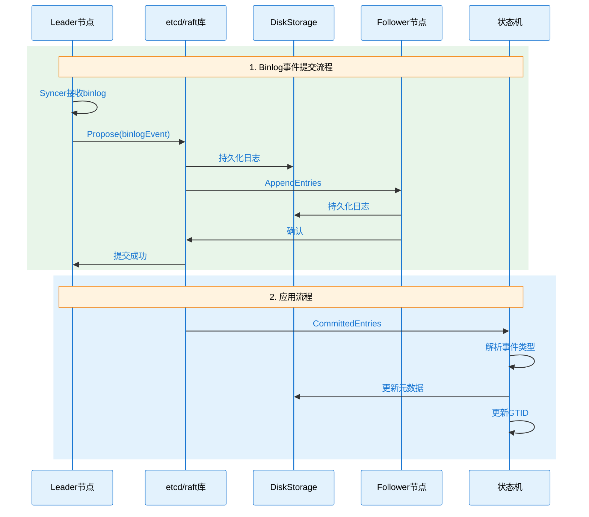
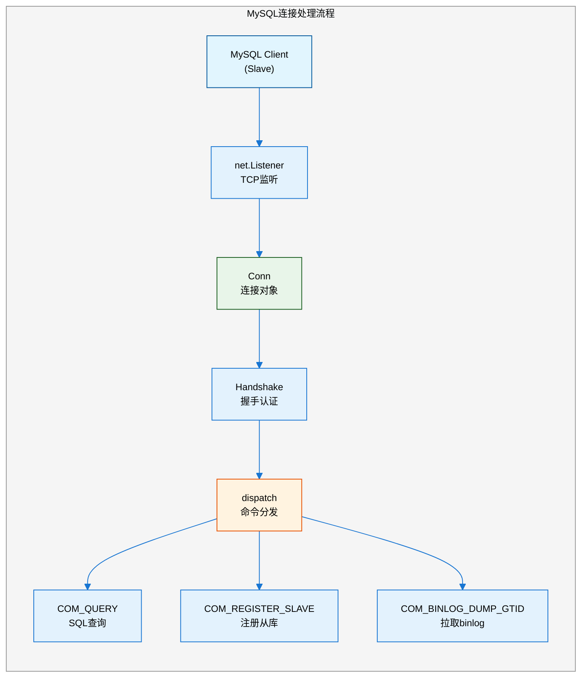
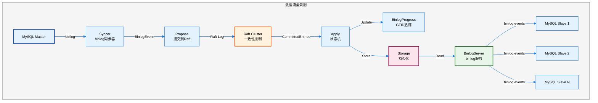

# Kingbus 项目代码结构分析

## 概述

Kingbus 是一个基于 Raft 一致性算法的 MySQL binlog 收集与分发系统。本文档详细分析其代码结构，帮助开发者快速理解和阅读源码。

## 1. 项目整体架构



## 2. 目录结构详解

```
kingbus/
├── cmd/kingbus/          # 程序入口
│   └── main.go           # main函数，启动服务
├── config/               # 配置管理
│   ├── config.go         # Raft和服务器配置
│   └── server_config.go  # Syncer/BinlogServer配置
├── server/               # 核心服务实现
│   ├── server.go         # KingbusServer主控制器
│   ├── binlog_syncer.go  # 从MySQL拉取binlog
│   ├── binlog_server.go  # 向slave分发binlog
│   ├── apply.go          # Raft状态机应用
│   ├── binlog_progress.go# GTID进度追踪
│   ├── prometheus.go     # Prometheus监控
│   └── metrics.go        # 性能指标
├── storage/              # 存储层
│   ├── storage.go        # 存储接口定义
│   ├── disk_storage.go   # 磁盘存储实现
│   ├── meta_storage.go   # 元数据存储(BoltDB)
│   ├── segment.go        # Segment文件管理
│   ├── mmap_file.go      # 内存映射文件
│   └── index.go          # 索引文件
├── raft/                 # Raft一致性层
│   ├── raft.go           # Raft节点封装
│   ├── peer_handler.go   # 节点间通信
│   └── membership/       # 集群成员管理
├── api/                  # REST API
│   ├── api_server.go     # HTTP服务器
│   └── *_handler.go      # 各类API处理器
├── mysql/                # MySQL协议
│   ├── conn.go           # MySQL连接处理
│   ├── command.go        # MySQL命令
│   └── auth.go           # 认证实现
├── log/                  # 日志模块
│   └── log.go            # zap日志封装
└── utils/                # 工具函数
    ├── broadcast.go      # 广播通知
    └── *.go              # 其他工具
```

## 3. 核心组件详解

### 3.1 KingbusServer (server/server.go)

**职责**: 整个系统的核心控制器，管理所有子服务的生命周期。



**关键方法说明**：

| 方法 | 功能 |
|-----|------|
| `NewKingbusServer()` | 创建服务器，初始化Raft、存储、API |
| `Run()` | 启动Raft循环、API服务器、Prometheus |
| `startRaft()` | 初始化Raft节点和存储 |
| `runRaft()` | Raft主循环，处理Apply和Ready |
| `StartServer()` | 启动Syncer或BinlogServer |
| `Propose()` | 提交数据到Raft集群 |

### 3.2 存储层架构 (storage/)



**文件组织**：

```
data/
├── kingbus_meta.db           # BoltDB元数据文件
├── 00000000000000000001-00000000000001000000.log    # Segment日志文件(只读)
├── 00000000000000000001-00000000000001000000.index  # 索引文件(只读)
├── 00000000000001000001-inprogress.log              # 当前写入Segment
└── 00000000000001000001-inprogress.index            # 当前写入索引
```

### 3.3 Raft层 (raft/)



**Raft节点封装**：

| 组件 | 文件 | 功能 |
|-----|------|------|
| Node | raft/raft.go | 封装etcd/raft，管理Apply通道 |
| RaftCluster | raft/membership/cluster.go | 集群成员管理 |
| Member | raft/membership/member.go | 成员信息 |
| PeerHandler | raft/peer_handler.go | HTTP对等节点通信 |

### 3.4 MySQL协议层 (mysql/)



**主要文件说明**：

| 文件 | 功能 |
|-----|------|
| conn.go | MySQL连接生命周期管理 |
| command.go | 命令处理（QUERY, REGISTER, DUMP等） |
| auth.go | MySQL认证协议实现 |
| resp.go | 响应包构造 |

## 4. 数据流图



## 5. 关键代码路径

### 5.1 服务启动流程

```
main.go
  └── NewKingbusServer()
      ├── startRaft()              # 初始化Raft
      │   ├── NewDiskStorage()     # 创建存储
      │   ├── NewMetaStore()       # 创建元数据存储
      │   └── StartNode/RestartNode# 启动Raft节点
      ├── startRaftPeer()          # 启动对等通信
      ├── startAdminServer()       # 启动API服务
      ├── newBinlogProgress()      # 初始化GTID追踪
      └── startPrometheus()        # 启动监控
  └── Run()
      ├── runRaft()                # Raft主循环
      ├── adminSvr.Run()           # API服务
      └── prometheusSvr.Run()      # 监控服务
```

### 5.2 Binlog同步流程

```
StartServer(SyncerServerType)
  └── startSyncerServer()
      ├── NewSyncer()              # 创建同步器
      ├── syncer.Start()           # 开始同步
      │   ├── preCheck()           # 检查GTID模式
      │   ├── GetMasterInfo()      # 获取Master信息
      │   └── StartSyncGTID()      # 基于GTID同步
      └── StartProposeBinlog()     # 启动Propose协程
          └── for {
              ├── <-syncer.BinlogEventC()  # 接收事件
              ├── EncodeBinlogEvent()      # 编码事件
              └── ProposeWithRetry()       # 提交到Raft
          }
```

### 5.3 Binlog分发流程

```
BinlogServer.Start()
  └── for {
      ├── listener.Accept()        # 接受连接
      └── onConn()
          ├── NewConn()            # 创建连接
          │   └── handshake()      # 握手认证
          └── Conn.Run()           # 运行连接
              └── dispatch()       # 命令分发
                  ├── handleQuery()# 处理SQL
                  ├── handleRegisterSlave()
                  └── handleBinlogDumpGTID()
                      └── DumpBinlogAt()  # 开始dump
  }
```

## 6. 源码阅读建议

### 6.1 推荐阅读顺序

```mermaid
%%{init: {'theme': 'base', 'themeVariables': { 'fontSize': '12px', 'fontFamily': 'Arial', 'primaryColor': '#e3f2fd', 'primaryTextColor': '#000000', 'primaryBorderColor': '#1976d2', 'lineColor': '#1976d2', 'background': '#ffffff', 'clusterBkg': '#f5f5f5', 'clusterBorder': '#999999', 'edgeLabelBackground': '#ffffff'}}}%%
graph LR
    A["1. main.go<br/>入口"] --> B["2. server.go<br/>核心控制器"]
    B --> C["3. storage.go<br/>存储接口"]
    C --> D["4. disk_storage.go<br/>存储实现"]
    D --> E["5. raft.go<br/>Raft封装"]
    E --> F["6. binlog_syncer.go<br/>同步器"]
    F --> G["7. binlog_server.go<br/>分发器"]
    G --> H["8. apply.go<br/>状态机"]

    style A fill:#e1f5fe,stroke:#01579b
    style B fill:#e8f5e9,stroke:#1b5e20
    style E fill:#fff3e0,stroke:#e65100
    style H fill:#fce4ec,stroke:#880e4f
```



### 6.2 核心概念理解

| 概念 | 说明 | 关键文件 |
|-----|------|---------|
| **Raft Entry** | Raft日志条目，包含binlog事件或配置变更 | raft/raft.go |
| **Segment** | 1GB大小的日志分段文件 | storage/segment.go |
| **GTID** | 全局事务ID，用于定位复制位置 | server/binlog_progress.go |
| **Apply** | 将已提交的Raft日志应用到状态机 | server/apply.go |
| **Slave** | 连接到BinlogServer的MySQL从库 | mysql/conn.go |

### 6.3 关键常量

```go
// 存储相关
SegmentSize = 1GB            // Segment文件大小
IndexEntrySize = 12          // 索引条目大小

// Raft相关
maxInflightMsgs = 512        // 最大并发消息
MaxRequestBytes = 20MB       // 最大请求大小
ProposeMaxRetryCount = 1000  // 提交重试次数

// 同步相关
HeartbeatPeriod = 10s        // 心跳间隔
ReadTimeout = 20s            // 读超时
```

## 7. 扩展阅读

- `vdocs/kingbus-raft-usage-analysis.md` - Raft使用深度分析
- `vdocs/kingbus-architecture-analysis.md` - 架构深度分析
- `docs/cn/architecture.md` - 官方架构文档
