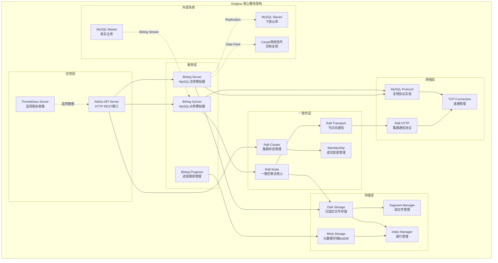
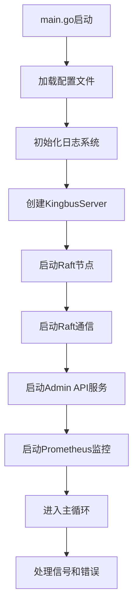
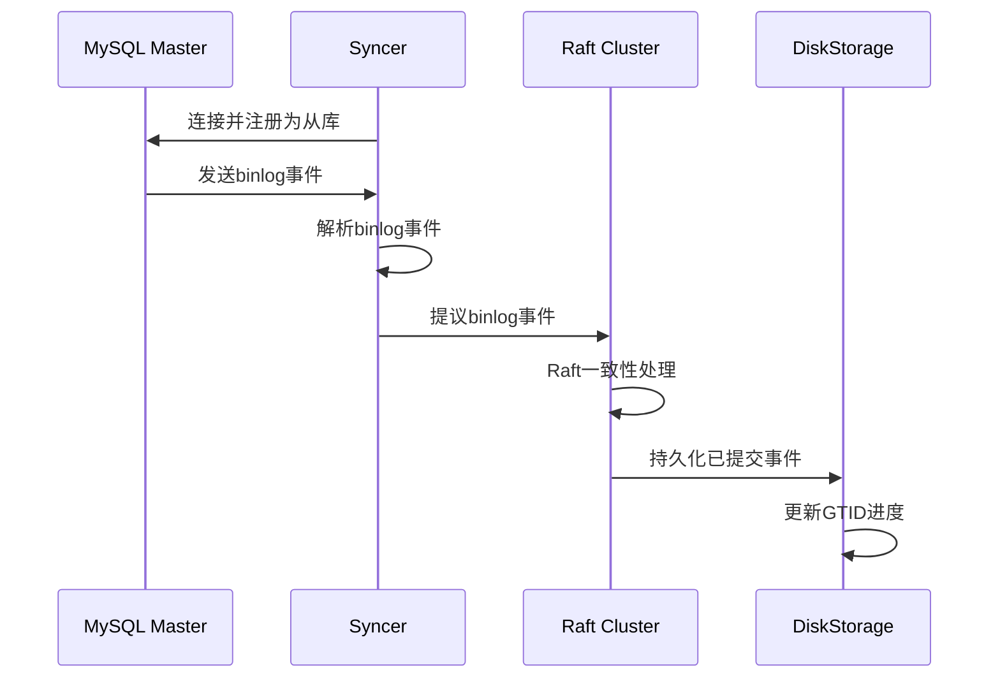
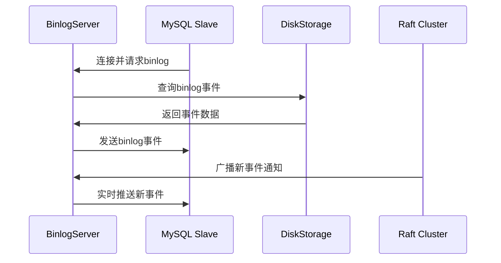
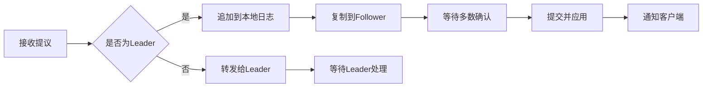
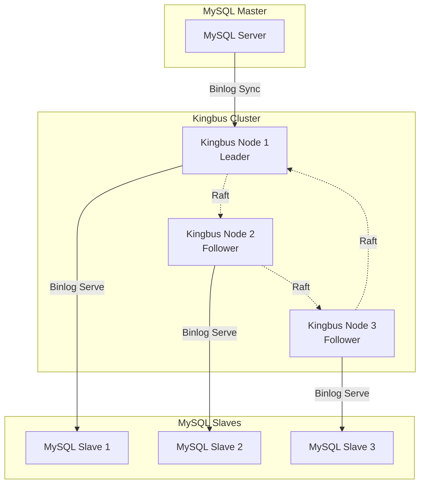

# Kingbus 架构分析与技术文档

## 项目概述

Kingbus是一个基于Raft一致性算法的分布式MySQL binlog存储系统。它可以作为MySQL主服务器的从库，同时也可以作为其他从库的主服务器，充当中间层的MySQL binlog服务器角色。

### 核心特性

- **MySQL复制协议兼容**：支持GTID模式的binlog同步
- **地理复制支持**：基于Raft算法实现多地域复制
- **高可用性**：确保MySQL binlog复制服务持续可用
- **水平扩展**：支持从库的水平扩展，减轻主库压力
- **异构复制**：支持与Canal等异构复制组件集成

## 系统架构

### 整体架构设计

Kingbus采用分层架构设计，主要包含以下核心层次：

1. **API层**：提供HTTP REST API接口
2. **服务层**：包含Binlog同步器和Binlog服务器
3. **一致性层**：基于Raft算法的分布式一致性
4. **存储层**：分段式磁盘存储系统
5. **网络层**：MySQL协议和Raft通信

### 核心模块架构图



### 核心组件

#### 1. KingbusServer (核心服务器)

```go
type KingbusServer struct {
    Cfg            *config.KingbusServerConfig
    adminSvr       *api.AdminServer      // API服务器
    syncer         *Syncer               // Binlog同步器
    master         *BinlogServer         // Binlog服务器
    binlogProgress *BinlogProgress       // Binlog进度管理
    prometheusSvr  *PrometheusServer     // 监控服务器
    
    id       types.ID
    raftNode *raft.Node                 // Raft节点
    cluster  *membership.RaftCluster    // 集群管理
    store    storage.Storage            // 存储引擎
}
```

**职责**：
- 统一管理所有子服务组件
- 协调Raft一致性和binlog处理
- 处理集群成员变更和故障转移

#### 2. Syncer (Binlog同步器)

```go
type Syncer struct {
    started *atomic.Bool
    cfg     *config.SyncerConfig
    
    conn     *client.Conn
    io       *replication.BinlogSyncer
    ctx      context.Context
    cancel   context.CancelFunc
    
    binlogEventC chan *storagepb.BinlogEvent
    dataC        chan []byte
    store        storage.Storage
}
```

**功能**：
- 作为MySQL从库连接到主库
- 接收并解析MySQL binlog事件
- 将binlog事件提议到Raft集群

#### 3. BinlogServer (Binlog服务器)

```go
type BinlogServer struct {
    started *atomic.Bool
    cfg     *config.BinlogServerConfig
    
    listener net.Listener
    slaves   map[string]*mysql.Slave
    
    broadcast   *utils.Broadcast
    kingbusInfo KingbusInfo
    store       storage.Storage
}
```

**功能**：
- 模拟MySQL主库行为
- 向下游从库发送binlog事件
- 处理MySQL复制协议请求

#### 4. Raft Node (一致性节点)

```go
type Node struct {
    tickMu       *sync.Mutex
    NodeConfig
    
    msgSnapC     chan raftpb.Message
    applyc       chan ApplyEntry
    appliedIndex uint64
    
    committedIndex uint64
    term           uint64
    
    Transport    rafthttp.Transporter
    Storage      storage.Storage
}
```

**功能**：
- 实现Raft一致性算法
- 处理日志复制和领导者选举
- 确保集群数据一致性

#### 5. DiskStorage (存储引擎)

```go
type DiskStorage struct {
    Dir      string
    Segments []*Segment
    
    ReserveSegmentCount int
    purgeStarted        *atomic.Bool
    
    MetaStorage
}
```

**功能**：
- 分段式文件存储
- Raft日志持久化
- 元数据管理和GTID跟踪

## 核心流程分析

### 1. 启动流程



### 2. Binlog同步流程



### 3. Binlog分发流程



### 4. Raft一致性流程



## 数据流架构

### 存储结构设计

#### 1. 分段存储 (Segment Storage)

- **文件分段**：每个段文件默认1GB大小
- **索引机制**：支持快速定位Raft索引
- **压缩清理**：自动清理过期数据

#### 2. 元数据存储 (MetaStorage)

使用BoltDB存储关键元数据：
- Raft状态 (HardState, ConfState)
- GTID集合 (ExecutedGTIDSet, GtidPurged)
- 应用索引 (AppliedIndex)
- 主库信息 (MasterInfo)

#### 3. Binlog事件格式

```protobuf
message BinlogEvent {
    optional uint32 type = 1;
    optional FlavorType flavor = 2;
    optional uint32 divided_count = 3;
    optional uint32 divided_seq_num = 4;
    optional bytes data = 5;
}
```

## 集群管理

### 成员管理

```go
type RaftCluster struct {
    lg     *zap.Logger
    
    localID types.ID
    cid     types.ID
    
    members map[types.ID]*Member
    removed map[types.ID]bool
}
```

**功能**：
- 集群成员添加/删除
- 成员状态监控
- 配置变更管理

### 故障处理

1. **Leader选举**：基于Raft算法的自动故障转移
2. **网络分区**：PreVote机制减少不必要的选举
3. **数据恢复**：快照和日志回放机制

## API接口设计

### REST API端点

- `POST /member` - 添加集群成员
- `DELETE /member/{id}` - 删除集群成员
- `PUT /member/{id}` - 更新成员信息
- `GET /members` - 获取成员列表
- `POST /binlog/syncer/start` - 启动同步器
- `POST /binlog/syncer/stop` - 停止同步器
- `POST /binlog/server/start` - 启动binlog服务
- `POST /binlog/server/stop` - 停止binlog服务

### 配置管理

```yaml
# 节点配置
name: 'kingbus_0'
admin-url: http://127.0.0.1:5000
peer-url: http://127.0.0.1:9696

# 集群配置
initial-cluster: kingbus_0=http://127.0.0.1:9696,kingbus_1=http://127.0.0.1:9697
initial-cluster-state: new

# 性能配置
heartbeat-interval: 200ms
election-timeout: 4000ms
data-dir: /home/kingbus/data
reserve-data-size: 20
```

## 性能优化

### 1. 并发处理

- **异步IO**：Raft写入与消息发送并行
- **批量处理**：批量处理binlog事件
- **管道化**：读写分离的管道设计

### 2. 存储优化

- **预写日志**：WAL机制确保数据持久性
- **压缩算法**：减少存储空间占用
- **缓存机制**：热数据内存缓存

### 3. 网络优化

- **连接复用**：TCP连接池管理
- **压缩传输**：网络数据压缩
- **心跳检测**：及时发现网络故障

## 监控与运维

### Prometheus指标

- `kingbus_raft_applied_index` - Raft应用索引
- `kingbus_binlog_events_total` - Binlog事件总数
- `kingbus_syncer_lag_seconds` - 同步延迟
- `kingbus_cluster_members` - 集群成员数量

### 日志系统

使用结构化日志记录：
- 系统启动和关闭事件
- Raft状态变更
- Binlog处理错误
- 网络连接状态

## 部署架构

### 典型部署拓扑



### 容器化部署

```yaml
# docker-compose.yml
version: '3.8'
services:
  kingbus-0:
    image: kingbus:latest
    container_name: kingbus-node-0
    hostname: kingbus-0
    ports:
      - "5000:5000"   # Admin API
      - "9696:9696"   # Raft通信
      - "3390:3390"   # Binlog服务
    volumes:
      - ./data/kingbus-0:/data
      - ./config/kingbus-0.yaml:/etc/kingbus.yaml
      - ./logs/kingbus-0:/logs
    environment:
      - KINGBUS_NODE_NAME=kingbus_0
      - KINGBUS_CLUSTER_STATE=new
    networks:
      - kingbus-network
    restart: unless-stopped
    
  kingbus-1:
    image: kingbus:latest
    container_name: kingbus-node-1
    hostname: kingbus-1
    ports:
      - "5001:5000"
      - "9697:9697"
      - "3391:3390"
    volumes:
      - ./data/kingbus-1:/data
      - ./config/kingbus-1.yaml:/etc/kingbus.yaml
      - ./logs/kingbus-1:/logs
    environment:
      - KINGBUS_NODE_NAME=kingbus_1
      - KINGBUS_CLUSTER_STATE=new
    networks:
      - kingbus-network
    restart: unless-stopped
    
  kingbus-2:
    image: kingbus:latest
    container_name: kingbus-node-2
    hostname: kingbus-2
    ports:
      - "5002:5000"
      - "9698:9698"
      - "3392:3390"
    volumes:
      - ./data/kingbus-2:/data
      - ./config/kingbus-2.yaml:/etc/kingbus.yaml
      - ./logs/kingbus-2:/logs
    environment:
      - KINGBUS_NODE_NAME=kingbus_2
      - KINGBUS_CLUSTER_STATE=new
    networks:
      - kingbus-network
    restart: unless-stopped

  prometheus:
    image: prom/prometheus:latest
    container_name: kingbus-prometheus
    ports:
      - "9090:9090"
    volumes:
      - ./monitoring/prometheus.yml:/etc/prometheus/prometheus.yml
      - prometheus-data:/prometheus
    networks:
      - kingbus-network
    restart: unless-stopped

  grafana:
    image: grafana/grafana:latest
    container_name: kingbus-grafana
    ports:
      - "3000:3000"
    volumes:
      - grafana-data:/var/lib/grafana
      - ./monitoring/dashboards:/etc/grafana/provisioning/dashboards
    environment:
      - GF_SECURITY_ADMIN_PASSWORD=admin123
    networks:
      - kingbus-network
    restart: unless-stopped

networks:
  kingbus-network:
    driver: bridge
    ipam:
      config:
        - subnet: 172.20.0.0/16

volumes:
  prometheus-data:
  grafana-data:
```

### Kubernetes部署

```yaml
# kingbus-statefulset.yaml
apiVersion: apps/v1
kind: StatefulSet
metadata:
  name: kingbus
  namespace: kingbus-system
spec:
  serviceName: kingbus-headless
  replicas: 3
  selector:
    matchLabels:
      app: kingbus
  template:
    metadata:
      labels:
        app: kingbus
    spec:
      containers:
      - name: kingbus
        image: kingbus:v1.0.0
        ports:
        - containerPort: 5000
          name: admin-api
        - containerPort: 9696
          name: raft-peer
        - containerPort: 3390
          name: binlog-server
        env:
        - name: KINGBUS_NODE_NAME
          valueFrom:
            fieldRef:
              fieldPath: metadata.name
        - name: KINGBUS_CLUSTER_STATE
          value: "new"
        volumeMounts:
        - name: data
          mountPath: /data
        - name: config
          mountPath: /etc/kingbus.yaml
          subPath: kingbus.yaml
        resources:
          requests:
            cpu: 500m
            memory: 1Gi
          limits:
            cpu: 2000m
            memory: 4Gi
        livenessProbe:
          httpGet:
            path: /cluster
            port: 5000
          initialDelaySeconds: 30
          periodSeconds: 10
        readinessProbe:
          httpGet:
            path: /cluster
            port: 5000
          initialDelaySeconds: 5
          periodSeconds: 5
      volumes:
      - name: config
        configMap:
          name: kingbus-config
  volumeClaimTemplates:
  - metadata:
      name: data
    spec:
      accessModes: ["ReadWriteOnce"]
      storageClassName: fast-ssd
      resources:
        requests:
          storage: 100Gi
```

## 技术优势

### 1. 架构优势

- **微服务设计**：组件解耦，易于维护
- **插件化架构**：支持功能扩展
- **配置驱动**：灵活的配置管理

### 2. 可靠性保证

- **强一致性**：基于Raft算法的数据一致性
- **故障自愈**：自动故障检测和恢复
- **数据持久化**：多层次的数据保护

### 3. 性能特点

- **高吞吐量**：支持大规模binlog处理
- **低延迟**：优化的网络和存储路径
- **水平扩展**：支持集群规模扩展

## 应用场景

### 1. 读写分离架构

- 减轻主库复制压力
- 支持大量只读从库
- 提高整体系统可用性

### 2. 跨地域复制

- 多数据中心部署
- 灾难恢复支持
- 地理分布式架构

### 3. 数据同步中间件

- 异构系统数据同步
- 实时数据处理管道
- 数据仓库ETL支持

## 深度技术分析

### 1. MySQL协议兼容性实现

#### 1.1 Change Master 和 Show Slave Status 命令支持

**Change Master 命令支持**：
Kingbus完全支持标准的MySQL `CHANGE MASTER` 命令。从源码分析可以看出：

```go
// docs/cn/quick_start.md 和 docs/en/quick_start.md 中的示例
CHANGE MASTER TO MASTER_HOST = '192.168.1.149', 
MASTER_USER = 'kingbus', MASTER_PASSWORD = 'kingbus', 
MASTER_PORT = 3390, MASTER_AUTO_POSITION = 1, 
MASTER_RETRY_COUNT = 0, MASTER_HEARTBEAT_PERIOD = 100;
```

**Show Slave Status 命令实现**：
Kingbus在 `mysql/command.go` 中实现了MySQL协议的关键命令处理：

```go
func (c *Conn) handleShow(stmt *ast.ShowStmt) error {
    showVariable := stmt.Pattern.Pattern.Text()
    switch strings.ToLower(showVariable) {
    case ServerID:
        masterInfo, err := c.binlogServer.GetMasterInfo()
        result, err := gomysql.BuildSimpleResultset(
            []string{showVariable},
            [][]interface{}{[]interface{}{masterInfo.ServerID}},
            false)
        return c.writeResultset(result)
    }
}
```

**支持的MySQL变量查询**：
- `SELECT @@GLOBAL.SERVER_UUID`
- `SELECT @@GLOBAL.SERVER_ID` 
- `SELECT @master_binlog_checksum`
- `SELECT UNIX_TIMESTAMP()`
- `SELECT @@gtid_mode`
- `SELECT @@gtid_purged`
- `SHOW VARIABLES LIKE 'SERVER_ID'`

### 2. Binlog写入权限机制

#### 2.1 只有Leader可以写入Binlog

从源码分析可以确认：**Binlog文件只有Raft集群的Leader节点可以写入**。

**核心证据**：
```go
// server/server.go:592-621
func (s *KingbusServer) StartProposeBinlog(ctx context.Context) {
    go func() {
        for s.IsLeader() && s.IsSyncerStarted() {  // 只有Leader执行
            select {
            case e := <-s.syncer.BinlogEventC():
                dataWithType, err := utils.EncodeBinlogEvent(e)
                s.ProposeWithRetry(ctx, dataWithType)  // 提议到Raft集群
            }
        }
    }()
}
```

**写入流程**：
1. 只有Leader节点运行Syncer从MySQL主库同步binlog
2. Leader接收到binlog事件后，通过Raft协议提议给集群
3. 经过Raft一致性确认后，所有节点（包括Follower）都会应用并存储
4. Follower节点不能直接写入，只能通过Raft日志复制获得数据

#### 2.2 Raft日志写入机制

```go
// raft/raft.go:314-337
func (r *Node) appendRaftEntries(entries []raftpb.Entry) error {
    // 所有节点都会执行此方法来持久化Raft日志
    err = r.Storage.SaveRaftEntries(entries)
    return nil
}
```

### 3. Binlog分发机制

#### 3.1 所有节点都可以分发Binlog

**关键发现**：虽然只有Leader可以写入binlog，但**所有节点（Leader和Follower）都可以分发binlog给下游从库**。

**分发实现**：
```go
// server/binlog_server.go:186-241
func (s *BinlogServer) DumpBinlogAt(ctx context.Context, slaveGtids gomysql.GTIDSet, 
    eventC chan *storagepb.BinlogEvent, errorC chan error) error {
    go func() {
        for {
            // 所有节点都可以读取已应用的Raft日志
            if nextRaftIndex <= s.kingbusInfo.AppliedIndex() {
                raftEntry, err := reader.GetNext()
                event := utils.DecodeBinlogEvent(raftEntry)
                eventC <- event  // 发送给下游从库
            }
        }
    }()
}
```

**分发策略**：
- 每个节点维护独立的BinlogServer
- 通过读取本地已应用的Raft日志来分发binlog
- 支持负载均衡：不同的从库可以连接不同的Kingbus节点

### 4. Raft传递的Binlog格式

#### 4.1 Protobuf格式定义

Raft传递的binlog采用Protocol Buffers格式：

```protobuf
// storage/storagepb/record.proto
message BinlogEvent {
    optional uint32 type = 1;              // 事件类型
    optional FlavorType flavor = 2;        // MySQL/MariaDB
    optional uint32 divided_count = 3;     // 分片总数
    optional uint32 divided_seq_num = 4;   // 分片序号
    optional bytes data = 5;               // 原始binlog数据
}

message Record {
    optional uint32 crc = 1;               // CRC校验
    optional bytes data = 2;               // 序列化的BinlogEvent
}
```

#### 4.2 数据封装流程

```go
// utils/pb_utils.go:67-77
func EncodeBinlogEvent(e *storagepb.BinlogEvent) ([]byte, error) {
    data, err := e.Marshal()
    dataWithType := make([]byte, 1, len(data)+1)
    dataWithType[0] = MySQLBinlogEventType  // 类型标识
    dataWithType = append(dataWithType, data...)
    return dataWithType, nil
}
```

**数据流转**：
1. Syncer接收原始MySQL binlog事件
2. 封装成BinlogEvent protobuf消息
3. 添加类型标识头部
4. 通过Raft协议传递给集群
5. 各节点解码并持久化存储

### 5. 崩溃恢复处理流程

#### 5.1 恢复标记机制

```go
// storage/disk_storage.go:441-467
func (s *DiskStorage) getRecover() bool {
    v, err := s.MetaStorage.Get(utils.StringToBytes(NeedRecoverKey))
    if utils.BytesToString(v) == "true" {
        return true
    }
    return false
}

func (s *DiskStorage) setRecover(needRecover bool) {
    var v []byte
    if needRecover {
        v = utils.StringToBytes("true")
    } else {
        v = utils.StringToBytes("false")
    }
    err := s.MetaStorage.Set(utils.StringToBytes(NeedRecoverKey), v)
}
```

#### 5.2 崩溃恢复流程

1. **启动检测**：检查NeedRecoverKey标记
2. **日志恢复**：从Raft日志中恢复未应用的条目
3. **状态重建**：重建GTID集合和binlog进度
4. **一致性校验**：确保与集群其他节点数据一致
5. **清理标记**：正常关闭时设置needRecover=false

#### 5.3 事务完整性保证

```go
// server/binlog_progress.go:29
type BinlogProgress struct {
    trxBoundaryParser *mysql.TransactionBoundaryParser  // 事务边界解析器
    executedGtidSet   gomysql.GTIDSet                   // 已执行GTID集合
}
```

Kingbus实现了事务边界检测，确保崩溃恢复时事务的完整性。

### 6. Binlog不丢失保证机制

#### 6.1 多层次数据保护

**1. Raft一致性保证**：
- 数据必须在集群多数节点确认后才算提交
- 防止单点故障导致的数据丢失

**2. 持久化存储**：
```go
// storage/segment.go:255-259
err = s.LogFile.sync()  // 强制刷盘
if err != nil {
    return err
}
```

**3. CRC校验**：
```go
// storage/disk_storage.go:358
r.Crc = crc32.ChecksumIEEE(r.Data)  // CRC32校验
```

**4. GTID跟踪**：
```go
// server/binlog_progress.go:147-161
if raftIndex-s.persistentAppliedIndex > persistentCount ||
    time.Now().Sub(s.persistentTime) > persistentTimeInterval {
    err = s.store.SetBinlogProgress(raftIndex, s.executedGtidSet)
    // 定期持久化GTID进度
}
```

#### 6.2 数据一致性机制

**应用索引跟踪**：
- 每个binlog事件都有对应的Raft索引
- 通过AppliedIndex确保读取的数据已被应用
- 防止读取到未提交的数据

**GTID连续性检查**：
- 基于MySQL GTID机制确保事件顺序
- 支持断点续传和增量同步

### 7. 架构优势总结

#### 7.1 写入集中化，读取分布化
- **写入**：只有Leader可写，保证数据一致性
- **读取**：所有节点可读，支持负载均衡

#### 7.2 强一致性保证
- 基于Raft算法的分布式一致性
- 多数节点确认机制
- 事务完整性检测

#### 7.3 高可用性设计
- 自动故障转移和Leader选举
- 崩溃恢复机制
- 多层次数据保护

#### 7.4 MySQL协议完全兼容
- 支持标准的主从复制命令
- GTID模式完全兼容
- 透明的从库接入

## 总结

通过深入源码分析，Kingbus展现出了精心设计的分布式架构：

1. **MySQL协议兼容性**：完全支持CHANGE MASTER和相关查询命令
2. **写入权限控制**：只有Leader可写入binlog，确保数据一致性
3. **分发机制灵活**：所有节点都可分发binlog，支持负载均衡
4. **数据格式标准**：采用Protobuf格式，支持事件分片和校验
5. **崩溃恢复完善**：多重机制确保数据不丢失和事务完整性
6. **可靠性保证**：Raft一致性+持久化存储+CRC校验+GTID跟踪

该系统特别适合需要高可用MySQL复制环境的企业级应用场景，在保证数据一致性的同时提供了出色的可扩展性和可靠性。 