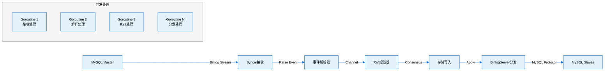
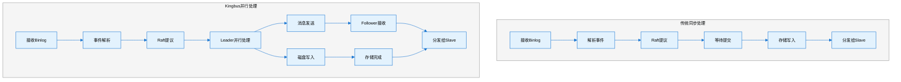
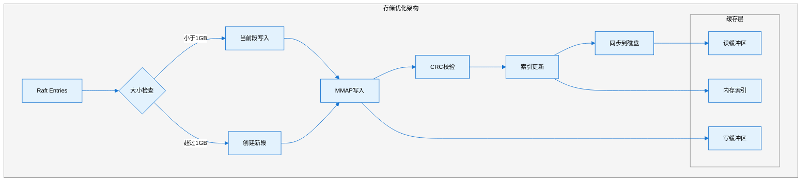
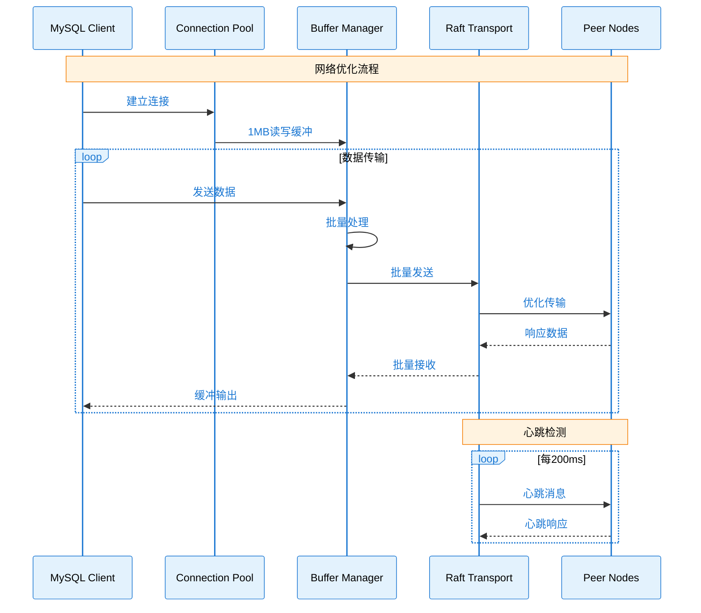

# Kingbus 性能优化深度解析

## 概述

Kingbus作为一个高性能的分布式MySQL binlog存储系统，在设计中采用了多种性能优化策略。本文将深入分析其核心优化机制，包括并发处理、存储优化和网络优化三个方面，并结合源码进行详细解读。

## 1. 并发处理优化

### 1.1 异步IO：Raft写入与消息发送并行

#### 核心机制

Kingbus在Raft节点处理中实现了写入磁盘与消息发送的并行化，这是基于Raft论文10.2.1节的优化策略。

**源码分析：**

```go
// raft/raft.go:252-305
func (r *Node) Run(rh *ReadyHandler) {
    for {
        select {
        case rd := <-r.Ready():
            // 1. 更新提交索引
            updateCommittedIndex(&ap, rh)
            
            // 2. Leader可以并行处理：磁盘写入和消息发送
            if isLead {
                // 立即发送消息，不等待磁盘写入完成
                r.Transport.Send(r.processMessages(rd.Messages))
            }
            
            // 3. 保存HardState到磁盘
            if !etcdraft.IsEmptyHardState(rd.HardState) {
                r.Storage.SaveHardState(rd.HardState)
            }
            
            // 4. 保存Entries到存储
            r.appendRaftEntries(rd.Entries)
            
            // 5. 应用已提交的条目
            r.applyc <- ap
            
            // Follower需要等待配置变更应用完成
            if !isLead {
                // 等待应用完成后再发送消息
                if waitApply {
                    <-notifyc
                }
                r.Transport.Send(msgs)
            }
        }
    }
}
```

**优化效果：**
- Leader节点的消息发送不需要等待磁盘IO完成
- 大幅降低了网络延迟对整体性能的影响
- 提高了集群的整体吞吐量

### 1.2 批量处理：Binlog事件批量处理机制

#### 缓冲通道设计

Kingbus使用带缓冲的通道来实现binlog事件的批量处理：

```go
// server/binlog_syncer.go:38-63
type Syncer struct {
    binlogEventC chan *storagepb.BinlogEvent  // 1000缓冲
    dataC        chan []byte                   // 10缓冲
}

func NewSyncer(cfg *config.SyncerConfig, store storage.Storage) (*Syncer, error) {
    s := new(Syncer)
    s.binlogEventC = make(chan *storagepb.BinlogEvent, 1000)  // 大缓冲区
    s.dataC = make(chan []byte, 10)
    return s, nil
}
```

#### 事件分割处理

对于大型binlog事件，系统会自动进行分割处理：

```go
// server/binlog_syncer.go:176-210
func (s *Syncer) proposeBinlogEvent(event *replication.BinlogEvent) error {
    // 检查事件大小，如果超过MySQL最大包大小则分割
    if event.Header.EventSize+mysql.OKHeaderByte < uint32(mysql.MaxPayloadLen) {
        // 小事件直接处理
        newEvent := &storagepb.BinlogEvent{
            Type:          uint32(event.Header.EventType),
            DividedCount:  0,
            DividedSeqNum: 0,
            Data:          event.RawData,
        }
        s.binlogEventC <- newEvent
    } else {
        // 大事件分割处理
        divideEvents, err := s.divideBinlogEvent(event)
        for _, dividedEvent := range divideEvents {
            s.binlogEventC <- dividedEvent
        }
    }
}
```

### 1.3 管道化：读写分离的管道设计

#### 多阶段管道架构

Kingbus实现了完整的管道化处理架构：



#### 读写分离实现

**写入路径（热路径）：**
```go
// server/server.go:149-171
go func() {
    for s.started.Load() {
        event, err := binlogStreamer.GetEvent(s.ctx)
        if err != nil {
            return
        }
        // 异步提议到Raft
        err = s.proposeBinlogEvent(event)
    }
}()
```

**读取路径（冷路径）：**
```go
// server/binlog_server.go:186-238
go func() {
    for {
        if nextRaftIndex <= s.kingbusInfo.AppliedIndex() {
            raftEntry, err := reader.GetNext()
            // 处理事件并发送给slave
            select {
            case eventC <- event:
            case <-ctx.Done():
                return
            }
        } else {
            // 等待新事件广播
            <-s.broadcast.Receive()
        }
    }
}()
```

## 2. 存储优化

### 2.1 WAL预写日志机制

#### 分段式存储设计

Kingbus实现了高效的分段式WAL存储：

```go
// storage/disk_storage.go:50-64
type DiskStorage struct {
    Dir      string
    Segments []*Segment          // 分段文件数组
    
    ReserveSegmentCount int      // 预留段数量
    purgeStarted        *atomic.Bool
}

// 每个段文件1GB大小
var SegmentSize int64 = 1024 * 1024 * 1024
```

#### WAL写入流程

```go
// storage/disk_storage.go:308-344
func (s *DiskStorage) SaveRaftEntries(entries []raftpb.Entry) error {
    beginSaveTime := time.Now()
    
    // 1. 将entries转换为records
    records, recordsSize := entriesToRecords(entries)
    
    // 2. 获取写入段（如果需要则创建新段）
    writeSegment, isNew, err := s.getWriteSegment(startIndex, recordsSize)
    
    // 3. 追加记录到段文件
    err = writeSegment.appendRecords(records, startIndex)
    
    // 4. 更新段列表
    if isNew {
        s.Segments = append(s.Segments, writeSegment)
    }
    
    // 5. 记录性能指标
    writeTps.Mark(int64(len(records)))
    writeThroughput.Mark(int64(recordsSize))
    writeLatency.Update(int64(time.Now().Sub(beginSaveTime) / time.Millisecond))
}
```

#### 原子性保证

每条记录都包含CRC校验，确保数据完整性：

```go
// storage/disk_storage.go:346-364
func entriesToRecords(entries []raftpb.Entry) ([]*storagepb.Record, int) {
    records := make([]*storagepb.Record, 0, len(entries))
    for i := 0; i < len(entries); i++ {
        r := new(storagepb.Record)
        r.Data, err = entries[i].Marshal()
        r.Crc = crc32.ChecksumIEEE(r.Data)  // CRC校验
        records = append(records, r)
    }
    return records, size
}
```

### 2.2 数据压缩和存储优化

#### Protocol Buffers压缩

使用高效的protobuf序列化：

```protobuf
// storage/storagepb/record.proto
message Record {
    optional uint32 crc  = 1;
    optional bytes data  = 2;
}

message BinlogEvent {
    optional uint32 type = 1;
    optional FlavorType flavor = 2;
    optional uint32 divided_count = 3;
    optional uint32 divided_seq_num = 4;
    optional bytes data = 5;
}
```

#### MMAP文件映射

对于只读段文件使用MMAP提高访问效率：

```go
// storage/mmap_file.go:42-68
func newMmapFile(dir string, name string, fileSize int64) *MmapFile {
    f := new(MmapFile)
    f.file, err = os.OpenFile(f.filePath, os.O_RDWR|os.O_CREATE|os.O_EXCL, FileMode)
    
    // 预分配文件空间
    err = fileutil.Preallocate(f.file, fileSize, true)
    
    // 内存映射
    f.mappedData, err = syscall.Mmap(int(f.file.Fd()), 0, int(fileSize),
        syscall.PROT_READ|syscall.PROT_WRITE, syscall.MAP_SHARED|syscall.MAP_NORESERVE)
    
    return f
}
```

#### 同步优化

使用`sync_file_range`系统调用优化数据同步：

```go
// storage/mmap_file.go:112-126
func (f *MmapFile) sync() error {
    err := utils.Syncfilerange(
        f.file.Fd(),
        int64(f.syncPosition),
        int64(f.writePosition-f.syncPosition),
        utils.SYNC_FILE_RANGE_WAIT_BEFORE|utils.SYNC_FILE_RANGE_WRITE|utils.SYNC_FILE_RANGE_WAIT_AFTER,
    )
    f.syncPosition = f.writePosition
    return nil
}
```

### 2.3 热数据缓存机制

#### 索引缓存

为最新的可写段维护内存索引：

```go
// storage/index.go:40-46
type RWFile struct {
    entries  []*IndexEntry    // 内存中的索引条目
    writer   *bufio.Writer
    file     *os.File
    filePath string
}

// 索引条目结构
type IndexEntry struct {
    RaftIndex    uint64        // Raft索引
    FilePosition uint32        // 文件位置
}
```

#### 缓冲写入

使用大容量缓冲区减少系统调用：

```go
// storage/index.go:234-235
// 1MB索引缓冲区
rw.writer = bufio.NewWriterSize(rw.file, IndexEntrySize*1024*1024)
```

## 3. 网络优化

### 3.1 连接复用和TCP连接池管理

#### MySQL连接管理

Kingbus为每个slave维护独立的连接：

```go
// mysql/conn.go:37-50
type Conn struct {
    *BaseConn
    capability   uint32
    connectionID uint32
    status       uint16
    user         string
    salt         []byte
    closed       *atomic.Bool
    ctx          context.Context
    cancel       context.CancelFunc
    userVariables map[string]interface{}
    binlogServer  BinlogServer
}
```

#### 缓冲优化

使用大容量读写缓冲区：

```go
// mysql/base_conn.go:46-55
func NewBaseConn(conn net.Conn) *BaseConn {
    c := new(BaseConn)
    // 1MB读缓冲区
    c.br = bufio.NewReaderSize(conn, 1<<20)
    // 1MB写缓冲区  
    c.bw = bufio.NewWriterSize(conn, 1<<20)
    c.Conn = conn
    return c
}
```

#### Raft网络传输

使用etcd的rafthttp传输层：

```go
// raft/raft.go:94-97
type NodeConfig struct {
    Transport rafthttp.Transporter  // 高效的Raft消息传输
    PeerListener []*peerListener     // 对等节点监听器
}
```

### 3.2 网络数据传输优化

#### 消息批量发送

Raft消息会进行批量处理和优化：

```go
// raft/raft.go:349-386
func (r *Node) processMessages(ms []raftpb.Message) []raftpb.Message {
    sentAppResp := false
    for i := len(ms) - 1; i >= 0; i-- {
        // 去重AppResp消息
        if ms[i].Type == raftpb.MsgAppResp {
            if sentAppResp {
                ms[i].To = 0  // 标记为无效
            } else {
                sentAppResp = true
            }
        }
        
        // 快照消息特殊处理
        if ms[i].Type == raftpb.MsgSnap {
            select {
            case r.msgSnapC <- ms[i]:
            default:
                // 如果通道满了就丢弃
            }
            ms[i].To = 0
        }
    }
    return ms
}
```

#### 流控制机制

限制并发快照消息数量：

```go
// raft/raft.go:41-42
const maxInFlightMsgSnap = 16  // 最大并发快照数
```

### 3.3 心跳检测和故障发现

#### Raft心跳机制

```go
// raft/raft.go:107-121
func NewNode(cfg NodeConfig) *Node {
    r := &Node{
        // 心跳超时检测器，期望在2个心跳间隔内发送心跳
        td: contention.NewTimeoutDetector(2 * cfg.Heartbeat),
    }
    
    // 创建心跳定时器
    if r.Heartbeat == 0 {
        r.ticker = &time.Ticker{}
    } else {
        r.ticker = time.NewTicker(r.Heartbeat)
    }
}
```

#### 心跳超时检测

```go
// raft/raft.go:376-383
if ms[i].Type == raftpb.MsgHeartbeat {
    ok, exceed := r.td.Observe(ms[i].To)
    if !ok {
        log.Log.Warnf("failed to send out Heartbeat on time (exceeded the %v timeout for %v)", 
                      r.Heartbeat, exceed)
        log.Log.Warnf("server is likely overloaded")
    }
}
```

#### MySQL复制心跳

配置MySQL复制的心跳参数：

```go
// config/server_config.go:168-175
syncerCfg := replication.BinlogSyncerConfig{
    // master心跳周期：10秒
    HeartbeatPeriod: time.Second * 10,
    // 读取超时：20秒，超时后重连
    ReadTimeout: time.Second * 20,
    // 最大重连尝试次数
    MaxReconnectAttempts: 3,
}
```

## 性能优化效果图表

### 并发处理性能对比



### 存储层性能架构



### 网络优化流程



## 性能监控指标

### 关键性能指标

1. **吞吐量指标**
   - `writeTps`: 写入事务数/秒
   - `writeThroughput`: 写入字节数/秒
   - `syncerEps`: 同步事件数/秒
   - `applyEps`: 应用事件数/秒

2. **延迟指标**
   - `writeLatency`: 写入延迟
   - `readLatency`: 读取延迟
   - `proposeChannelSize`: 提议通道大小

3. **资源使用**
   - `kingbus_raft_applied_index`: Raft应用索引
   - `kingbus_cluster_members`: 集群成员数
   - `kingbus_syncer_lag_seconds`: 同步延迟

### 性能调优建议

#### 1. 并发参数调优

```yaml
# kingbus.yaml
heartbeat-interval: 200ms     # 心跳间隔
election-timeout: 4000ms      # 选举超时
reserve-data-size: 20         # 预留存储空间(GB)
```

#### 2. 缓冲区大小优化

```go
// 建议的缓冲区大小
binlogEventC: 1000           // binlog事件缓冲
readBuffer: 1MB              // 网络读缓冲
writeBuffer: 1MB             // 网络写缓冲
indexBuffer: 1MB             // 索引缓冲
```

#### 3. 系统级优化

- **文件系统**: 使用XFS或ext4，启用noatime选项
- **内核参数**: 调整TCP缓冲区大小
- **磁盘**: 使用SSD，启用写缓存
- **网络**: 使用万兆网卡，调整MTU大小

## 总结

Kingbus通过以下三个层面的优化实现了高性能：

### 并发处理优化
- **异步IO**: Leader节点并行处理磁盘写入和网络发送
- **批量处理**: 使用缓冲通道批量处理binlog事件
- **管道化**: 多阶段管道处理，读写分离

### 存储优化
- **WAL机制**: 分段式预写日志，确保数据持久性
- **压缩存储**: Protocol Buffers序列化，CRC校验
- **缓存机制**: 内存索引，MMAP文件映射

### 网络优化
- **连接复用**: 高效的连接池管理
- **批量传输**: 消息去重和批量发送
- **心跳检测**: 多层次的故障检测机制

这些优化策略使得Kingbus能够在保证数据一致性的前提下，实现高吞吐量、低延迟的binlog处理性能，特别适合大规模MySQL复制环境的需求。 