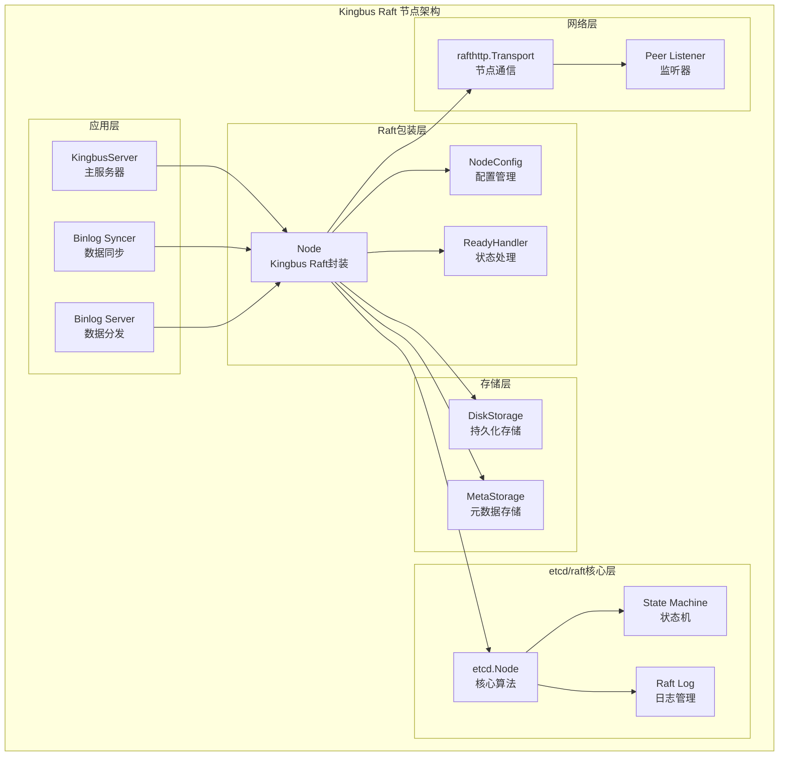
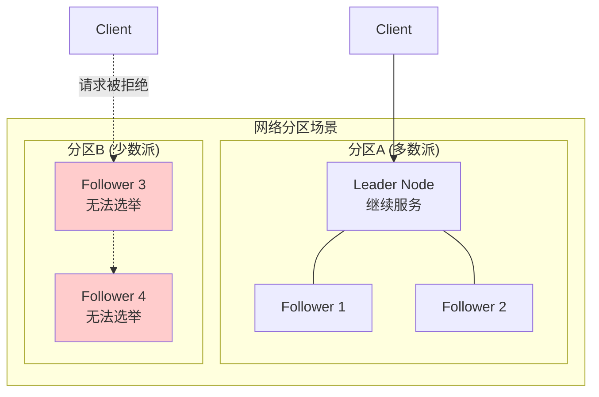
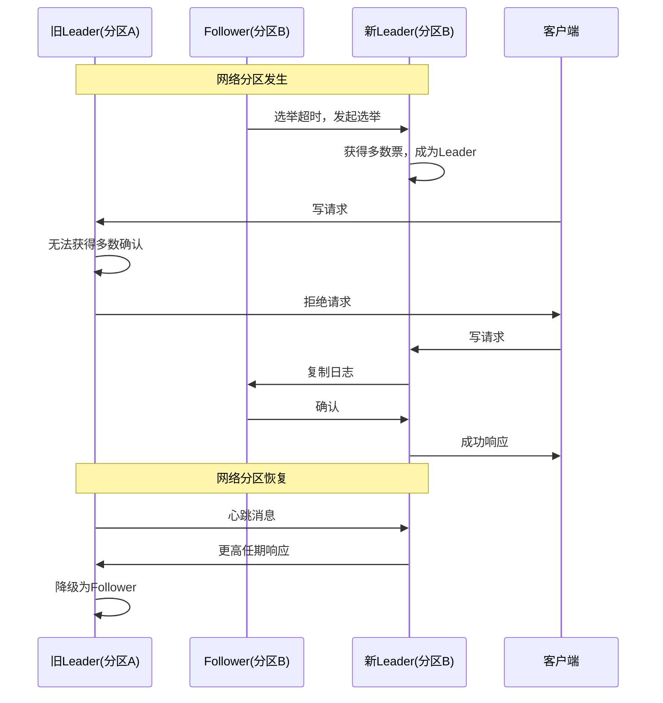
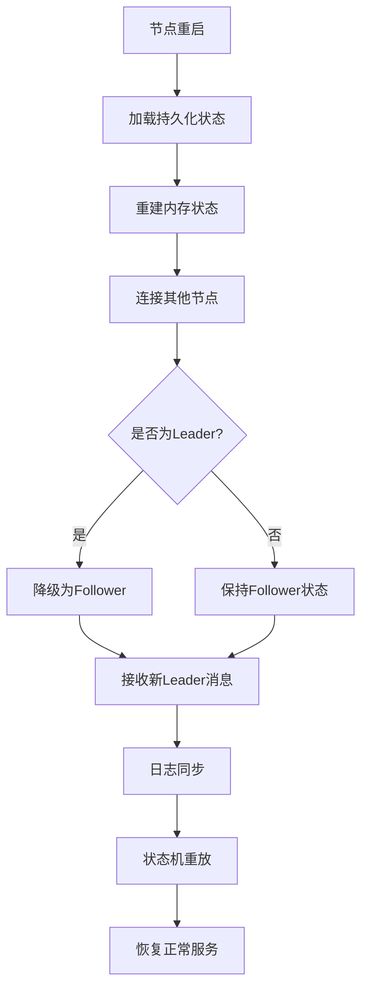
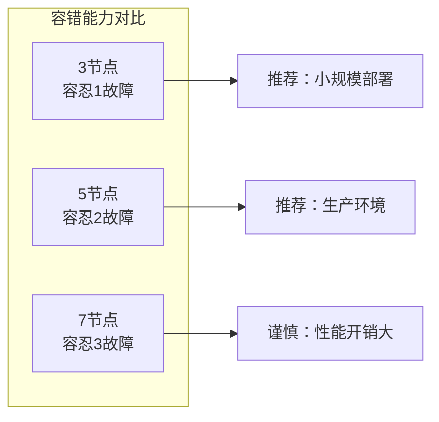

# Kingbus Raft 使用深度分析

## 概述

本文档深入分析Kingbus如何使用Raft一致性算法，探讨其实现方式、面临的问题以及解决方案。通过结合源码分析和网络搜索的最佳实践，全面解析Kingbus在分布式一致性方面的技术选型和优化策略。

## 1. Kingbus Raft 实现方式

### 1.1 技术选型：使用etcd/raft开源库

Kingbus **没有自己实现Raft算法**，而是选择了**etcd/raft开源库**作为底层一致性算法实现。这是一个成熟、稳定且广泛使用的Raft实现。

#### 核心依赖

```go
// raft/raft.go
import (
    "github.com/coreos/etcd/pkg/contention"
    etcdraft "github.com/coreos/etcd/raft"
    "github.com/coreos/etcd/raft/raftpb"
    "github.com/coreos/etcd/rafthttp"
)
```

#### etcd/raft库特点

根据官方文档，etcd/raft库具有以下特点：

- **最广泛使用**：截至2016年，它是生产环境中使用最广泛的Raft库，每天为数万个集群提供服务
- **简约设计**：只实现核心Raft算法，网络和磁盘IO由用户实现
- **确定性设计**：便于测试，将Raft建模为状态机
- **成熟稳定**：被etcd、Kubernetes、Docker Swarm、CockroachDB、TiDB等知名项目使用

### 1.2 Kingbus Raft节点架构



### 1.3 核心组件实现

#### Node结构体

```go
// raft/raft.go:44-69
type Node struct {
    tickMu *sync.Mutex
    NodeConfig
    
    // 快照消息通道
    msgSnapC chan raftpb.Message
    
    // 应用条目通道
    applyc       chan ApplyEntry
    appliedIndex uint64 // 已应用索引
    
    committedIndex uint64 // 已提交索引
    term           uint64 // 当前任期
    
    // 读状态通道
    readStateC chan etcdraft.ReadState
    
    // 心跳定时器
    ticker *time.Ticker
    // 心跳超时检测器
    td *contention.TimeoutDetector
    
    stopped chan struct{}
    done    chan struct{}
}
```

#### NodeConfig配置

```go
// raft/raft.go:82-100
type NodeConfig struct {
    // 检查节点是否被移除
    IsIDRemoved func(id uint64) bool
    etcdraft.Node  // 嵌入etcd raft节点
    
    Storage   storage.Storage      // 存储接口
    Heartbeat time.Duration        // 心跳间隔
    Transport rafthttp.Transporter // 网络传输
    
    PeerListener []*peerListener   // 对等节点监听器
}
```

### 1.4 Raft运行机制

#### 主循环实现

```go
// raft/raft.go:213-279
func (r *Node) Run(rh *ReadyHandler) {
    internalTimeout := time.Second
    
    go func() {
        defer r.onStop()
        isLead := false
        
        for {
            select {
            case <-r.ticker.C:
                r.tick() // 心跳/选举定时器
                
            case rd := <-r.Ready():
                // 1. 处理软状态变更（Leader变更）
                if rd.SoftState != nil {
                    leadChange := rd.SoftState.Lead != etcdraft.None && 
                                 rh.GetLead() != rd.SoftState.Lead
                    rh.UpdateLead(rd.SoftState.Lead)
                    isLead = rd.SoftState.RaftState == etcdraft.StateLeader
                    rh.UpdateLeadership(leadChange)
                    r.td.Reset()
                }
                
                // 2. 更新提交索引
                updateCommittedIndex(&ap, rh)
                
                // 3. Leader并行处理：消息发送与磁盘写入
                if isLead {
                    r.Transport.Send(r.processMessages(rd.Messages))
                }
                
                // 4. 持久化HardState
                if !etcdraft.IsEmptyHardState(rd.HardState) {
                    r.Storage.SaveHardState(rd.HardState)
                }
                
                // 5. 持久化日志条目
                r.appendRaftEntries(rd.Entries)
                
                // 6. 应用已提交条目
                r.applyc <- ap
            }
        }
    }()
}
```

## 2. Raft算法常见问题分析

### 2.1 网络分区问题 (Network Partition)

#### 问题描述
网络分区是分布式系统中最常见的问题之一。当网络分区发生时，Raft集群可能被分割成多个子集群。

#### 问题影响
- **脑裂风险**：可能出现多个Leader
- **数据不一致**：不同分区可能接受不同的写操作
- **可用性下降**：少数分区无法继续服务

#### Raft解决方案



**Raft的解决机制：**

1. **多数派原则**：只有获得多数节点支持的分区才能继续服务
2. **选举限制**：少数分区无法选出新Leader
3. **写操作拒绝**：少数分区拒绝所有写操作

### 2.2 Leader选举超时问题

#### 问题描述
- **选举风暴**：多个节点同时发起选举
- **选举失败**：长时间无法选出Leader
- **网络抖动**：频繁的Leader切换

#### Kingbus解决方案

```go
// raft/raft.go:103-121
func NewNode(cfg NodeConfig) *Node {
    r := &Node{
        // 心跳超时检测器：2倍心跳间隔
        td: contention.NewTimeoutDetector(2 * cfg.Heartbeat),
        // ... 其他初始化
    }
    
    // 心跳定时器
    if r.Heartbeat == 0 {
        r.ticker = &time.Ticker{}
    } else {
        r.ticker = time.NewTicker(r.Heartbeat)
    }
    return r
}
```

**优化策略：**

1. **随机化超时**：etcd/raft内置选举超时随机化
2. **PreVote机制**：减少不必要的选举
3. **心跳超时检测**：及时发现Leader失效

### 2.3 日志复制延迟问题

#### 问题描述
- **网络延迟**：影响日志复制性能
- **慢节点**：拖累整体性能
- **批量处理**：单条复制效率低

#### Kingbus优化方案

```go
// raft/raft.go:349-386
func (r *Node) processMessages(ms []raftpb.Message) []raftpb.Message {
    sentAppResp := false
    for i := len(ms) - 1; i >= 0; i-- {
        // 1. 消息去重：避免重复的AppendEntries响应
        if ms[i].Type == raftpb.MsgAppResp {
            if sentAppResp {
                ms[i].To = 0  // 标记为删除
            } else {
                sentAppResp = true
            }
        }
        
        // 2. 快照处理：异步处理大快照
        if ms[i].Type == raftpb.MsgSnap {
            select {
            case r.msgSnapC <- ms[i]:
            default:
                // 快照通道满时丢弃
            }
            ms[i].To = 0
        }
        
        // 3. 心跳监控：检测心跳发送性能
        if ms[i].Type == raftpb.MsgHeartbeat {
            ok, exceed := r.td.Observe(ms[i].To)
            if !ok {
                log.Log.Warnf("failed to send out Heartbeat on time (exceeded the %v timeout for %v)", 
                    r.Heartbeat, exceed)
                log.Log.Warnf("server is likely overloaded")
            }
        }
    }
    return ms
}
```

### 2.4 Split Brain（脑裂）问题

#### 问题描述
在网络分区情况下，可能出现多个节点都认为自己是Leader的情况。

#### Raft防护机制



**防护要点：**
1. **任期机制**：更高任期的消息会让旧Leader降级
2. **多数派写入**：写操作必须获得多数节点确认
3. **只读Leader**：少数分区的Leader无法处理写操作

## 3. Kingbus Raft问题解决方案

### 3.1 性能优化方案

#### 异步IO优化

```go
// Leader节点并行处理：消息发送与磁盘写入
if isLead {
    // 立即发送消息，不等待磁盘写入
    r.Transport.Send(r.processMessages(rd.Messages))
}

// 后续才进行磁盘写入
if !etcdraft.IsEmptyHardState(rd.HardState) {
    r.Storage.SaveHardState(rd.HardState)
}
r.appendRaftEntries(rd.Entries)
```

**优化效果：**
- 减少网络延迟对性能的影响
- 提高Leader的响应速度
- 符合Raft论文10.2.1节的优化建议

#### 流量控制优化

```go
// raft/raft.go:38-42
const (
    // 最大并发快照消息数量
    maxInFlightMsgSnap = 16
)
```

**控制策略：**
- 限制并发快照数量，避免网络拥塞
- 消息去重，减少不必要的网络流量
- 心跳性能监控，及时发现性能问题

### 3.2 故障恢复机制

#### 节点重启恢复



#### 集群成员变更

```go
// raft/membership/cluster.go:47-56
type RaftCluster struct {
    ID    types.ID        `json:"id"`
    Store storage.Storage `json:"-"`
    
    sync.Mutex `json:"-"`
    MembersMap map[types.ID]*Member `json:"members_map"`
    // 已移除成员映射，ID不可重用
    RemovedMap map[types.ID]bool `json:"removed_map"`
}
```

**安全保证：**
- 成员变更通过Raft日志同步
- 移除的节点ID不可重用
- 支持动态添加/删除节点

### 3.3 监控和诊断

#### 心跳超时检测

```go
// 心跳超时检测器
td := contention.NewTimeoutDetector(2 * cfg.Heartbeat)

// 心跳发送监控
if ms[i].Type == raftpb.MsgHeartbeat {
    ok, exceed := r.td.Observe(ms[i].To)
    if !ok {
        log.Log.Warnf("failed to send out Heartbeat on time")
        log.Log.Warnf("server is likely overloaded")
    }
}
```

#### 性能指标监控

Kingbus集成了Prometheus监控，提供关键Raft指标：

- `raft_applied_index`: 已应用索引
- `raft_committed_index`: 已提交索引
- `raft_term`: 当前任期
- `raft_leader_changes_total`: Leader变更次数
- `raft_proposals_failed_total`: 提议失败次数

## 4. 最佳实践和调优建议

### 4.1 集群规划

#### 节点数量选择



**选择原则：**
- **3节点**：适合小规模或测试环境
- **5节点**：生产环境推荐配置
- **7+节点**：谨慎使用，网络开销大

#### 网络拓扑优化

- **低延迟网络**：节点间RTT < 10ms
- **专用网络**：避免与业务流量竞争
- **多机房部署**：考虑网络分区风险

### 4.2 配置优化

#### 超时参数调优

```yaml
# kingbus.yaml配置示例
heartbeat-interval: 200ms    # 心跳间隔
election-timeout: 4000ms     # 选举超时（心跳间隔的10-20倍）
```

**调优原则：**
- 心跳间隔：平衡性能与网络开销
- 选举超时：避免网络抖动导致的频繁选举
- 批量大小：根据网络带宽调整

#### 存储优化

- **SSD存储**：提高日志写入性能
- **预分配空间**：减少文件系统开销
- **定期压缩**：清理过期日志

### 4.3 运维建议

#### 监控告警

```yaml
# Prometheus告警规则示例
groups:
- name: kingbus-raft
  rules:
  - alert: RaftLeaderMissing
    expr: absent(kingbus_raft_leader_id)
    for: 30s
    
  - alert: RaftHighElectionCount
    expr: increase(kingbus_raft_leader_changes_total[5m]) > 3
    for: 1m
```

#### 故障处理流程

1. **节点故障**：
   - 确认故障类型（网络/硬件/软件）
   - 评估集群健康状态
   - 决定是否需要紧急恢复

2. **网络分区**：
   - 识别分区情况
   - 确保多数分区继续服务
   - 修复网络后验证数据一致性

3. **性能问题**：
   - 检查心跳延迟指标
   - 分析磁盘IO性能
   - 优化网络配置

## 5. 总结

### 5.1 Kingbus Raft使用总结

Kingbus通过使用成熟的etcd/raft库，获得了以下优势：

1. **稳定可靠**：基于经过大规模生产验证的Raft实现
2. **功能完整**：支持Leader选举、日志复制、成员变更等完整功能
3. **性能优化**：实现了异步IO、消息去重等性能优化
4. **易于维护**：避免了自研算法的复杂性和风险

### 5.2 关键技术亮点

1. **并行优化**：Leader节点的消息发送与磁盘写入并行处理
2. **流量控制**：智能的消息去重和流量控制机制
3. **故障检测**：完善的心跳超时检测和性能监控
4. **成员管理**：安全的集群成员动态变更机制

### 5.3 适用场景

Kingbus的Raft实现特别适合：

- **MySQL Binlog复制**：需要强一致性的数据复制场景
- **中等规模集群**：3-5节点的分布式部署
- **高可用要求**：需要自动故障转移的关键业务
- **跨地域部署**：支持多数据中心的一致性需求

通过合理的配置调优和运维实践，Kingbus能够为MySQL Binlog复制提供稳定、高效的分布式一致性保证。 