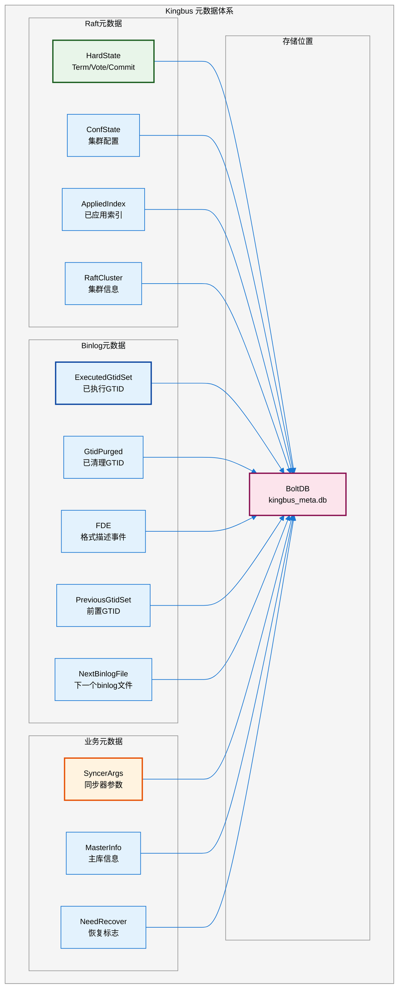
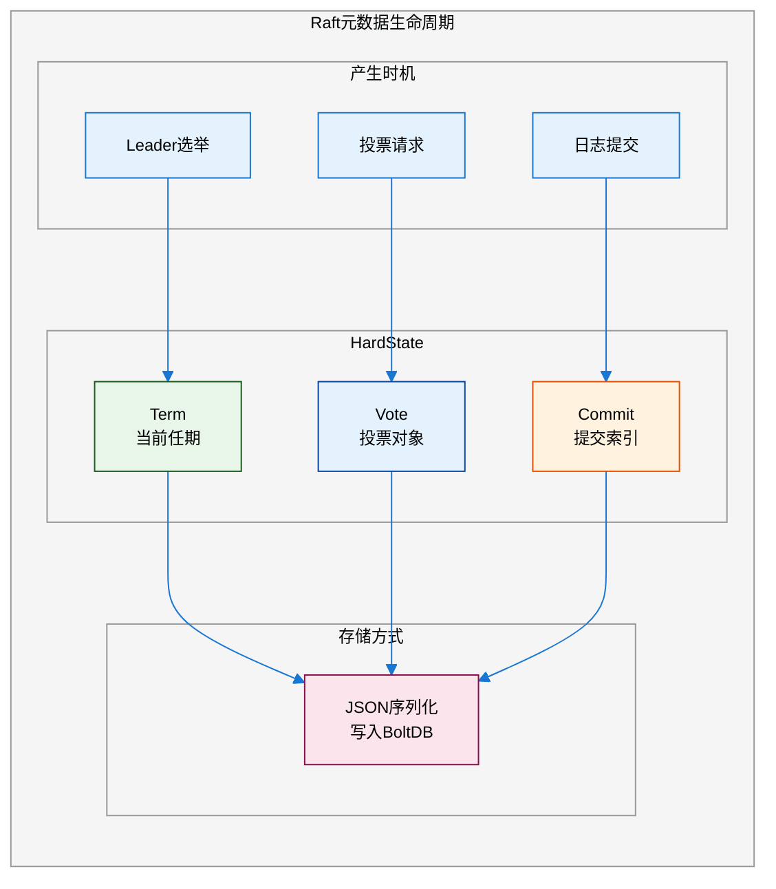
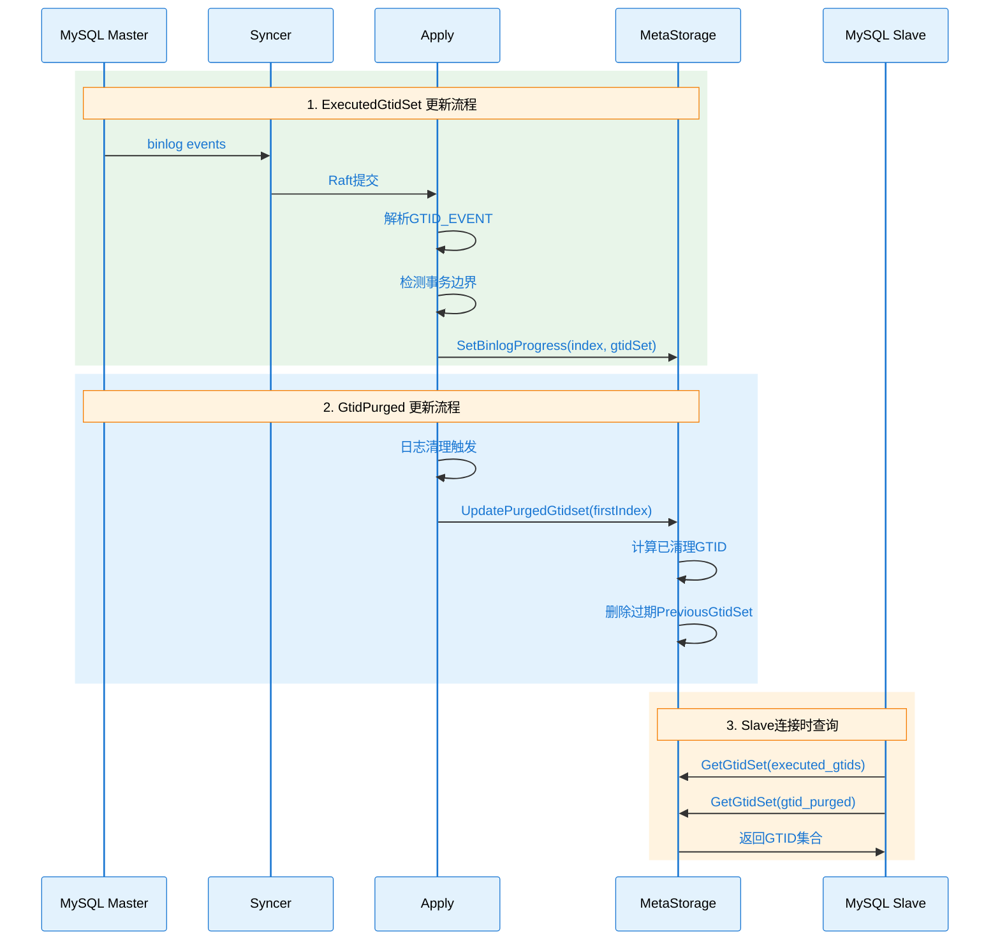
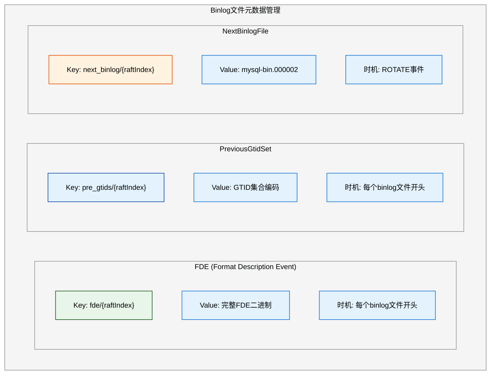
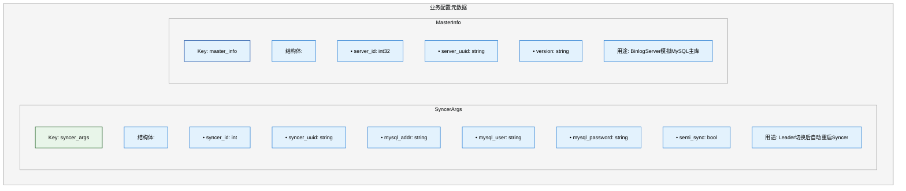
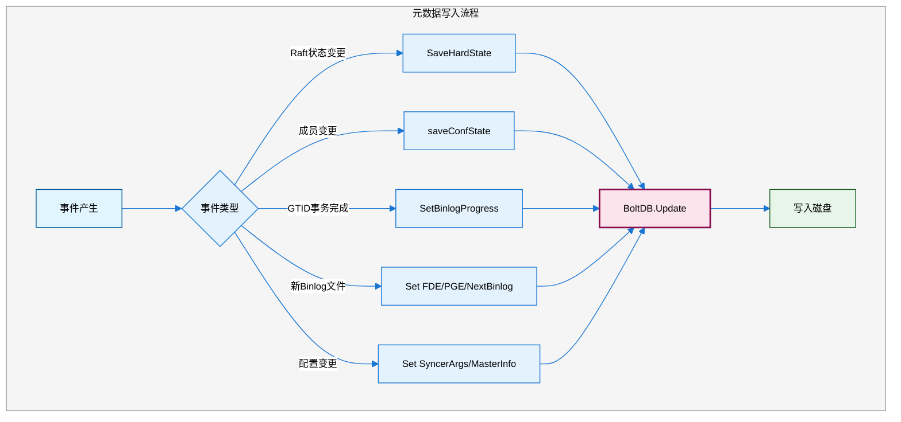
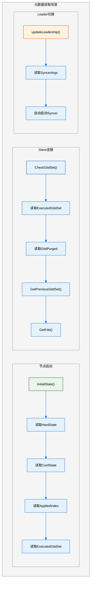
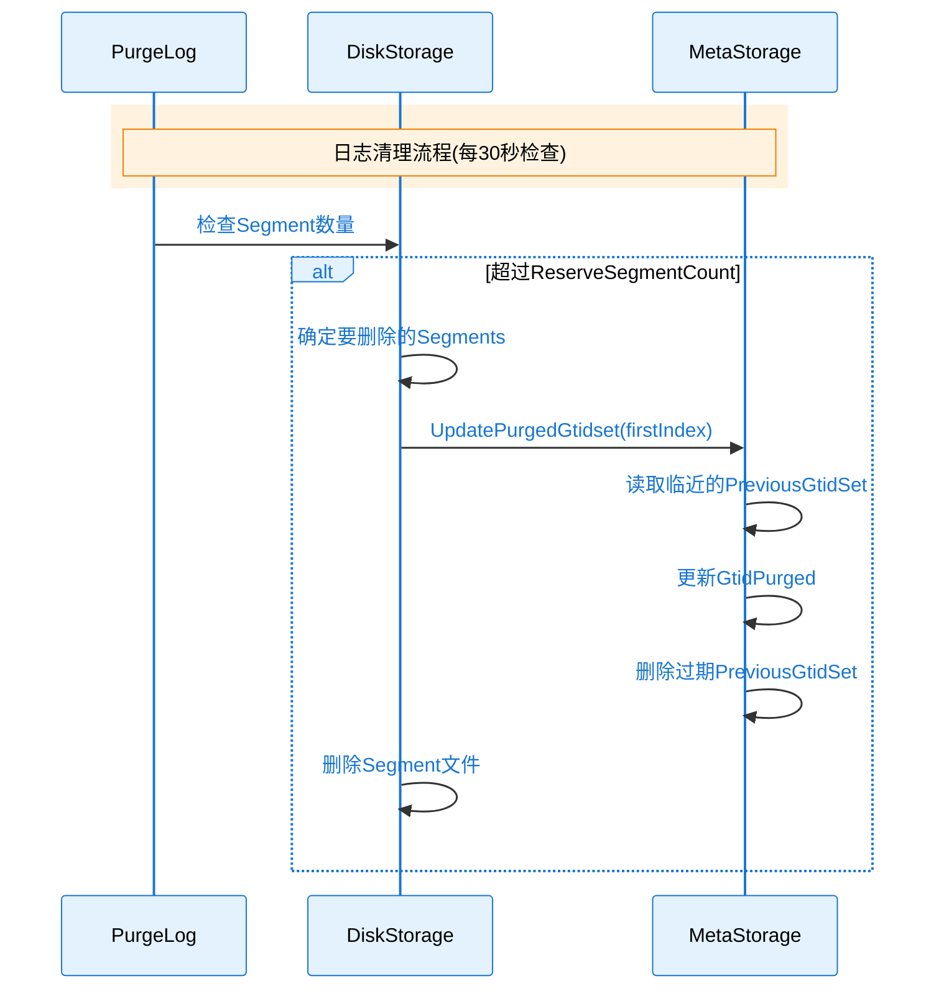
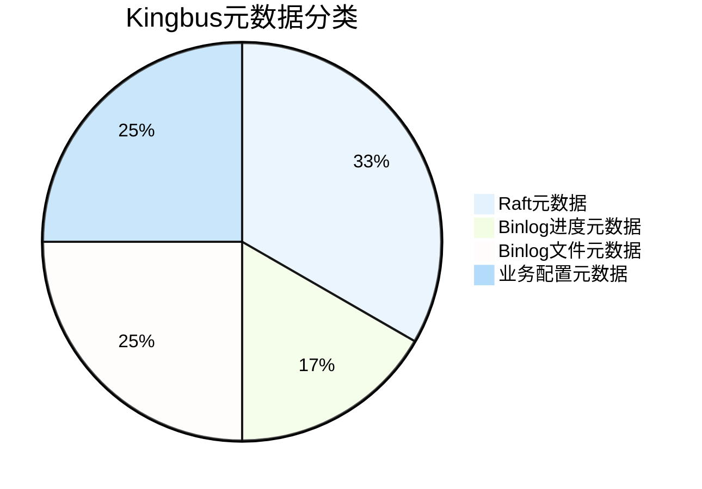

# Kingbus 元数据管理分析

## 概述

本文档详细分析 Kingbus 系统中的所有元数据，包括元数据的类型、存储方式、产生来源、维护机制等。

## 1. 元数据总览



## 2. 元数据详细说明

### 2.1 元数据清单

| 键名 | 类型 | 功能描述 | 产生模块 | 更新时机 |
|-----|------|---------|---------|---------|
| **hard_state** | Raft | Raft硬状态(Term/Vote/Commit) | Raft | 每次状态变更 |
| **conf_state** | Raft | 集群成员配置 | Raft | 成员变更时 |
| **apply_index** | Raft | 已应用的Raft索引 | Apply | 事务边界 |
| **raft_cluster** | Raft | 集群成员详细信息 | Membership | 成员变更时 |
| **mysql/executed_gtids** | Binlog | 已执行的GTID集合 | BinlogProgress | 事务完成时 |
| **mysql/gtid_purged** | Binlog | 已清理的GTID集合 | PurgeLog | 日志清理时 |
| **fde/{raftIndex}** | Binlog | FORMAT_DESCRIPTION_EVENT | Apply | 新binlog文件 |
| **pre_gtids/{raftIndex}** | Binlog | PREVIOUS_GTIDS_EVENT | Apply | 新binlog文件 |
| **next_binlog/{raftIndex}** | Binlog | 下一个binlog文件名 | Apply | ROTATE事件 |
| **syncer_args** | 业务 | Syncer启动参数 | AdminAPI | 启动Syncer时 |
| **master_info** | 业务 | 上游MySQL主库信息 | Syncer | 启动Syncer时 |
| **ds_need_recover** | 系统 | 存储是否需要恢复 | Storage | 启动/关闭时 |

### 2.2 元数据存储结构

```go
// storage/storage.go 中定义的常量
const (
    HardStateKey       = "hard_state"        // Raft硬状态
    ConfStateKey       = "conf_state"        // 集群配置状态
    ExecutedGtidSetKey = "executed_gtids"    // 已执行GTID
    GtidPurgedKey      = "gtid_purged"       // 已清理GTID
    FdePrefix          = "fde"               // FDE前缀
    NextBinlogPrefix   = "next_binlog"       // 下一binlog前缀
    MasterInfoKey      = "master_info"       // 主库信息
    PgePrefix          = "pre_gtids"         // 前置GTID前缀
    SyncerArgsKey      = "syncer_args"       // Syncer参数
    NeedRecoverKey     = "ds_need_recover"   // 恢复标志
    RaftClusterKey     = "raft_cluster"      // 集群信息
    AppliedIndexKey    = "apply_index"       // 已应用索引
)
```

## 3. 元数据功能分类

### 3.1 Raft一致性元数据



**HardState详解**：

```go
// 存储位置: meta_storage.go
func (s *MetaStore) SaveHardState(st pb.HardState) error {
    value, _ := json.Marshal(st)  // JSON序列化
    return s.Set(utils.StringToBytes(HardStateKey), value)
}

// HardState结构 (来自etcd/raft)
type HardState struct {
    Term   uint64  // 当前任期
    Vote   uint64  // 投票给的节点ID
    Commit uint64  // 已提交的日志索引
}
```

**ConfState详解**：

```go
// 集群配置状态
type ConfState struct {
    Nodes    []uint64  // 当前节点列表
    Learners []uint64  // 学习者节点列表
}

// 存储时机: 成员变更后
func saveConfState(store storage.Storage, confState *raftpb.ConfState) {
    value, _ := json.Marshal(confState)
    store.Set(utils.StringToBytes(storage.ConfStateKey), value)
}
```

### 3.2 Binlog进度元数据



**ExecutedGtidSet 管理**：

```go
// storage/meta_storage.go
// 键格式: mysql/executed_gtids
func (s *MetaStore) SetBinlogProgress(appliedIndex uint64, executedGtidSet gomysql.GTIDSet) error {
    // 原子更新: 同时保存appliedIndex和executedGtidSet
    return s.DB.Update(func(tx *bolt.Tx) error {
        b := tx.Bucket(s.BucketName)
        // 保存GTID
        b.Put(gtidsKey, executedGtidSet.Encode())
        // 保存appliedIndex
        b.Put(appliedIndexKey, appliedIndexValue)
        return nil
    })
}
```

**更新触发条件** (binlog_progress.go):

```go
// 每10000个事务 或 每4秒 持久化一次
const (
    persistentCount        = 10000
    persistentTimeInterval = 4 * time.Second
)

func (s *BinlogProgress) updateProcess(raftIndex uint64, eventRawData []byte) error {
    // 检测事务边界
    if s.trxBoundaryParser.IsNotInsideTransaction() {
        // 更新executedGtidSet
        s.executedGtidSet.Update(currentGtidStr)
        
        // 触发持久化检查
        if raftIndex-s.persistentAppliedIndex > persistentCount ||
           time.Since(s.persistentTime) > persistentTimeInterval {
            s.store.SetBinlogProgress(raftIndex, s.executedGtidSet)
        }
    }
}
```

### 3.3 Binlog文件元数据



**用途说明**：

| 元数据 | 用途 |
|-------|------|
| **FDE** | Slave连接时发送，包含binlog版本信息 |
| **PreviousGtidSet** | 定位Slave开始复制的位置 |
| **NextBinlogFile** | 构造ROTATE事件，告知Slave当前binlog文件 |

### 3.4 业务配置元数据



**SyncerArgs持久化目的**：

```go
// server/server.go - Leader切换时自动恢复Syncer
func (s *KingbusServer) updateLeadership(leadChange bool) {
    if leadChange && s.IsLeader() {
        go func() {
            // 等待10秒确保旧Leader已停止
            <-time.After(time.Second * 10)
            
            // 从存储读取Syncer参数
            value, _ := s.store.Get(utils.StringToBytes(storage.SyncerArgsKey))
            if value != nil {
                var syncerArgs config.SyncerArgs
                json.Unmarshal(value, &syncerArgs)
                // 自动启动Syncer
                s.StartServer(config.SyncerServerType, &syncerArgs)
            }
        }()
    }
}
```

## 4. 元数据维护机制

### 4.1 写入流程



### 4.2 读取流程



### 4.3 清理机制



**清理代码**：

```go
// storage/meta_storage.go
func (s *MetaStore) UpdatePugedGtidset(firstIndex uint64) error {
    // 1. 查找firstIndex之后最近的PreviousGtidSet
    // 2. 将其合并到GtidPurged
    // 3. 删除firstIndex之前的所有PreviousGtidSet
}

// storage/disk_storage.go - 触发时机
func (s *DiskStorage) StartPurgeLog() {
    timer := time.NewTimer(time.Second * 30)
    for {
        select {
        case <-timer.C:
            if s.ReserveSegmentCount < len(s.Segments) {
                // 清理超出保留数量的Segments
                s.purgeSegments(deleteSegments, true)
            }
        }
    }
}
```

## 5. 元数据一致性保证

### 5.1 原子性保证

```go
// SetBinlogProgress 原子更新多个元数据
func (s *MetaStore) SetBinlogProgress(appliedIndex uint64, executedGtidSet gomysql.GTIDSet) error {
    return s.DB.Update(func(tx *bolt.Tx) error {
        b := tx.Bucket(s.BucketName)
        // 在同一事务中更新两个键
        b.Put(gtidsKey, gtidsValue)
        b.Put(appliedIndexKey, appliedIndexValue)
        return nil
    })
}
```

### 5.2 一致性恢复

```go
// 启动时检查是否需要恢复
func (s *DiskStorage) initSegments() {
    needRecover := s.getRecover()  // 读取 ds_need_recover
    s.Segments = openSegments(s.Dir, needRecover)
}

// 正常关闭时清除恢复标志
func (s *DiskStorage) Close() error {
    s.setRecover(false)  // 设置 ds_need_recover = false
    s.MetaStorage.Close2()
}

// 如果异常退出，下次启动会重建索引
func openSegment(dir, name string, status SegmentStatus, needRecover bool) *Segment {
    if needRecover {
        s.LogIndex = s.rebuildIndex()  // 从Segment重建索引
    }
}
```

## 6. 元数据监控与诊断

### 6.1 关键指标

| 指标 | 含义 | 告警阈值 |
|-----|------|---------|
| **applied_index** | 已应用Raft索引 | 与committed_index差距过大 |
| **executed_gtid_set** | 已执行GTID | 与Master差距过大 |
| **gtid_purged** | 已清理GTID | 无法满足Slave需求 |

### 6.2 诊断工具

```bash
# 使用tools/meta_store查看元数据
go run tools/meta_store/meta_store.go -d /path/to/data

# 查看存储的所有键值
# 可以检查:
# - executed_gtids: 当前进度
# - gtid_purged: 已清理范围
# - syncer_args: Syncer配置
# - master_info: 主库信息
```

## 7. 总结

### 7.1 元数据分类汇总



### 7.2 维护要点

1. **Raft元数据**: 由etcd/raft库自动管理，通过SaveHardState持久化
2. **Binlog进度**: 基于事务边界更新，批量持久化减少IO
3. **Binlog文件**: 在特定事件时记录，用于Slave定位
4. **业务配置**: 通过Raft Propose保证集群一致，支持Leader切换恢复
5. **一致性恢复**: 通过NeedRecover标志和索引重建保证数据完整性

