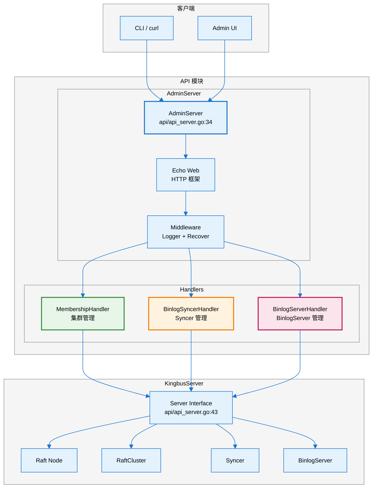
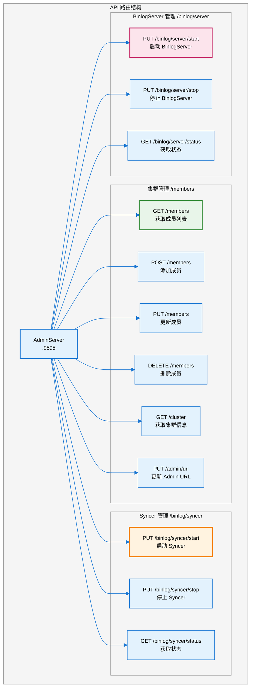
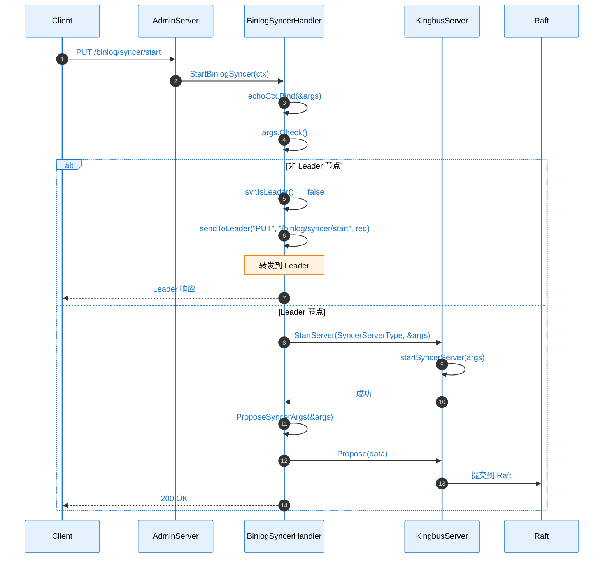
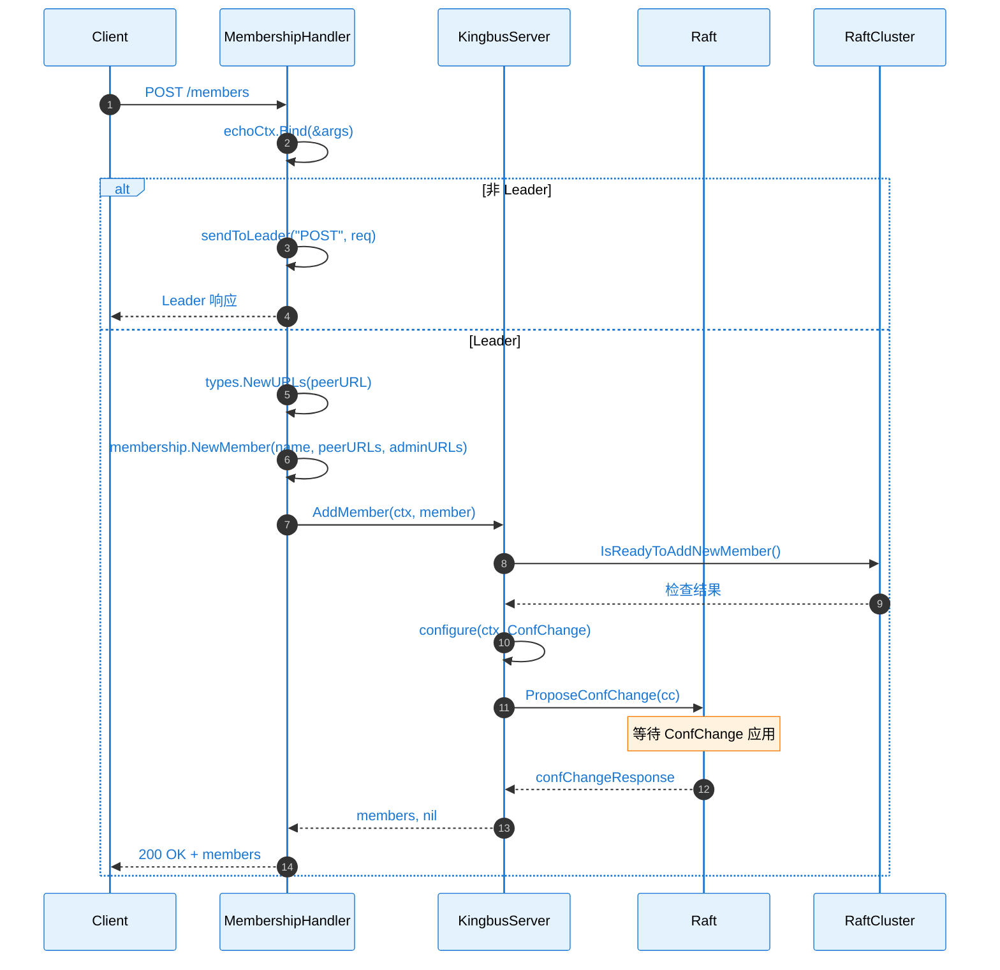
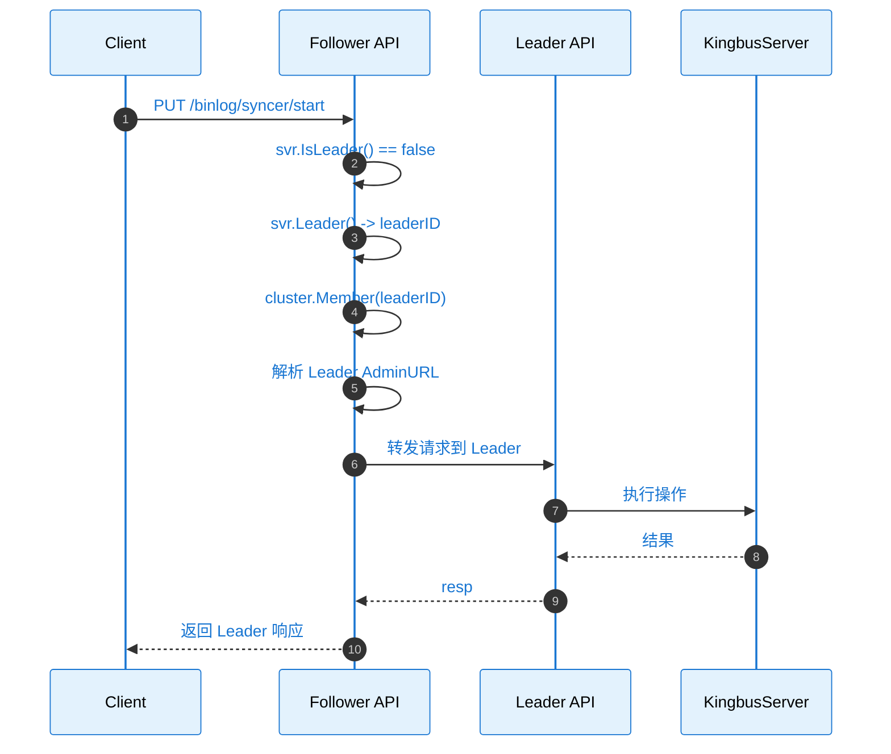
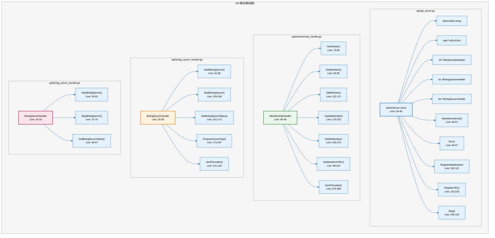
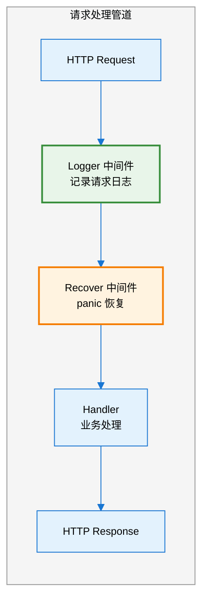
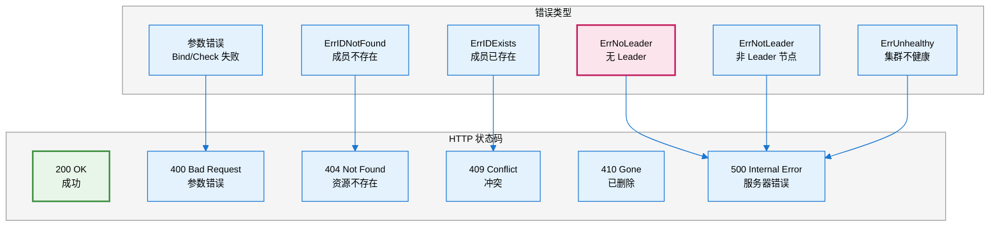
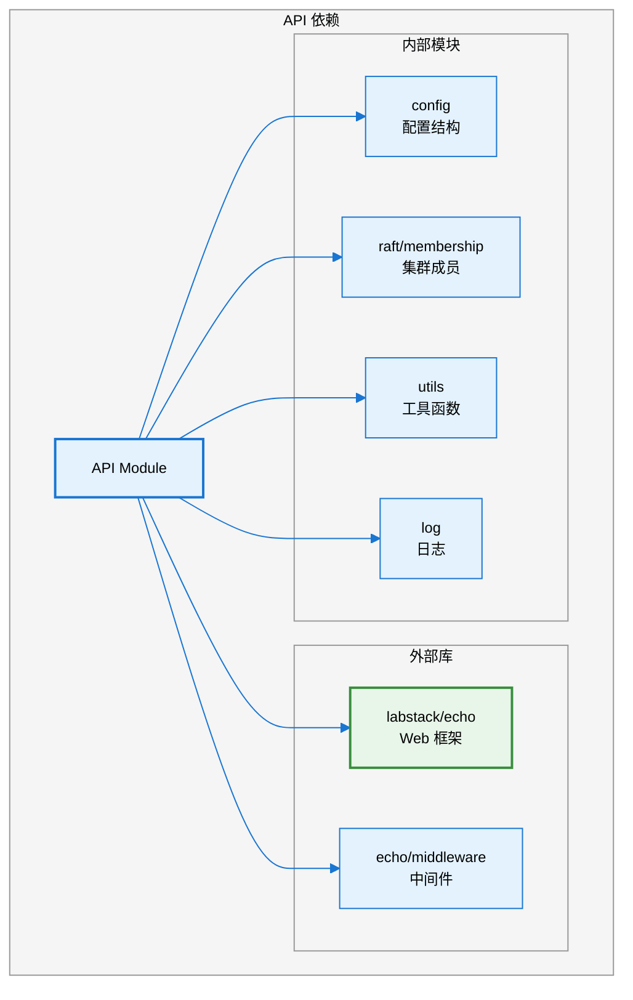

# Kingbus API 模块分析

## 1. 模块概述

**API** 模块是 Kingbus 的管理接口层，基于 Echo Web 框架实现 RESTful API，提供集群管理、Syncer 控制、BinlogServer 控制等功能。

### 核心职责

- 集群成员管理（添加、删除、更新节点）
- Syncer 生命周期管理（启动、停止、状态查询）
- BinlogServer 生命周期管理
- 请求转发（非 Leader 节点转发到 Leader）
- 日志记录和错误恢复

---

## 2. 架构图



---

## 3. API 路由表



---

## 4. 时序图

### 4.1 启动 Syncer 流程



### 4.2 添加集群成员流程



### 4.3 请求转发流程



---

## 5. 源码链路树状图



---

## 6. 关键代码路径表

| **功能** | **文件路径** | **行号** | **函数/结构体** |
|---------|-------------|---------|----------------|
| **AdminServer 结构体** | `api/api_server.go` | 34-40 | `AdminServer` |
| **Server 接口** | `api/api_server.go` | 43-63 | `Server` |
| **创建 AdminServer** | `api/api_server.go` | 66-87 | `NewAdminServer()` |
| **启动服务** | `api/api_server.go` | 90-97 | `Run()` |
| **注册中间件** | `api/api_server.go` | 100-112 | `RegisterMiddleware()` |
| **注册路由** | `api/api_server.go` | 115-133 | `RegisterURL()` |
| **停止服务** | `api/api_server.go` | 136-142 | `Stop()` |
| **MembershipHandler** | `api/membership_handler.go` | 45-49 | `MembershipHandler` |
| **获取集群信息** | `api/membership_handler.go` | 73-89 | `GetCluster()` |
| **添加成员** | `api/membership_handler.go` | 122-170 | `AddMember()` |
| **删除成员** | `api/membership_handler.go` | 226-273 | `DeleteMember()` |
| **BinlogSyncerHandler** | `api/binlog_syncer_handler.go` | 33-38 | `BinlogSyncerHandler` |
| **启动 Syncer** | `api/binlog_syncer_handler.go` | 41-98 | `StartBinlogSyncer()` |
| **停止 Syncer** | `api/binlog_syncer_handler.go` | 129-148 | `StopBinlogSyncer()` |
| **BinlogServerHandler** | `api/binlog_server_handler.go` | 16-19 | `BinlogServerHandler` |
| **启动 BinlogServer** | `api/binlog_server_handler.go` | 23-55 | `StartBinlogServer()` |

---

## 7. API 接口详解

### 7.1 集群管理 API

#### GET /members
获取集群所有成员列表。

```bash
curl http://localhost:9595/members
```

**响应**:
```json
{
  "message": "success",
  "data": [
    {
      "ID": "8e9e05c52164694d",
      "name": "node1",
      "peerURLs": ["http://127.0.0.1:2380"],
      "adminURLs": ["http://127.0.0.1:9595"]
    }
  ]
}
```

#### POST /members
添加新成员到集群。

```bash
curl -X POST http://localhost:9595/members \
  -H "Content-Type: application/json" \
  -d '{
    "name": "node2",
    "peer_url": "http://127.0.0.1:2381",
    "admin_url": "http://127.0.0.1:9596"
  }'
```

#### DELETE /members
从集群删除成员。

```bash
curl -X DELETE http://localhost:9595/members \
  -H "Content-Type: application/json" \
  -d '{"name": "node2"}'
```

#### GET /cluster
获取集群完整信息（包含 Leader 标识）。

```bash
curl http://localhost:9595/cluster
```

**响应**:
```json
{
  "message": "success",
  "data": [
    {
      "Id": "8e9e05c52164694d",
      "name": "node1",
      "peerURLs": ["http://127.0.0.1:2380"],
      "adminURLs": ["http://127.0.0.1:9595"],
      "isLeader": true
    }
  ]
}
```

### 7.2 Syncer API

#### PUT /binlog/syncer/start
启动 Syncer。

```bash
curl -X PUT http://localhost:9595/binlog/syncer/start \
  -H "Content-Type: application/json" \
  -d '{
    "mysql_addr": "127.0.0.1:3306",
    "mysql_user": "repl",
    "mysql_password": "repl123",
    "semi_sync": false
  }'
```

#### PUT /binlog/syncer/stop
停止 Syncer。

```bash
curl -X PUT http://localhost:9595/binlog/syncer/stop
```

#### GET /binlog/syncer/status
获取 Syncer 状态。

```bash
curl http://localhost:9595/binlog/syncer/status
```

**响应**:
```json
{
  "message": "success",
  "data": {
    "mysql_addr": "127.0.0.1:3306",
    "mysql_user": "repl",
    "semi_sync": false,
    "status": "running",
    "current_gtid": "uuid:1-1000",
    "last_binlog_file": "mysql-bin.000001",
    "last_file_position": 12345,
    "executed_gtid_set": "uuid:1-1000",
    "purged_gtid_set": ""
  }
}
```

### 7.3 BinlogServer API

#### PUT /binlog/server/start
启动 BinlogServer。

```bash
curl -X PUT http://localhost:9595/binlog/server/start \
  -H "Content-Type: application/json" \
  -d '{
    "addr": "0.0.0.0:3307",
    "user": "kingbus",
    "password": "kingbus123"
  }'
```

#### PUT /binlog/server/stop
停止 BinlogServer。

```bash
curl -X PUT http://localhost:9595/binlog/server/stop
```

#### GET /binlog/server/status
获取 BinlogServer 状态。

```bash
curl http://localhost:9595/binlog/server/status
```

**响应**:
```json
{
  "message": "success",
  "data": {
    "addr": "0.0.0.0:3307",
    "user": "kingbus",
    "status": "running",
    "slaves": [
      {
        "server_id": 100,
        "uuid": "xxx-xxx",
        "hostname": "slave1",
        "state": "DUMPING",
        "connect_time": "2024-01-01T00:00:00Z"
      }
    ],
    "current_gtid": "uuid:1-1000",
    "executed_gtid_set": "uuid:1-1000"
  }
}
```

---

## 8. 中间件



### Logger 中间件日志格式

```json
{
  "time": "2024-01-01T00:00:00.000Z",
  "id": "xxx",
  "remote_ip": "127.0.0.1",
  "host": "localhost:9595",
  "method": "PUT",
  "uri": "/binlog/syncer/start",
  "status": 200,
  "latency": 12345,
  "latency_human": "12.345ms",
  "bytes_in": 123,
  "bytes_out": 456
}
```

---

## 9. 错误处理



---

## 10. Server 接口定义

```go
// api/api_server.go:43-63
type Server interface {
    // 成员管理
    AddMember(ctx context.Context, memb membership.Member) ([]*membership.Member, error)
    RemoveMember(ctx context.Context, id uint64) ([]*membership.Member, error)
    UpdateMember(ctx context.Context, updateMemb membership.Member) ([]*membership.Member, error)
    
    // 状态查询
    GetIP() string
    IsLeader() bool
    Leader() types.ID
    
    // Raft 操作
    Propose(data []byte) error
    
    // 子服务管理
    StartServer(svrType config.SubServerType, args interface{}) error
    StopServer(svrType config.SubServerType)
    GetServerStatus(svrType config.SubServerType) interface{}
}
```

---

## 11. 依赖关系



---

## 12. 配置参数

| **参数** | **位置** | **说明** |
|---------|---------|---------|
| `AdminURLs` | `config.yaml` | Admin API 监听地址 |
| `adminAPITimeout` | `api_server.go:30` | API 超时时间 (10s) |

---

## 13. 使用示例

### 完整部署流程

```bash
# 1. 启动 Kingbus 集群 (3 节点)
./kingbus --config node1.yaml &
./kingbus --config node2.yaml &
./kingbus --config node3.yaml &

# 2. 检查集群状态
curl http://localhost:9595/cluster

# 3. 启动 Syncer (连接 MySQL Master)
curl -X PUT http://localhost:9595/binlog/syncer/start \
  -H "Content-Type: application/json" \
  -d '{
    "mysql_addr": "mysql-master:3306",
    "mysql_user": "repl",
    "mysql_password": "repl123"
  }'

# 4. 检查 Syncer 状态
curl http://localhost:9595/binlog/syncer/status

# 5. 启动 BinlogServer (供下游 Slave 连接)
curl -X PUT http://localhost:9595/binlog/server/start \
  -H "Content-Type: application/json" \
  -d '{
    "addr": "0.0.0.0:3307",
    "user": "kingbus",
    "password": "kingbus123"
  }'

# 6. 检查 BinlogServer 状态
curl http://localhost:9595/binlog/server/status
```

