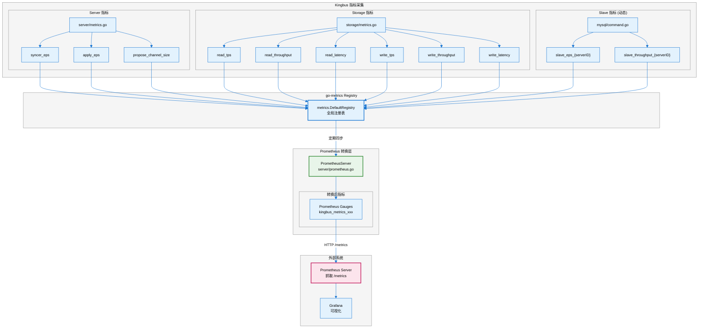
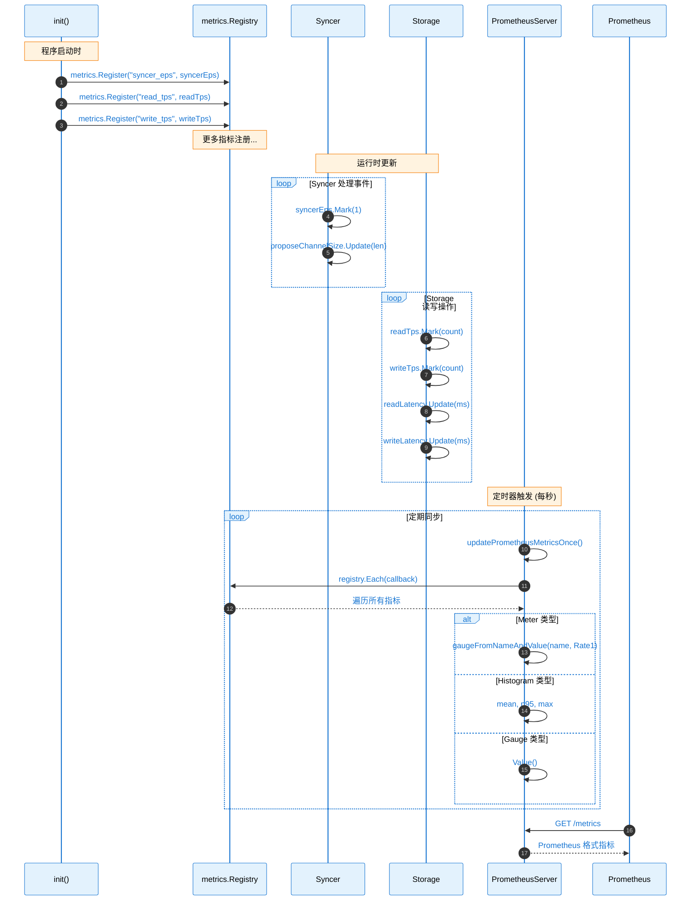
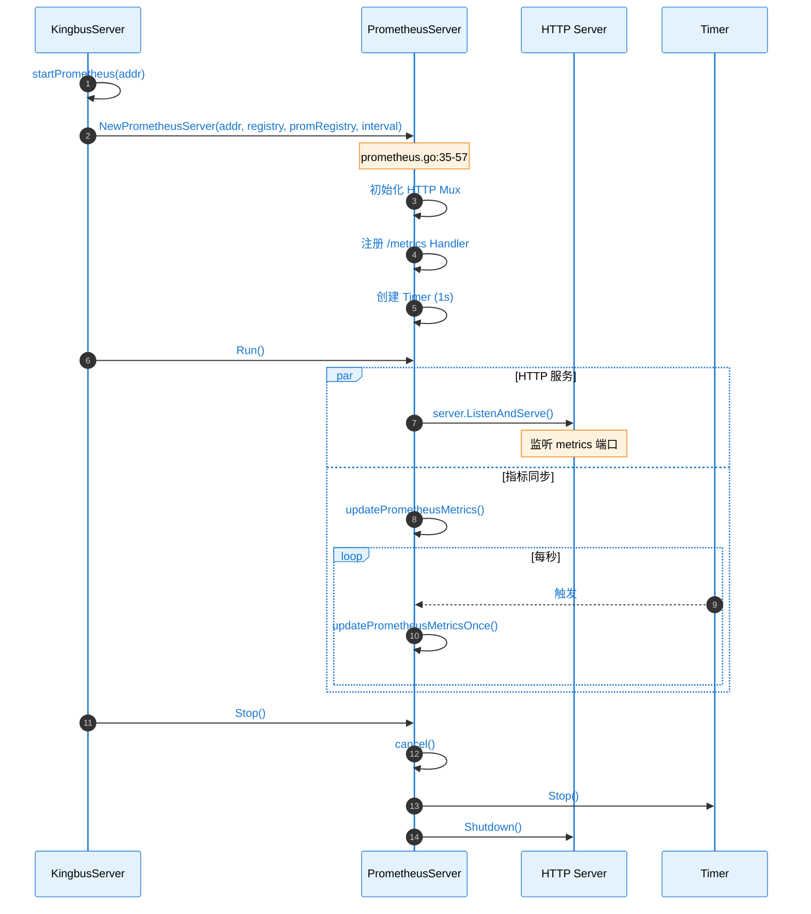
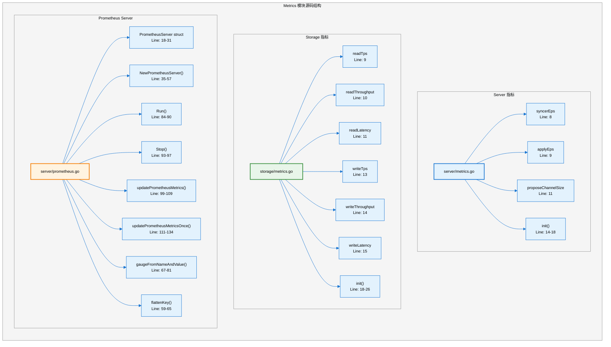
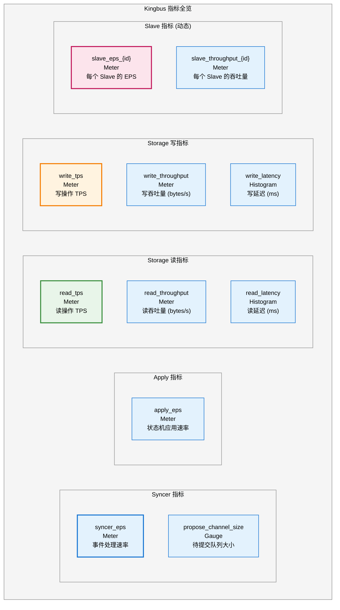
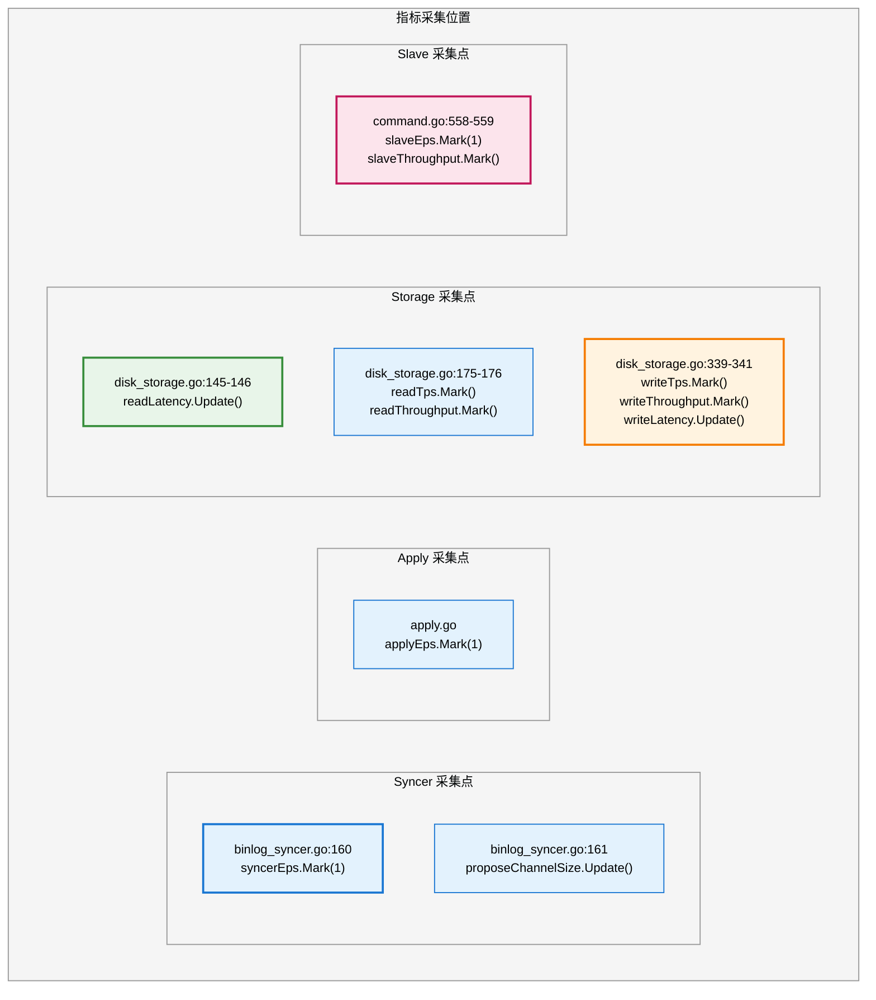
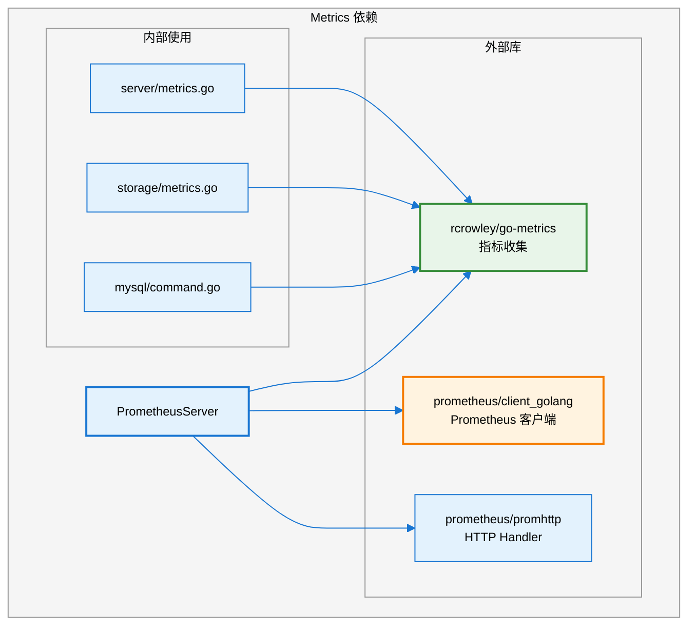

# Kingbus Metrics 模块分析

## 1. 模块概述

**Metrics** 模块负责 Kingbus 的监控指标收集与暴露，采用双层架构：使用 `go-metrics` 库进行内部指标收集，通过 `PrometheusServer` 将指标转换并暴露给 Prometheus 抓取。

### 核心职责

- 收集 Syncer、Storage、BinlogServer 的运行时指标
- 定期将 go-metrics 指标同步到 Prometheus
- 提供 HTTP `/metrics` 端点供 Prometheus 抓取
- 支持 Meter、Gauge、Histogram 等多种指标类型

---

## 2. 架构图



---

## 3. 时序图

### 3.1 指标注册与更新流程



### 3.2 PrometheusServer 生命周期



---

## 4. 源码链路树状图



---

## 5. 关键代码路径表

| **功能** | **文件路径** | **行号** | **函数/变量** |
|---------|-------------|---------|--------------|
| **PrometheusServer 结构体** | `server/prometheus.go` | 18-31 | `PrometheusServer` |
| **创建 PrometheusServer** | `server/prometheus.go` | 35-57 | `NewPrometheusServer()` |
| **启动 Server** | `server/prometheus.go` | 84-90 | `Run()` |
| **停止 Server** | `server/prometheus.go` | 93-97 | `Stop()` |
| **更新指标** | `server/prometheus.go` | 111-134 | `updatePrometheusMetricsOnce()` |
| **创建 Gauge** | `server/prometheus.go` | 67-81 | `gaugeFromNameAndValue()` |
| **Syncer EPS** | `server/metrics.go` | 8 | `syncerEps` |
| **Apply EPS** | `server/metrics.go` | 9 | `applyEps` |
| **Propose Channel Size** | `server/metrics.go` | 11 | `proposeChannelSize` |
| **Read TPS** | `storage/metrics.go` | 9 | `readTps` |
| **Read Throughput** | `storage/metrics.go` | 10 | `readThroughput` |
| **Read Latency** | `storage/metrics.go` | 11 | `readLatency` |
| **Write TPS** | `storage/metrics.go` | 13 | `writeTps` |
| **Write Throughput** | `storage/metrics.go` | 14 | `writeThroughput` |
| **Write Latency** | `storage/metrics.go` | 15 | `writeLatency` |
| **Slave EPS** | `mysql/command.go` | 519 | 动态创建 |
| **Slave Throughput** | `mysql/command.go` | 520 | 动态创建 |

---

## 6. 指标详解

### 6.1 所有指标一览



### 6.2 指标类型说明

| **go-metrics 类型** | **Prometheus 转换** | **说明** |
|-------------------|-------------------|---------|
| `Meter` | Gauge (Rate1) | 速率类指标，取最近1分钟速率 |
| `Gauge` | Gauge (Value) | 瞬时值指标 |
| `GaugeFloat64` | Gauge (Value) | 浮点瞬时值 |
| `Histogram` | Gauge (mean/p95/max) | 分布类指标，转为多个 Gauge |
| `Counter` | Gauge (Count) | 计数器 |
| `Timer` | Gauge (Rate1) | 计时器，取速率 |

---

## 7. Prometheus 指标格式

### 转换后的指标命名

```
kingbus_metrics_{原指标名}
```

### 示例输出

```prometheus
# HELP kingbus_metrics_syncer_eps syncer_eps
# TYPE kingbus_metrics_syncer_eps gauge
kingbus_metrics_syncer_eps 1234.56

# HELP kingbus_metrics_read_latency_mean read_latency.mean
# TYPE kingbus_metrics_read_latency_mean gauge
kingbus_metrics_read_latency_mean 5.23

# HELP kingbus_metrics_read_latency_p95 read_latency.p95
# TYPE kingbus_metrics_read_latency_p95 gauge
kingbus_metrics_read_latency_p95 12.45

# HELP kingbus_metrics_read_latency_max read_latency.max
# TYPE kingbus_metrics_read_latency_max gauge
kingbus_metrics_read_latency_max 45.67

# HELP kingbus_metrics_write_tps write_tps
# TYPE kingbus_metrics_write_tps gauge
kingbus_metrics_write_tps 5678.90

# HELP kingbus_metrics_slave_eps_100 slave_eps_100
# TYPE kingbus_metrics_slave_eps_100 gauge
kingbus_metrics_slave_eps_100 1000.00
```

---

## 8. 指标采集点



---

## 9. 配置参数

| **参数** | **位置** | **默认值** | **说明** |
|---------|---------|-----------|---------|
| `MetricsAddr` | `config.yaml` | `:9596` | Prometheus 端口 |
| `FlushInterval` | `prometheus.go:36` | `1s` | 指标同步间隔 |
| `namespace` | `prometheus.go:44` | `kingbus` | 指标命名空间 |
| `subsystem` | `prometheus.go:45` | `metrics` | 指标子系统 |

---

## 10. 使用方式

### Prometheus 配置

```yaml
# prometheus.yml
scrape_configs:
  - job_name: 'kingbus'
    static_configs:
      - targets: ['kingbus-host:9596']
    scrape_interval: 5s
```

### Grafana Dashboard 示例查询

```promql
# Syncer 事件处理速率
kingbus_metrics_syncer_eps

# Storage 读延迟 P95
kingbus_metrics_read_latency_p95

# Storage 写吞吐量
kingbus_metrics_write_throughput

# 所有 Slave 的 EPS
{__name__=~"kingbus_metrics_slave_eps_.*"}
```

---

## 11. 依赖关系



---

## 12. 监控告警建议

| **指标** | **告警条件** | **说明** |
|---------|-------------|---------|
| `syncer_eps` | = 0 持续 1 分钟 | Syncer 停止工作 |
| `propose_channel_size` | > 800 | 积压严重，可能需要扩容 |
| `read_latency_p95` | > 100ms | 读性能下降 |
| `write_latency_p95` | > 50ms | 写性能下降 |
| `slave_eps_{id}` | 骤降 | Slave 同步异常 |

