# Kingbus Sender (BinlogServer) 模块分析

## 1. 模块概述

**BinlogServer** 模块是 Kingbus 的下游分发组件，它模拟 MySQL Master 的行为，接受 MySQL Slave 的连接请求，并向它们分发 binlog 事件。

### 核心职责

- 监听 TCP 端口，接受 MySQL Slave 连接
- 处理 MySQL 复制协议握手和认证
- 管理已注册的 Slave 连接
- 根据 Slave 的 GTID 集合从 Storage 读取并分发 binlog 事件
- 处理心跳包发送

---

## 2. 架构图

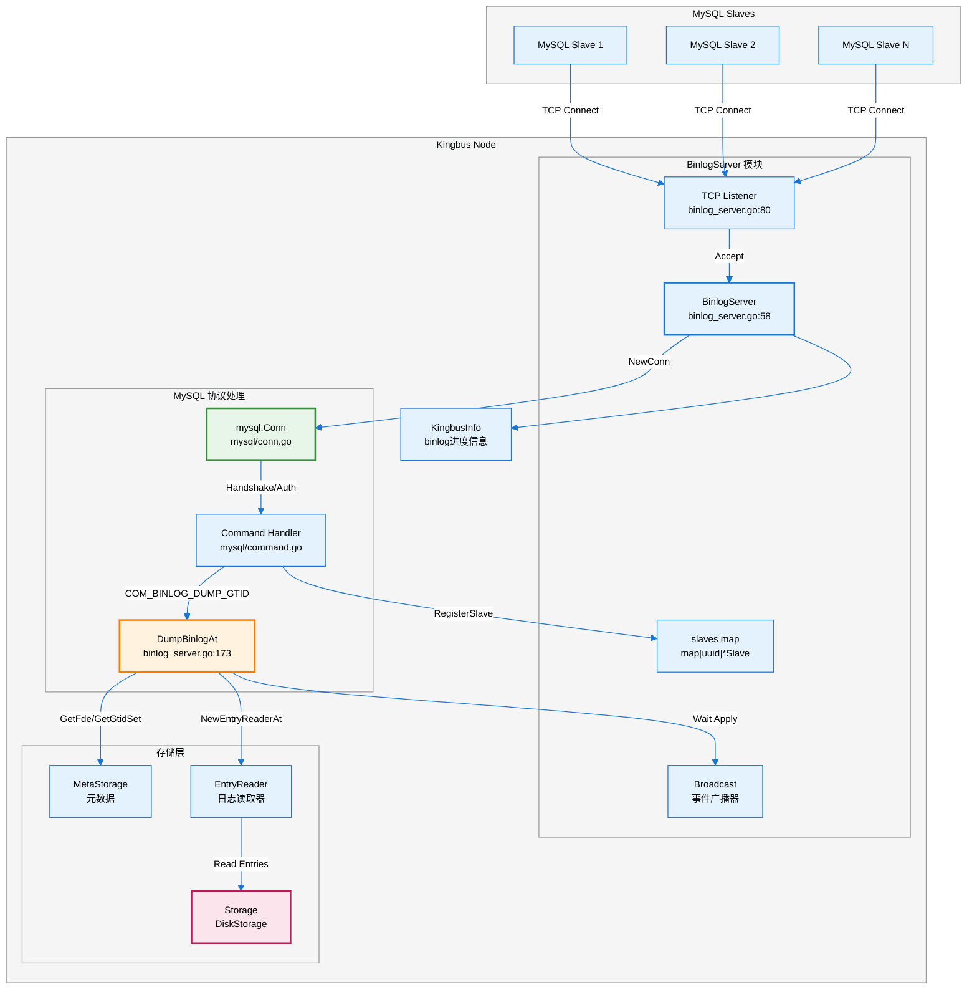

---

## 3. 时序图

### 3.1 Slave 连接与注册流程

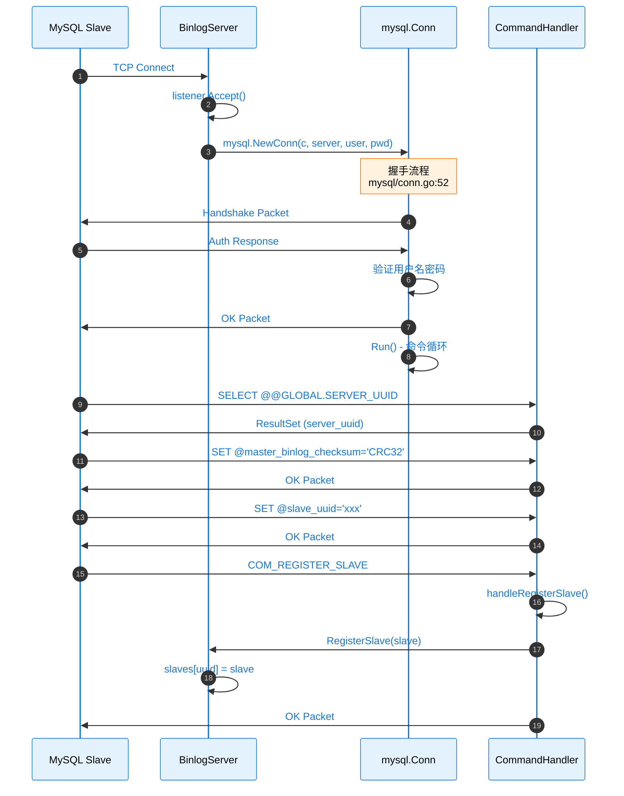

### 3.2 Binlog Dump 流程

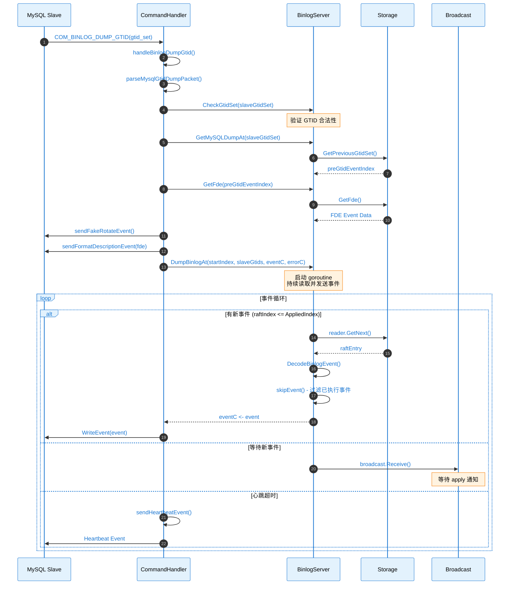

---

## 4. 源码链路树状图

```mermaid
%%{init: {'theme': 'base', 'themeVariables': { 'fontSize': '12px', 'fontFamily': 'Arial', 'primaryColor': '#e3f2fd', 'primaryTextColor': '#000000', 'primaryBorderColor': '#1976d2', 'lineColor': '#1976d2', 'background': '#ffffff', 'clusterBkg': '#f5f5f5', 'clusterBorder': '#999999', 'edgeLabelBackground': '#ffffff'}}}%%
graph LR
    subgraph "BinlogServer 模块源码结构"
        
        ROOT["server/binlog_server.go"]
        
        subgraph "结构体定义"
            S1["BinlogServer struct<br/>Line: 58-71"]
            S1A["started *atomic.Bool"]
            S1B["cfg *BinlogServerConfig"]
            S1C["listener net.Listener"]
            S1D["slaves map[string]*Slave"]
            S1E["broadcast *Broadcast"]
            S1F["kingbusInfo KingbusInfo"]
            S1G["store storage.Storage"]
        end
        
        subgraph "核心函数"
            F1["NewBinlogServer()<br/>Line: 74-92"]
            F2["Start()<br/>Line: 95-114"]
            F3["Stop()<br/>Line: 117-134"]
            F4["onConn()<br/>Line: 136-143"]
            F5["RegisterSlave()<br/>Line: 146-158"]
            F6["UnregisterSlave()<br/>Line: 369-379"]
            F7["GetSlaves()<br/>Line: 161-170"]
        end
        
        subgraph "Binlog Dump"
            D1["DumpBinlogAt()<br/>Line: 173-241"]
            D2["skipEvent()<br/>Line: 244-273"]
            D3["CheckGtidSet()<br/>Line: 292-320"]
            D4["GetMySQLDumpAt()<br/>Line: 287-289"]
            D5["GetFde()<br/>Line: 324-333"]
            D6["GetNextBinlogFile()<br/>Line: 336-338"]
        end
        
        subgraph "状态查询"
            Q1["LastBinlogFile()<br/>Line: 276-278"]
            Q2["LastFilePosition()<br/>Line: 281-283"]
            Q3["GetGtidSet()<br/>Line: 341-343"]
            Q4["GetMasterInfo()<br/>Line: 346-367"]
        end
        
        ROOT --> S1
        S1 --> S1A & S1B & S1C & S1D & S1E & S1F & S1G
        ROOT --> F1 & F2 & F3 & F4 & F5 & F6 & F7
        ROOT --> D1 & D2 & D3 & D4 & D5 & D6
        ROOT --> Q1 & Q2 & Q3 & Q4
    end
    
    style ROOT fill:#e3f2fd,stroke:#1976d2,stroke-width:2px
    style S1 fill:#e8f5e9,stroke:#388e3c,stroke-width:2px
    style D1 fill:#fff3e0,stroke:#f57c00,stroke-width:2px
```

### MySQL 协议处理源码

```mermaid
%%{init: {'theme': 'base', 'themeVariables': { 'fontSize': '12px', 'fontFamily': 'Arial', 'primaryColor': '#e3f2fd', 'primaryTextColor': '#000000', 'primaryBorderColor': '#1976d2', 'lineColor': '#1976d2', 'background': '#ffffff', 'clusterBkg': '#f5f5f5', 'clusterBorder': '#999999', 'edgeLabelBackground': '#ffffff'}}}%%
graph LR
    subgraph "mysql 包源码结构"
        
        CONN["mysql/conn.go"]
        CMD["mysql/command.go"]
        
        subgraph "Conn 结构"
            C1["Conn struct<br/>conn.go"]
            C2["NewConn()"]
            C3["handshake()"]
            C4["Run()"]
            C5["Close()"]
        end
        
        subgraph "命令处理"
            CM1["dispatch()<br/>Line: 79-102"]
            CM2["handleQuery()<br/>Line: 104-138"]
            CM3["handleSelect()<br/>Line: 146-159"]
            CM4["handleSet()<br/>Line: 304-383"]
            CM5["handleRegisterSlave()<br/>Line: 397-447"]
            CM6["handleBinlogDumpGtid()<br/>Line: 450-580"]
        end
        
        subgraph "事件构建"
            E1["sendFakeRotateEvent()<br/>Line: 699-708"]
            E2["sendFormatDescriptionEvent()<br/>Line: 647-662"]
            E3["sendHeartbeatEvent()<br/>Line: 664-669"]
            E4["buildHeartbeatEvent()<br/>Line: 671-695"]
            E5["buildFakeRotateEvent()<br/>Line: 710-742"]
        end
        
        CONN --> C1 & C2 & C3 & C4 & C5
        CMD --> CM1 & CM2 & CM3 & CM4 & CM5 & CM6
        CMD --> E1 & E2 & E3 & E4 & E5
    end
    
    style CONN fill:#e3f2fd,stroke:#1976d2,stroke-width:2px
    style CMD fill:#e8f5e9,stroke:#388e3c,stroke-width:2px
    style CM6 fill:#fff3e0,stroke:#f57c00,stroke-width:2px
```

---

## 5. 关键代码路径表

| **功能** | **文件路径** | **行号** | **函数/结构体** |
|---------|-------------|---------|----------------|
| **BinlogServer 结构体** | `server/binlog_server.go` | 58-71 | `BinlogServer` |
| **KingbusInfo 接口** | `server/binlog_server.go` | 40-46 | `KingbusInfo` |
| **创建 BinlogServer** | `server/binlog_server.go` | 74-92 | `NewBinlogServer()` |
| **启动服务** | `server/binlog_server.go` | 95-114 | `Start()` |
| **停止服务** | `server/binlog_server.go` | 117-134 | `Stop()` |
| **处理新连接** | `server/binlog_server.go` | 136-143 | `onConn()` |
| **注册 Slave** | `server/binlog_server.go` | 146-158 | `RegisterSlave()` |
| **注销 Slave** | `server/binlog_server.go` | 369-379 | `UnregisterSlave()` |
| **Dump Binlog** | `server/binlog_server.go` | 173-241 | `DumpBinlogAt()` |
| **过滤已执行事件** | `server/binlog_server.go` | 244-273 | `skipEvent()` |
| **检查 GTID 合法性** | `server/binlog_server.go` | 292-320 | `CheckGtidSet()` |
| **MySQL Conn 结构** | `mysql/conn.go` | - | `Conn` |
| **命令分发** | `mysql/command.go` | 79-102 | `dispatch()` |
| **处理 SQL 查询** | `mysql/command.go` | 104-138 | `handleQuery()` |
| **处理 SET 命令** | `mysql/command.go` | 304-383 | `handleSet()` |
| **注册 Slave 命令** | `mysql/command.go` | 397-447 | `handleRegisterSlave()` |
| **Binlog Dump GTID** | `mysql/command.go` | 450-580 | `handleBinlogDumpGtid()` |
| **发送心跳事件** | `mysql/command.go` | 664-669 | `sendHeartbeatEvent()` |
| **Slave 结构体** | `mysql/slave.go` | - | `Slave` |

---

## 6. 核心数据流图

```mermaid
%%{init: {'theme': 'base', 'themeVariables': { 'fontSize': '12px', 'fontFamily': 'Arial', 'primaryColor': '#e3f2fd', 'primaryTextColor': '#000000', 'primaryBorderColor': '#1976d2', 'lineColor': '#1976d2', 'background': '#ffffff', 'clusterBkg': '#f5f5f5', 'clusterBorder': '#999999', 'edgeLabelBackground': '#ffffff'}}}%%
flowchart TB
    subgraph "Slave 连接到事件分发完整流程"
        
        A["MySQL Slave<br/>发起连接"] -->|"TCP"| B["BinlogServer.listener<br/>Accept"]
        B --> C["mysql.NewConn()<br/>创建连接对象"]
        C --> D["Handshake + Auth<br/>握手认证"]
        
        D --> E{"命令类型"}
        
        E -->|"COM_QUERY"| F["handleQuery()<br/>处理 SQL"]
        E -->|"COM_REGISTER_SLAVE"| G["RegisterSlave()<br/>注册到 slaves map"]
        E -->|"COM_BINLOG_DUMP_GTID"| H["handleBinlogDumpGtid()"]
        
        H --> I["CheckGtidSet()<br/>验证 GTID"]
        I --> J["GetMySQLDumpAt()<br/>计算起始位置"]
        J --> K["GetFde()<br/>获取 FDE"]
        
        K --> L["sendFakeRotateEvent()"]
        L --> M["sendFormatDescriptionEvent()"]
        M --> N["DumpBinlogAt()<br/>启动事件分发"]
        
        N --> O{"事件循环"}
        O -->|"有事件"| P["reader.GetNext()"]
        P --> Q["skipEvent()<br/>过滤已执行"]
        Q -->|"需要发送"| R["WriteEvent()"]
        R --> O
        Q -->|"跳过"| O
        
        O -->|"无事件"| S["broadcast.Receive()<br/>等待通知"]
        S --> O
        
        O -->|"心跳超时"| T["sendHeartbeatEvent()"]
        T --> O
    end
    
    style A fill:#e8f5e9,stroke:#388e3c,stroke-width:2px
    style H fill:#fff3e0,stroke:#f57c00,stroke-width:2px
    style N fill:#e3f2fd,stroke:#1976d2,stroke-width:2px
    style R fill:#fce4ec,stroke:#c2185b,stroke-width:2px
```

---

## 7. Slave 管理

### Slave 结构体

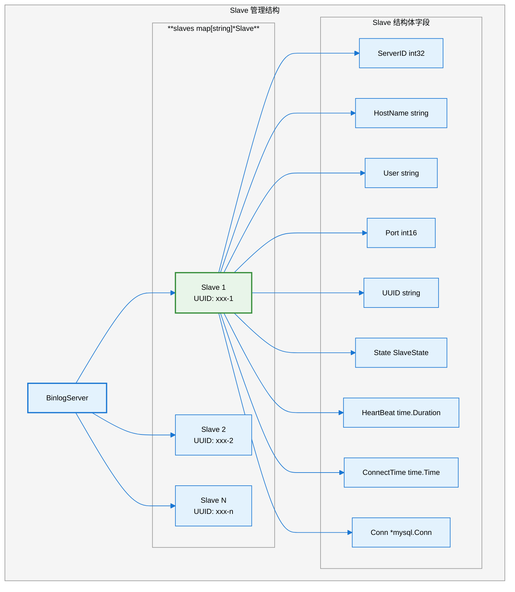

### Slave 状态

| **状态** | **说明** |
|---------|---------|
| `REGISTERED` | 已注册，等待 dump |
| `DUMPING` | 正在 dump binlog |
| `UNREGISTERED` | 已注销 |

---

## 8. 支持的 MySQL 命令

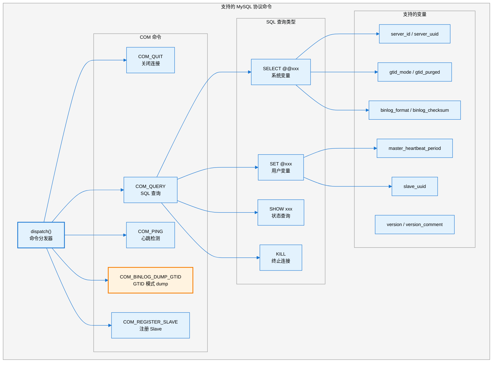

---

## 9. Metrics 指标

| **指标名** | **类型** | **说明** |
|-----------|---------|---------|
| `slave_eps_{serverID}` | Meter | 每个 Slave 的事件发送速率 |
| `slave_throughput_{serverID}` | Meter | 每个 Slave 的吞吐量 |

---

## 10. 使用方式

### API 调用

```bash
# 启动 BinlogServer
curl -X PUT http://localhost:9595/binlog/server/start \
  -H "Content-Type: application/json" \
  -d '{
    "addr": "0.0.0.0:3307",
    "user": "kingbus",
    "password": "kingbus_pwd"
  }'

# 获取 BinlogServer 状态
curl http://localhost:9595/binlog/server/status

# 停止 BinlogServer
curl -X PUT http://localhost:9595/binlog/server/stop
```

### MySQL Slave 配置

```sql
-- 在 MySQL Slave 上配置
CHANGE MASTER TO
  MASTER_HOST='kingbus_host',
  MASTER_PORT=3307,
  MASTER_USER='kingbus',
  MASTER_PASSWORD='kingbus_pwd',
  MASTER_AUTO_POSITION=1;

START SLAVE;
```

### 响应示例

```json
{
  "message": "success",
  "data": {
    "addr": "0.0.0.0:3307",
    "user": "kingbus",
    "status": "running",
    "slaves": [
      {
        "server_id": 100,
        "uuid": "xxx-xxx-xxx",
        "hostname": "slave1",
        "state": "DUMPING",
        "connect_time": "2024-01-01T00:00:00Z"
      }
    ],
    "current_gtid": "uuid:1-100",
    "executed_gtid_set": "uuid:1-100"
  }
}
```

---

## 11. 错误处理

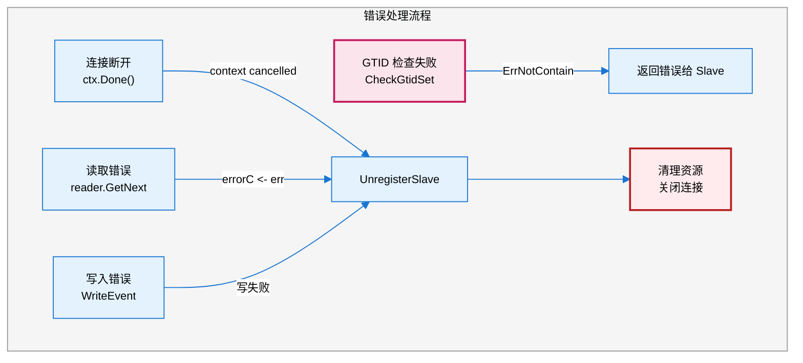

---

## 12. 常见问题解答

### Q1: BinlogServer (Sender) 需要持续还是短暂连接 Master？

**澄清概念**：BinlogServer（也称为 Sender）**不需要连接 MySQL Master**。它本身就是一个"伪 Master"，负责接受下游 MySQL Slave 的连接请求。

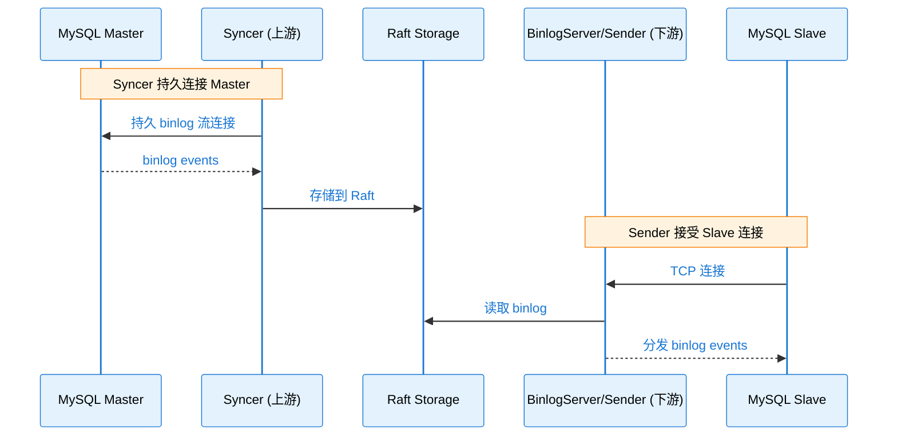

**真正需要连接 Master 的是 Syncer 模块**，而非 BinlogServer。

### Q2: 关于连接池的说明

**Kingbus 中没有实现连接池**。以下是 Syncer 模块的连接管理方式：

#### Syncer 的两种连接

| **连接类型** | **字段** | **用途** | **连接模式** |
|-------------|---------|---------|-------------|
| SQL 查询连接 | `conn *client.Conn` | 执行 SQL 命令（如 `SELECT @@gtid_purged`） | **单连接 + 重试** |
| Binlog 流连接 | `io *replication.BinlogSyncer` | 接收 binlog 事件流 | **持久长连接** |

#### 源码分析

```go
// server/binlog_syncer.go:38-52
type Syncer struct {
    started *atomic.Bool
    cfg     *config.SyncerConfig

    connLock sync.Mutex        // 连接锁，保护单连接
    conn     *client.Conn      // 单个 SQL 连接（非连接池）

    io           *replication.BinlogSyncer  // binlog 流连接
    ctx          context.Context
    cancel       context.CancelFunc
    binlogEventC chan *storagepb.BinlogEvent
    dataC        chan []byte

    store storage.Storage
}
```

#### Execute() 方法的重试逻辑（非连接池）

```go
// server/binlog_syncer.go:282-310
func (s *Syncer) Execute(cmd string, args ...interface{}) (rr *gomysql.Result, err error) {
    s.connLock.Lock()        // 互斥锁保护单连接
    defer s.connLock.Unlock()

    retryNum := 3            // 重试3次，不是连接池！
    for i := 0; i < retryNum; i++ {
        if s.conn == nil {
            // 连接不存在则创建新连接
            s.conn, err = client.Connect(addr, s.cfg.User, s.cfg.Password, "")
            if err != nil {
                return nil, err
            }
        }

        rr, err = s.conn.Execute(cmd, args...)
        if gomysql.ErrorEqual(err, mysql.ErrBadConn) {
            // 连接异常时关闭并重试
            s.conn.Close()
            s.conn = nil
            continue
        }
        return
    }
    return
}
```

### Q3: 为什么使用持久连接而非连接池？

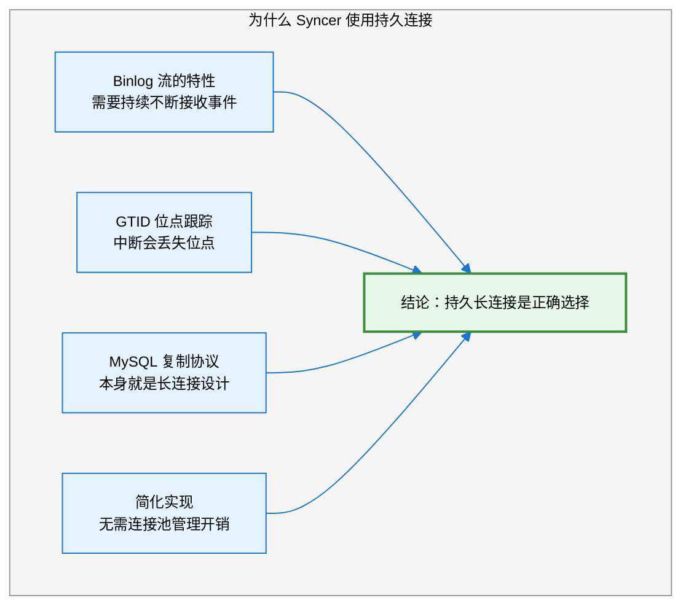

**总结**：
1. BinlogServer（Sender）不连接 Master，它接受 Slave 连接
2. Syncer 使用**持久长连接**连接上游 MySQL Master
3. Kingbus **没有连接池**，只有单连接 + 重试机制
4. go-mysql 库的 `replication.BinlogSyncer` 内部维护持久的 binlog 流连接

---

## 13. 依赖关系

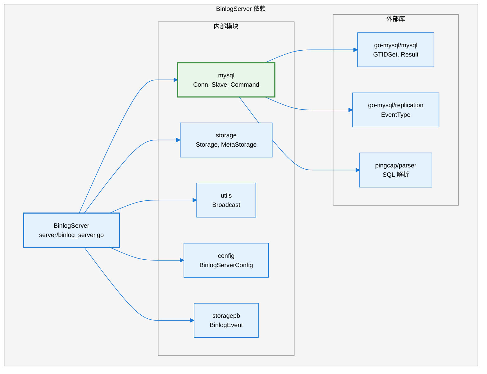

