# Kingbus Storage 模块分析

## 1. 模块概述

**Storage** 模块是 Kingbus 的持久化层，负责 Raft 日志和元数据的存储与读取。它采用 Segment 分段存储 + Mmap 内存映射的方式实现高性能的日志读写。

### 核心职责

- Raft 日志的持久化存储（实现 `etcd/raft.Storage` 接口）
- 元数据管理（使用 BoltDB）
- Segment 文件的生命周期管理
- 日志的自动清理（Purge）
- 支持高效的顺序写和随机读

---

## 2. 架构图

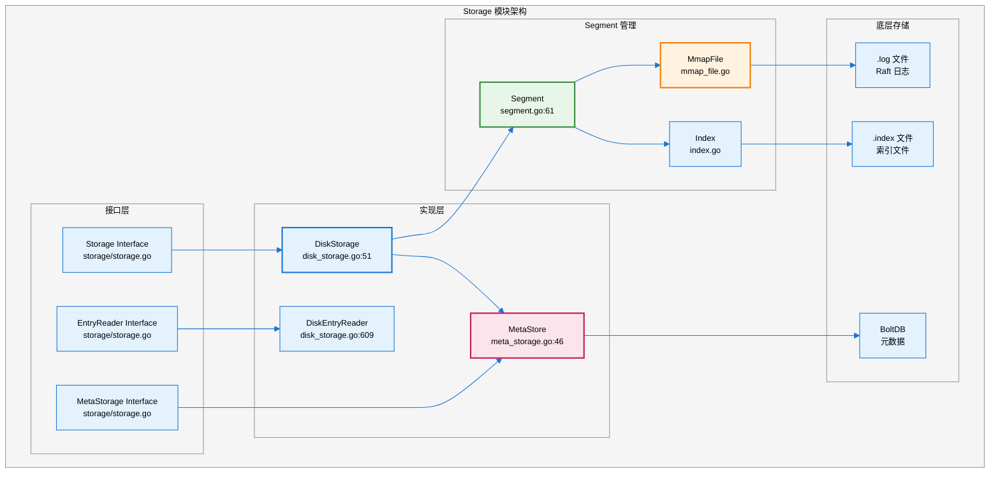

---

## 3. 时序图

### 3.1 写入 Raft 日志流程

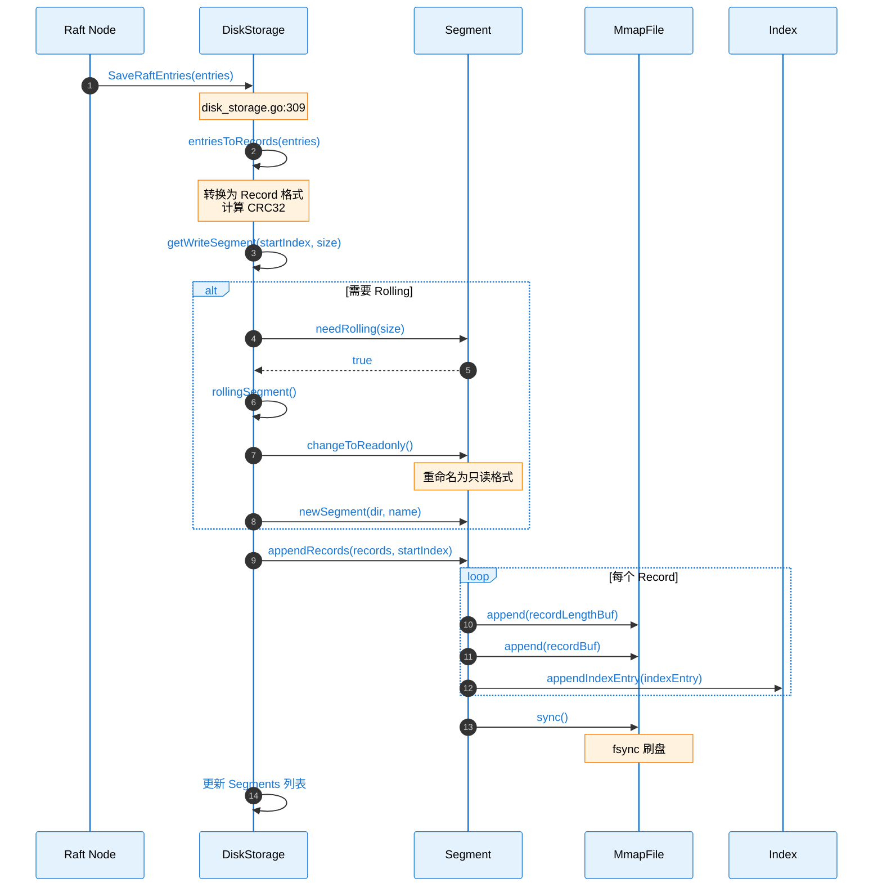

### 3.2 读取 Raft 日志流程

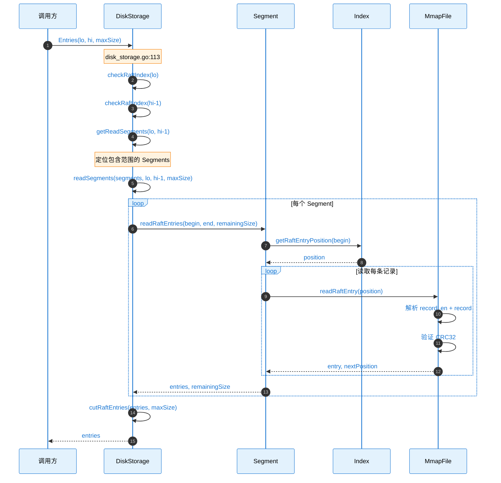

### 3.3 日志清理流程

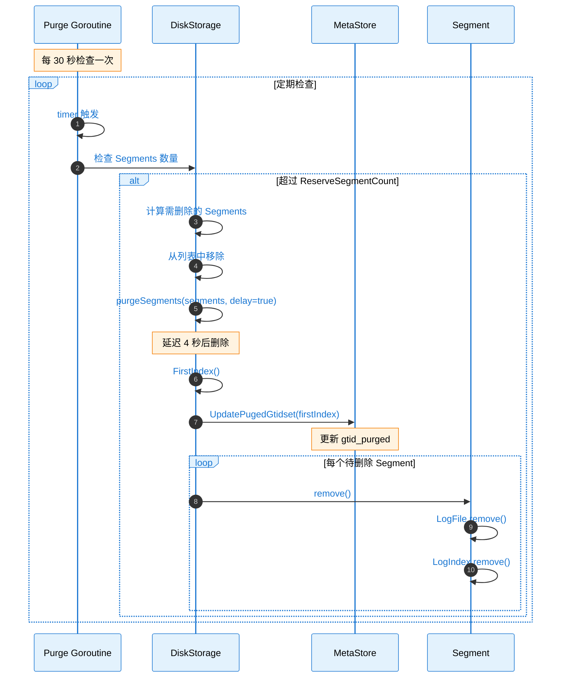

---

## 4. 源码链路树状图

### 4.1 DiskStorage 源码结构

```mermaid
%%{init: {'theme': 'base', 'themeVariables': { 'fontSize': '12px', 'fontFamily': 'Arial', 'primaryColor': '#e3f2fd', 'primaryTextColor': '#000000', 'primaryBorderColor': '#1976d2', 'lineColor': '#1976d2', 'background': '#ffffff', 'clusterBkg': '#f5f5f5', 'clusterBorder': '#999999', 'edgeLabelBackground': '#ffffff'}}}%%
graph LR
    subgraph "DiskStorage 源码结构"
        
        ROOT["storage/disk_storage.go"]
        
        subgraph "结构体定义"
            S1["DiskStorage struct<br/>Line: 51-64"]
            S1A["Dir string"]
            S1B["Mu sync.RWMutex"]
            S1C["Segments []*Segment"]
            S1D["ReserveSegmentCount int"]
            S1E["purgeStarted *atomic.Bool"]
            S1F["MetaStorage 嵌入"]
        end
        
        subgraph "Raft Storage 接口"
            I1["Entries(lo, hi, maxSize)<br/>Line: 113-147"]
            I2["Term(i)<br/>Line: 182-202"]
            I3["LastIndex()<br/>Line: 205-212"]
            I4["FirstIndex()<br/>Line: 215-222"]
            I5["Snapshot()<br/>Line: 225-227"]
        end
        
        subgraph "写操作"
            W1["SaveRaftEntries()<br/>Line: 309-344"]
            W2["entriesToRecords()<br/>Line: 346-364"]
            W3["getWriteSegment()<br/>Line: 559-589"]
            W4["rollingSegment()<br/>Line: 593-606"]
        end
        
        subgraph "读操作"
            R1["getReadSegments()<br/>Line: 470-509"]
            R2["readSegments()<br/>Line: 511-555"]
            R3["cutRaftEntries()<br/>Line: 150-179"]
            R4["checkRaftIndex()<br/>Line: 647-667"]
        end
        
        subgraph "清理操作"
            P1["StartPurgeLog()<br/>Line: 388-429"]
            P2["StopPurgeLog()<br/>Line: 432-439"]
            P3["purgeSegments()<br/>Line: 282-306"]
            P4["TruncateSuffix()<br/>Line: 230-280"]
        end
        
        subgraph "生命周期"
            L1["NewDiskStorage()<br/>Line: 67-96"]
            L2["initSegments()<br/>Line: 98-110"]
            L3["Close()<br/>Line: 367-385"]
        end
        
        ROOT --> S1
        S1 --> S1A & S1B & S1C & S1D & S1E & S1F
        ROOT --> I1 & I2 & I3 & I4 & I5
        ROOT --> W1 & W2 & W3 & W4
        ROOT --> R1 & R2 & R3 & R4
        ROOT --> P1 & P2 & P3 & P4
        ROOT --> L1 & L2 & L3
    end
    
    style ROOT fill:#e3f2fd,stroke:#1976d2,stroke-width:2px
    style W1 fill:#e8f5e9,stroke:#388e3c,stroke-width:2px
    style I1 fill:#fff3e0,stroke:#f57c00,stroke-width:2px
```

### 4.2 Segment 源码结构

```mermaid
%%{init: {'theme': 'base', 'themeVariables': { 'fontSize': '12px', 'fontFamily': 'Arial', 'primaryColor': '#e3f2fd', 'primaryTextColor': '#000000', 'primaryBorderColor': '#1976d2', 'lineColor': '#1976d2', 'background': '#ffffff', 'clusterBkg': '#f5f5f5', 'clusterBorder': '#999999', 'edgeLabelBackground': '#ffffff'}}}%%
graph LR
    subgraph "Segment 源码结构"
        
        ROOT["storage/segment.go"]
        
        subgraph "结构体"
            S1["Segment struct<br/>Line: 61-69"]
            S1A["Mu sync.RWMutex"]
            S1B["FirstIndex uint64"]
            S1C["LastIndex uint64"]
            S1D["LogFile *MmapFile"]
            S1E["LogIndex *Index"]
            S1F["Status SegmentStatus"]
        end
        
        subgraph "创建/打开"
            C1["newSegment()<br/>Line: 71-82"]
            C2["openSegments()<br/>Line: 85-116"]
            C3["openSegment()<br/>Line: 118-151"]
            C4["rebuildIndex()<br/>Line: 153-219"]
        end
        
        subgraph "读写操作"
            RW1["appendRecords()<br/>Line: 234-270"]
            RW2["appendRecord()<br/>Line: 272-307"]
            RW3["readRaftEntries()<br/>Line: 309-359"]
        end
        
        subgraph "状态管理"
            ST1["needRolling()<br/>Line: 361-365"]
            ST2["changeToReadonly()<br/>Line: 431-453"]
            ST3["truncateSuffix()<br/>Line: 385-429"]
            ST4["close()<br/>Line: 367-383"]
            ST5["remove()<br/>Line: 455-475"]
        end
        
        ROOT --> S1
        S1 --> S1A & S1B & S1C & S1D & S1E & S1F
        ROOT --> C1 & C2 & C3 & C4
        ROOT --> RW1 & RW2 & RW3
        ROOT --> ST1 & ST2 & ST3 & ST4 & ST5
    end
    
    style ROOT fill:#e8f5e9,stroke:#388e3c,stroke-width:2px
    style RW1 fill:#fff3e0,stroke:#f57c00,stroke-width:2px
```

### 4.3 MetaStore 源码结构

```mermaid
%%{init: {'theme': 'base', 'themeVariables': { 'fontSize': '12px', 'fontFamily': 'Arial', 'primaryColor': '#e3f2fd', 'primaryTextColor': '#000000', 'primaryBorderColor': '#1976d2', 'lineColor': '#1976d2', 'background': '#ffffff', 'clusterBkg': '#f5f5f5', 'clusterBorder': '#999999', 'edgeLabelBackground': '#ffffff'}}}%%
graph LR
    subgraph "MetaStore 源码结构"
        
        ROOT["storage/meta_storage.go"]
        
        subgraph "结构体"
            S1["MetaStore struct<br/>Line: 46-50"]
            S1A["DB *bolt.DB"]
            S1B["Dir string"]
            S1C["BucketName []byte"]
        end
        
        subgraph "基础操作"
            B1["NewMetaStore()<br/>Line: 53-77"]
            B2["init()<br/>Line: 80-91"]
            B3["Get(key)<br/>Line: 94-114"]
            B4["Set(key, value)<br/>Line: 117-127"]
            B5["Delete(key)<br/>Line: 130-140"]
            B6["Close2()<br/>Line: 552-554"]
        end
        
        subgraph "Raft 状态"
            R1["InitialState()<br/>Line: 143-174"]
            R2["SaveHardState()<br/>Line: 177-191"]
        end
        
        subgraph "GTID 管理"
            G1["SetGtidSet()<br/>Line: 194-204"]
            G2["GetGtidSet()<br/>Line: 232-250"]
            G3["SetPreviousGtidSet()<br/>Line: 253-286"]
            G4["GetPreviousGtidSet()<br/>Line: 324-377"]
            G5["UpdatePugedGtidset()<br/>Line: 380-441"]
        end
        
        subgraph "Binlog 元数据"
            M1["SetBinlogProgress()<br/>Line: 207-229"]
            M2["GetFde()<br/>Line: 444-487"]
            M3["GetNextBinlogFile()<br/>Line: 490-535"]
        end
        
        ROOT --> S1
        S1 --> S1A & S1B & S1C
        ROOT --> B1 & B2 & B3 & B4 & B5 & B6
        ROOT --> R1 & R2
        ROOT --> G1 & G2 & G3 & G4 & G5
        ROOT --> M1 & M2 & M3
    end
    
    style ROOT fill:#fce4ec,stroke:#c2185b,stroke-width:2px
    style G4 fill:#fff3e0,stroke:#f57c00,stroke-width:2px
```

---

## 5. 关键代码路径表

| **功能** | **文件路径** | **行号** | **函数/结构体** |
|---------|-------------|---------|----------------|
| **Storage 接口定义** | `storage/storage.go` | - | `Storage` |
| **MetaStorage 接口** | `storage/storage.go` | - | `MetaStorage` |
| **DiskStorage 结构体** | `storage/disk_storage.go` | 51-64 | `DiskStorage` |
| **创建 DiskStorage** | `storage/disk_storage.go` | 67-96 | `NewDiskStorage()` |
| **读取日志** | `storage/disk_storage.go` | 113-147 | `Entries()` |
| **获取 Term** | `storage/disk_storage.go` | 182-202 | `Term()` |
| **写入日志** | `storage/disk_storage.go` | 309-344 | `SaveRaftEntries()` |
| **日志滚动** | `storage/disk_storage.go` | 593-606 | `rollingSegment()` |
| **日志清理** | `storage/disk_storage.go` | 388-429 | `StartPurgeLog()` |
| **Segment 结构体** | `storage/segment.go` | 61-69 | `Segment` |
| **创建 Segment** | `storage/segment.go` | 71-82 | `newSegment()` |
| **打开 Segment** | `storage/segment.go` | 118-151 | `openSegment()` |
| **追加记录** | `storage/segment.go` | 234-270 | `appendRecords()` |
| **读取记录** | `storage/segment.go` | 309-359 | `readRaftEntries()` |
| **重建索引** | `storage/segment.go` | 153-219 | `rebuildIndex()` |
| **MetaStore 结构体** | `storage/meta_storage.go` | 46-50 | `MetaStore` |
| **获取 GTID** | `storage/meta_storage.go` | 232-250 | `GetGtidSet()` |
| **保存 Binlog 进度** | `storage/meta_storage.go` | 207-229 | `SetBinlogProgress()` |
| **MmapFile 结构体** | `storage/mmap_file.go` | - | `MmapFile` |
| **Index 结构体** | `storage/index.go` | - | `Index` |

---

## 6. 文件结构

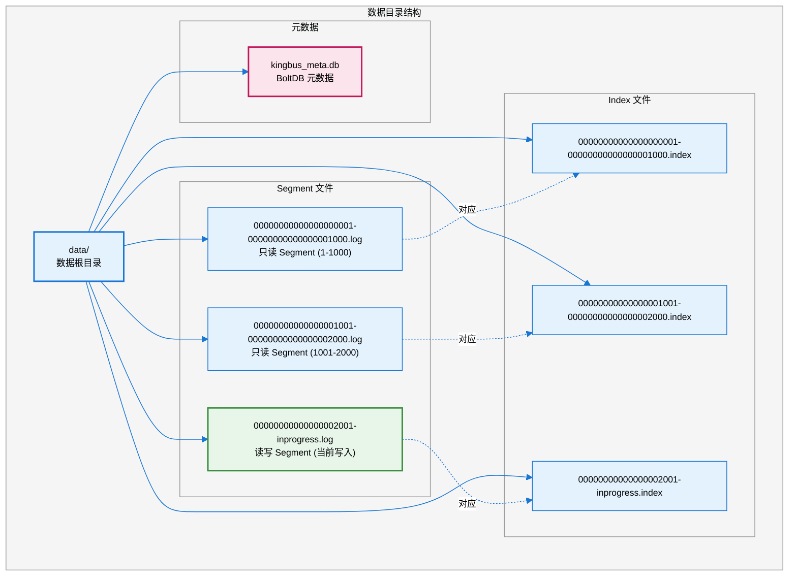

---

## 7. 数据格式

### 7.1 Record 格式

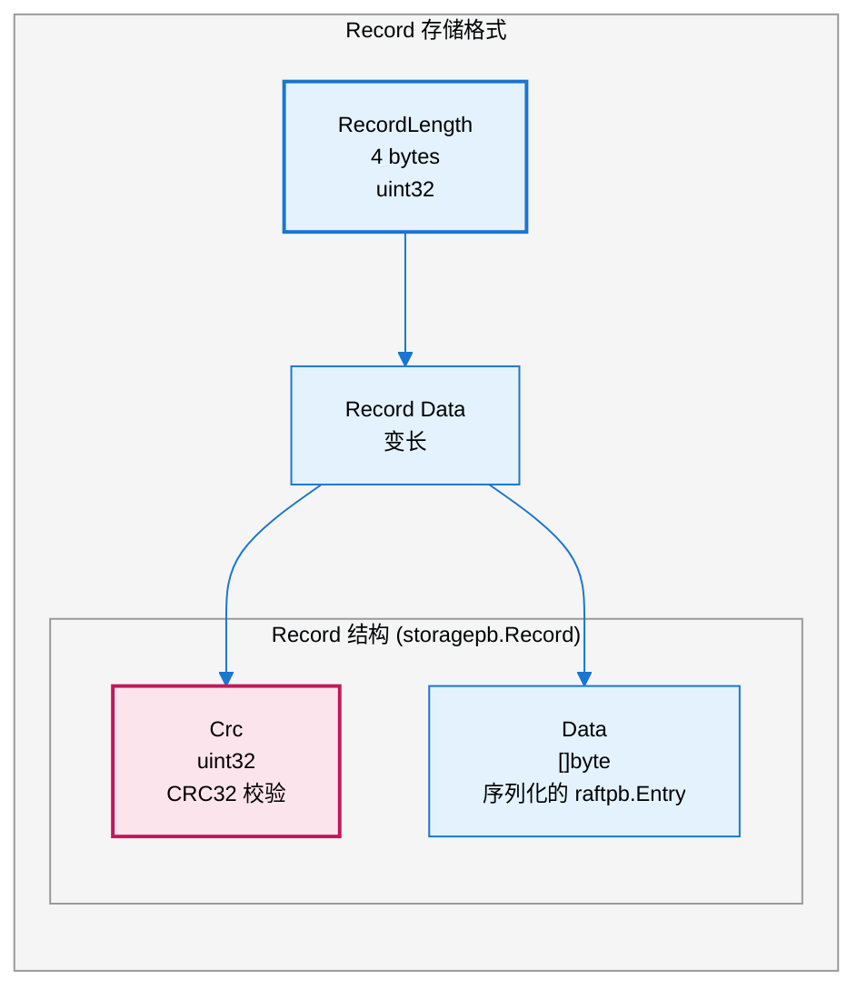

### 7.2 Index 格式

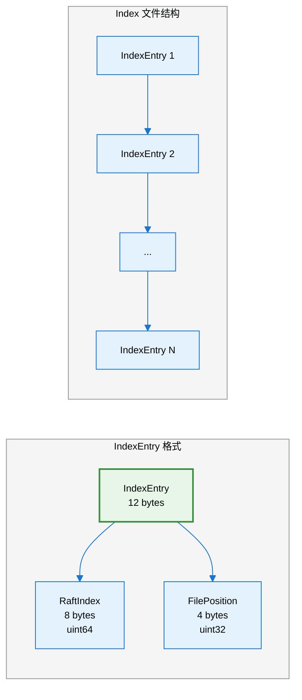

---

## 8. 元数据 Key 说明

| **Key** | **说明** | **值类型** |
|---------|---------|-----------|
| `raft_hard_state` | Raft HardState | JSON |
| `raft_conf_state` | Raft ConfState | JSON |
| `mysql/executed_gtid_set` | 已执行 GTID 集合 | 二进制编码 |
| `mysql/gtid_purged` | 已清理 GTID 集合 | 二进制编码 |
| `fde/{raftIndex}` | FDE 事件 | 原始字节 |
| `next_binlog/{raftIndex}` | 下一个 binlog 文件名 | 字符串 |
| `pge/{raftIndex}` | Previous GTID Event | 二进制编码 |
| `master_info` | Master 信息 | JSON |
| `syncer_args` | Syncer 配置 | JSON |
| `need_recover` | 恢复标志 | "true"/"false" |
| `raft_cluster` | Raft 集群配置 | JSON |
| `applied_index` | AppliedIndex | uint64 |

---

## 9. Mmap 使用

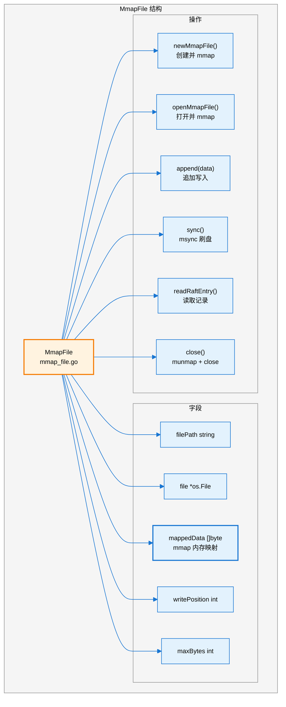

---

## 10. Metrics 指标

| **指标名** | **类型** | **文件** | **行号** | **说明** |
|-----------|---------|---------|---------|---------|
| `read_tps` | Meter | `storage/metrics.go` | 9 | 读取 TPS |
| `read_throughput` | Meter | `storage/metrics.go` | 10 | 读取吞吐量 |
| `read_latency` | Histogram | `storage/metrics.go` | 11 | 读取延迟 |
| `write_tps` | Meter | `storage/metrics.go` | 13 | 写入 TPS |
| `write_throughput` | Meter | `storage/metrics.go` | 14 | 写入吞吐量 |
| `write_latency` | Histogram | `storage/metrics.go` | 15 | 写入延迟 |

---

## 11. 配置参数

| **参数** | **默认值** | **说明** |
|---------|-----------|---------|
| `SegmentSize` | 1GB | 单个 Segment 文件大小 |
| `ReserveDataSize` | 配置文件 | 保留的数据大小（GB） |
| `FileMode` | 0600 | 文件权限 |
| `DirMode` | 0700 | 目录权限 |

---

## 12. 错误处理

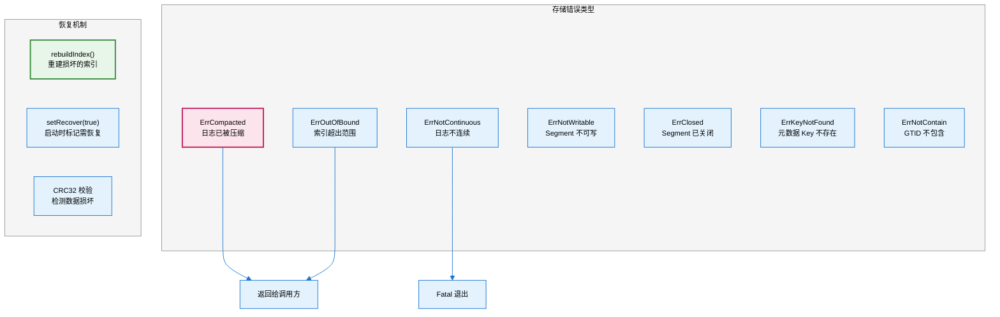

---

## 13. 依赖关系

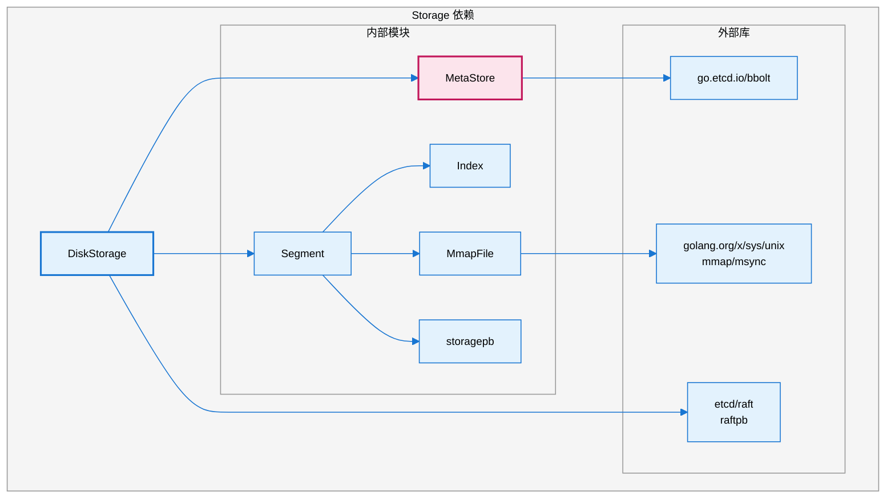

