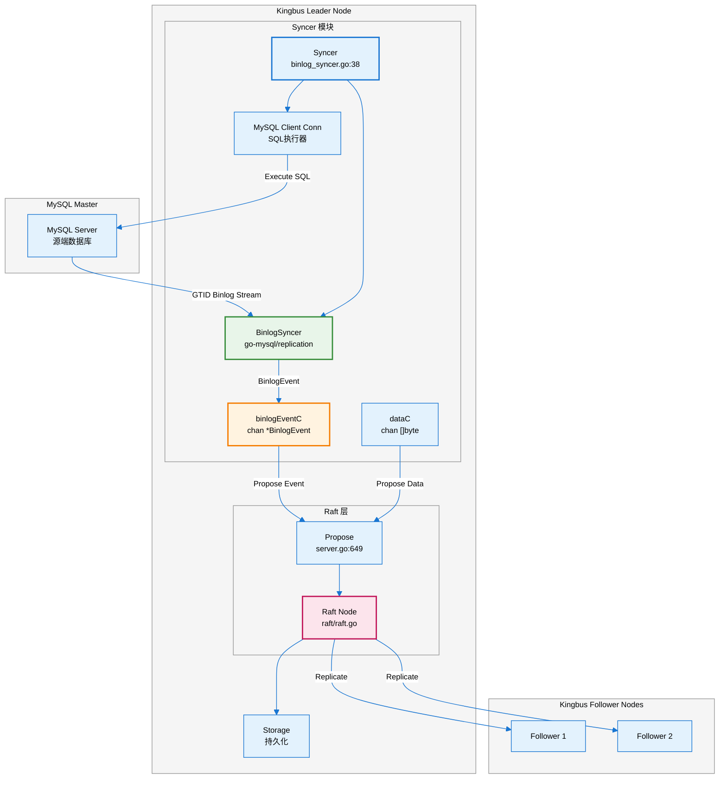
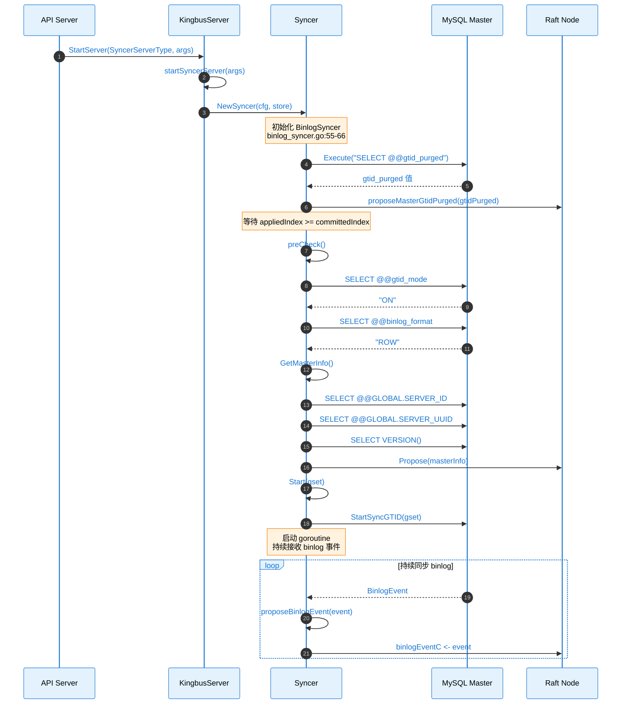
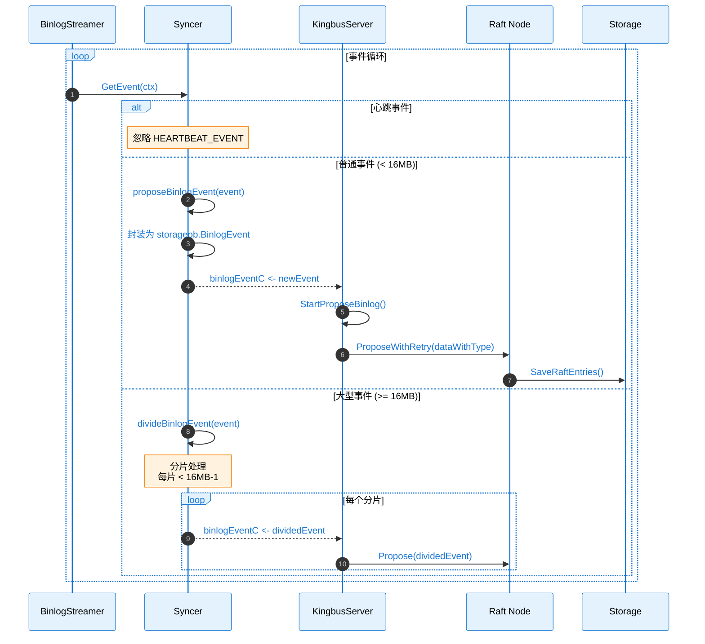
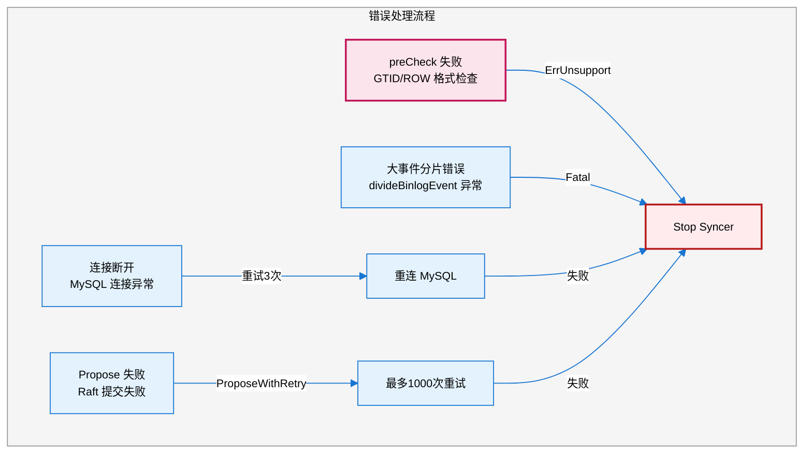
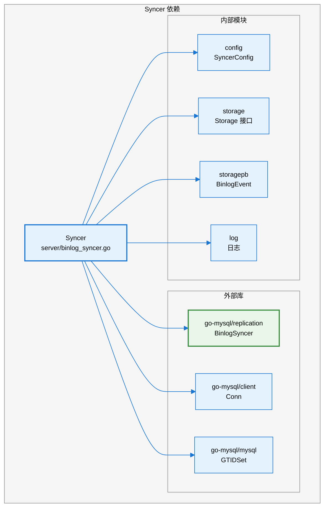

# Kingbus Syncer 模块分析

## 1. 模块概述

**Syncer** 模块是 Kingbus 的核心组件之一，它模拟 MySQL Slave 的行为，从上游 MySQL Master 拉取 binlog 事件，并通过 Raft 协议将这些事件同步到集群中的所有节点。

### 核心职责

- 连接 MySQL Master，验证复制前提条件
- 使用 GTID 模式从 Master 拉取 binlog 事件
- 将 binlog 事件提交到 Raft 集群进行复制
- 处理大型 binlog 事件的分片

---

## 2. 架构图



---

## 3. 时序图

### 3.1 Syncer 启动流程



### 3.2 Binlog 事件处理流程



---

## 4. 源码链路树状图

```mermaid
%%{init: {'theme': 'base', 'themeVariables': { 'fontSize': '12px', 'fontFamily': 'Arial', 'primaryColor': '#e3f2fd', 'primaryTextColor': '#000000', 'primaryBorderColor': '#1976d2', 'lineColor': '#1976d2', 'background': '#ffffff', 'clusterBkg': '#f5f5f5', 'clusterBorder': '#999999', 'edgeLabelBackground': '#ffffff'}}}%%
graph LR
    subgraph "Syncer 模块源码结构"
        
        ROOT["server/binlog_syncer.go"]
        
        subgraph "结构体定义"
            S1["Syncer struct<br/>Line: 38-52"]
            S1A["started *atomic.Bool"]
            S1B["cfg *config.SyncerConfig"]
            S1C["conn *client.Conn"]
            S1D["io *replication.BinlogSyncer"]
            S1E["binlogEventC chan *BinlogEvent"]
            S1F["dataC chan []byte"]
            S1G["store storage.Storage"]
        end
        
        subgraph "核心函数"
            F1["NewSyncer()<br/>Line: 55-66"]
            F2["Start(gset)<br/>Line: 127-174"]
            F3["Stop()<br/>Line: 313-327"]
            F4["preCheck()<br/>Line: 102-124"]
            F5["GetMasterInfo()<br/>Line: 223-279"]
            F6["Execute(sql)<br/>Line: 282-310"]
        end
        
        subgraph "事件处理"
            E1["proposeBinlogEvent()<br/>Line: 176-210"]
            E2["divideBinlogEvent()<br/>Line: 343-392"]
            E3["proposeMasterGtidPurged()<br/>Line: 84-99"]
            E4["getMasterGtidPurged()<br/>Line: 69-82"]
        end
        
        subgraph "Channel 访问"
            C1["BinlogEventC()<br/>Line: 213-215"]
            C2["DataC()<br/>Line: 218-220"]
        end
        
        ROOT --> S1
        S1 --> S1A & S1B & S1C & S1D & S1E & S1F & S1G
        ROOT --> F1 & F2 & F3 & F4 & F5 & F6
        ROOT --> E1 & E2 & E3 & E4
        ROOT --> C1 & C2
    end
    
    style ROOT fill:#e3f2fd,stroke:#1976d2,stroke-width:2px
    style S1 fill:#e8f5e9,stroke:#388e3c,stroke-width:2px
    style F2 fill:#fff3e0,stroke:#f57c00,stroke-width:2px
    style E1 fill:#fce4ec,stroke:#c2185b,stroke-width:2px
```



---

## 5. 关键代码路径表

| **功能** | **文件路径** | **行号** | **函数/结构体** |
|---------|-------------|---------|----------------|
| **Syncer 结构体定义** | `server/binlog_syncer.go` | 38-52 | `Syncer` |
| **创建 Syncer** | `server/binlog_syncer.go` | 55-66 | `NewSyncer()` |
| **启动同步** | `server/binlog_syncer.go` | 127-174 | `Start()` |
| **停止同步** | `server/binlog_syncer.go` | 313-327 | `Stop()` |
| **预检查** | `server/binlog_syncer.go` | 102-124 | `preCheck()` |
| **获取 Master 信息** | `server/binlog_syncer.go` | 223-279 | `GetMasterInfo()` |
| **执行 SQL** | `server/binlog_syncer.go` | 282-310 | `Execute()` |
| **提交 binlog 事件** | `server/binlog_syncer.go` | 176-210 | `proposeBinlogEvent()` |
| **大事件分片** | `server/binlog_syncer.go` | 343-392 | `divideBinlogEvent()` |
| **获取 Master gtid_purged** | `server/binlog_syncer.go` | 69-82 | `getMasterGtidPurged()` |
| **提交 gtid_purged** | `server/binlog_syncer.go` | 84-99 | `proposeMasterGtidPurged()` |
| **启动 Syncer 服务** | `server/server.go` | 855-904 | `startSyncerServer()` |
| **提交 binlog 事件到 Raft** | `server/server.go` | 592-621 | `StartProposeBinlog()` |
| **SyncerConfig 配置** | `config/config.go` | - | `SyncerConfig` |
| **SyncerArgs 参数** | `config/server_config.go` | - | `SyncerArgs` |
| **API 启动 Syncer** | `api/binlog_syncer_handler.go` | 41-98 | `StartBinlogSyncer()` |
| **API 停止 Syncer** | `api/binlog_syncer_handler.go` | 129-148 | `StopBinlogSyncer()` |
| **API 获取状态** | `api/binlog_syncer_handler.go` | 151-173 | `GetBinlogSyncerStatus()` |

---

## 6. 核心数据流图

```mermaid
%%{init: {'theme': 'base', 'themeVariables': { 'fontSize': '12px', 'fontFamily': 'Arial', 'primaryColor': '#e3f2fd', 'primaryTextColor': '#000000', 'primaryBorderColor': '#1976d2', 'lineColor': '#1976d2', 'background': '#ffffff', 'clusterBkg': '#f5f5f5', 'clusterBorder': '#999999', 'edgeLabelBackground': '#ffffff'}}}%%
flowchart TB
    subgraph "数据流向"
        
        A["MySQL Master<br/>binlog 事件源"] -->|"GTID Stream"| B["BinlogSyncer<br/>go-mysql 库"]
        B -->|"BinlogEvent"| C["Syncer.proposeBinlogEvent()<br/>Line: 176"]
        
        C -->|"< 16MB"| D["storagepb.BinlogEvent<br/>单事件封装"]
        C -->|">= 16MB"| E["divideBinlogEvent()<br/>Line: 343"]
        E -->|"分片"| D
        
        D -->|"binlogEventC"| F["KingbusServer<br/>StartProposeBinlog()"]
        F -->|"EncodeBinlogEvent"| G["Raft.Propose()<br/>提交到 Raft"]
        
        G --> H["Raft Log<br/>持久化"]
        H --> I["Apply<br/>状态机应用"]
    end
    
    style A fill:#e8f5e9,stroke:#388e3c,stroke-width:2px
    style C fill:#fff3e0,stroke:#f57c00,stroke-width:2px
    style E fill:#fce4ec,stroke:#c2185b,stroke-width:2px
    style G fill:#e3f2fd,stroke:#1976d2,stroke-width:2px
```



---

## 7. 配置参数

### SyncerConfig 结构

| **参数** | **类型** | **说明** |
|---------|---------|---------|
| `Host` | string | MySQL Master 地址 |
| `Port` | uint16 | MySQL Master 端口 |
| `User` | string | 复制用户名 |
| `Password` | string | 复制密码 |
| `Flavor` | string | MySQL/MariaDB |
| `SemiSyncEnabled` | bool | 半同步复制开关 |
| `BinlogSyncerConfig` | struct | go-mysql BinlogSyncer 配置 |

### Metrics 指标

| **指标名** | **文件** | **行号** | **说明** |
|-----------|---------|---------|---------|
| `syncer_eps` | `server/metrics.go` | 8 | Syncer 事件处理速率 |
| `propose_channel_size` | `server/metrics.go` | 11 | 待提交事件队列大小 |

---

## 8. 错误处理

### 关键错误场景



---

## 9. 依赖关系



---

## 10. 使用方式

### API 调用

```bash
# 启动 Syncer
curl -X PUT http://localhost:9595/binlog/syncer/start \
  -H "Content-Type: application/json" \
  -d '{
    "mysql_addr": "127.0.0.1:3306",
    "mysql_user": "repl",
    "mysql_password": "repl_password",
    "semi_sync": false
  }'

# 获取 Syncer 状态
curl http://localhost:9595/binlog/syncer/status

# 停止 Syncer
curl -X PUT http://localhost:9595/binlog/syncer/stop
```

### 响应示例

```json
{
  "message": "success",
  "data": {
    "mysql_addr": "127.0.0.1:3306",
    "mysql_user": "repl",
    "semi_sync": false,
    "status": "running",
    "current_gtid": "uuid:1-100",
    "last_binlog_file": "mysql-bin.000001",
    "last_file_position": 12345,
    "executed_gtid_set": "uuid:1-100"
  }
}
```

