# Kingbus Raft 接口与使用分析

## 1. 概述

Kingbus 使用 **etcd/raft** 库实现分布式一致性，将 MySQL binlog 事件作为 Raft 日志进行复制，确保集群中所有节点拥有一致的 binlog 数据。

### 核心设计理念

- **Raft 日志 = Binlog 事件**：每个 binlog 事件都作为一条 Raft Entry 提交
- **状态机 = Binlog 应用器**：Apply 操作更新 GTID 进度、保存元数据
- **持久化 = Segment 存储**：Raft 日志持久化到 Segment 文件

---

## 2. 架构图

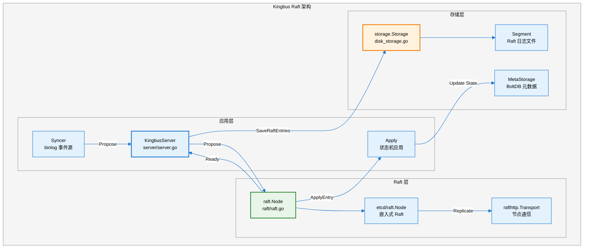

---

## 3. etcd/raft 接口解读

### 3.1 核心接口

Kingbus 实现或使用了以下 etcd/raft 接口：

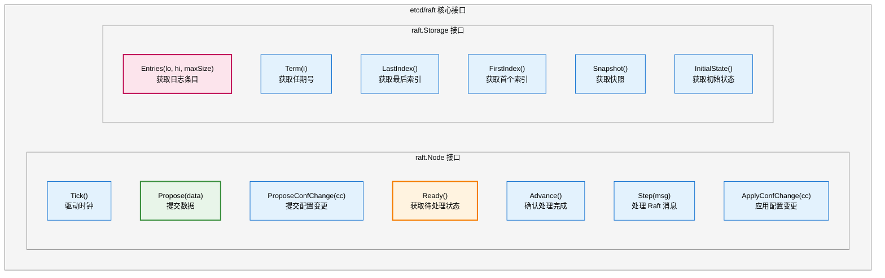

### 3.2 接口功能详解

| **接口** | **所属** | **功能** | **Kingbus 使用场景** |
|---------|---------|---------|---------------------|
| `Tick()` | Node | 驱动选举和心跳计时器 | 定时调用，触发心跳或选举 |
| `Propose(data)` | Node | 提交数据到 Raft | 提交 binlog 事件 |
| `ProposeConfChange(cc)` | Node | 提交成员变更 | 添加/删除集群节点 |
| `Ready()` | Node | 返回待处理的 Ready 状态 | 获取已提交条目、消息等 |
| `Advance()` | Node | 通知已处理完 Ready | Ready 处理后调用 |
| `Step(msg)` | Node | 处理来自其他节点的消息 | 处理网络收到的 Raft 消息 |
| `Entries(lo,hi,max)` | Storage | 读取日志范围 | 节点同步时读取日志 |
| `Term(i)` | Storage | 获取指定索引的任期 | Raft 一致性检查 |
| `LastIndex()` | Storage | 获取最后日志索引 | 判断日志边界 |
| `Snapshot()` | Storage | 获取快照 | Kingbus 未实现，返回不可用 |

---

## 4. Kingbus 的 Raft 使用流程

### 4.1 数据提交流程（Propose）

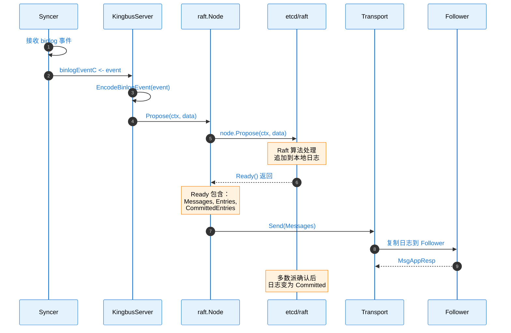

### 4.2 Ready 处理流程

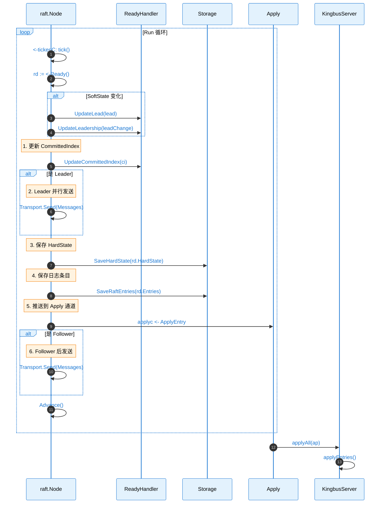

### 4.3 Apply 处理流程

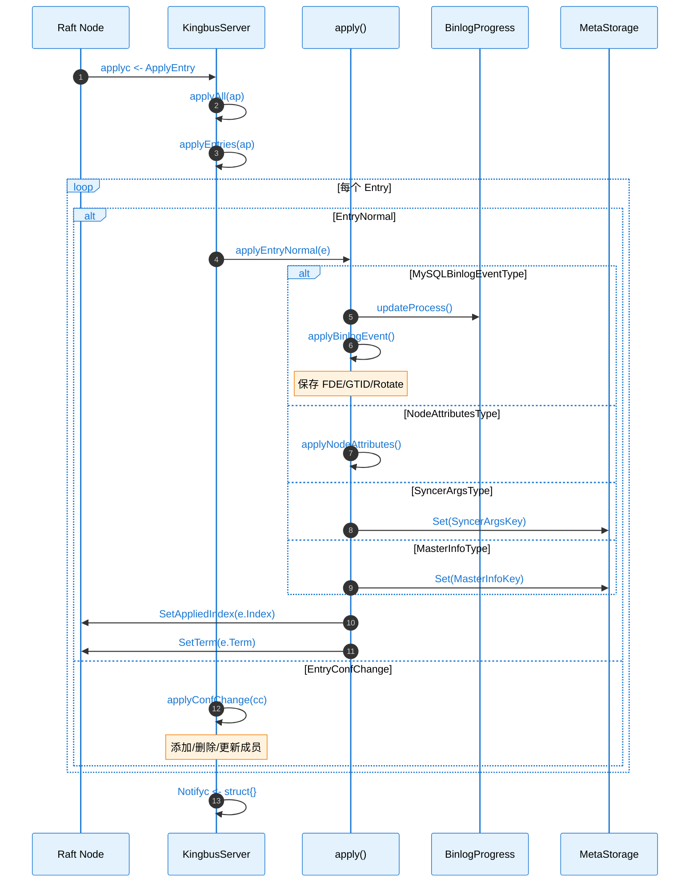

---

## 5. 源码链路树状图

### 5.1 Raft Node 封装

```mermaid
%%{init: {'theme': 'base', 'themeVariables': { 'fontSize': '12px', 'fontFamily': 'Arial', 'primaryColor': '#e3f2fd', 'primaryTextColor': '#000000', 'primaryBorderColor': '#1976d2', 'lineColor': '#1976d2', 'background': '#ffffff', 'clusterBkg': '#f5f5f5', 'clusterBorder': '#999999', 'edgeLabelBackground': '#ffffff'}}}%%
graph LR
    subgraph "raft/raft.go 源码结构"
        
        ROOT["raft/raft.go"]
        
        subgraph "Node 结构体 (Line: 45-69)"
            N1["tickMu *sync.Mutex"]
            N2["NodeConfig 嵌入"]
            N3["msgSnapC chan Message"]
            N4["applyc chan ApplyEntry"]
            N5["appliedIndex uint64"]
            N6["committedIndex uint64"]
            N7["term uint64"]
            N8["ticker *time.Ticker"]
            N9["stopped/done chan"]
        end
        
        subgraph "核心函数"
            F1["NewNode(cfg)<br/>Line: 103-122"]
            F2["Run(rh)<br/>Line: 213-311"]
            F3["Stop()<br/>Line: 186-193"]
            F4["Apply()<br/>Line: 196-198"]
            F5["tick()<br/>Line: 125-129"]
        end
        
        subgraph "辅助函数"
            H1["appendRaftEntries()<br/>Line: 314-337"]
            H2["updateCommittedIndex()<br/>Line: 339-347"]
            H3["processMessages()<br/>Line: 349-386"]
            H4["onStop()<br/>Line: 388-398"]
            H5["AdvanceTicks()<br/>Line: 404-408"]
        end
        
        subgraph "Index/Term 操作"
            I1["GetAppliedIndex()<br/>Line: 132-134"]
            I2["SetAppliedIndex()<br/>Line: 137-139"]
            I3["GetCommittedIndex()<br/>Line: 147-149"]
            I4["SetCommittedIndex()<br/>Line: 142-144"]
            I5["GetTerm()/SetTerm()<br/>Line: 152-159"]
        end
        
        ROOT --> N1 & N2 & N3 & N4 & N5 & N6 & N7 & N8 & N9
        ROOT --> F1 & F2 & F3 & F4 & F5
        ROOT --> H1 & H2 & H3 & H4 & H5
        ROOT --> I1 & I2 & I3 & I4 & I5
    end
    
    style ROOT fill:#e3f2fd,stroke:#1976d2,stroke-width:2px
    style F2 fill:#e8f5e9,stroke:#388e3c,stroke-width:2px
```

### 5.2 Apply 模块

```mermaid
%%{init: {'theme': 'base', 'themeVariables': { 'fontSize': '12px', 'fontFamily': 'Arial', 'primaryColor': '#e3f2fd', 'primaryTextColor': '#000000', 'primaryBorderColor': '#1976d2', 'lineColor': '#1976d2', 'background': '#ffffff', 'clusterBkg': '#f5f5f5', 'clusterBorder': '#999999', 'edgeLabelBackground': '#ffffff'}}}%%
graph LR
    subgraph "server/apply.go 源码结构"
        
        ROOT["server/apply.go"]
        
        subgraph "入口函数"
            E1["applyAll(ap)<br/>Line: 51-59"]
            E2["applyEntries(ap)<br/>Line: 61-83"]
            E3["apply(es)<br/>Line: 93-115"]
        end
        
        subgraph "Normal Entry 处理"
            N1["applyEntryNormal(e)<br/>Line: 118-141"]
            N2["applyMySQLBinlogEvent(e)<br/>Line: 144-168"]
            N3["applyBinlogEvent()<br/>Line: 214-287"]
            N4["applyNodeAttributes(e)<br/>Line: 289-302"]
            N5["applySyncerArgs(e)<br/>Line: 304-318"]
            N6["applyMasterInfo(e)<br/>Line: 371-386"]
            N7["applyMasterGtidPurged(e)<br/>Line: 172-211"]
        end
        
        subgraph "ConfChange 处理"
            C1["applyConfChange(cc)<br/>Line: 322-369"]
            C2["saveConfState()<br/>Line: 388-403"]
        end
        
        subgraph "辅助函数"
            H1["needApply(eventType)<br/>Line: 405-410"]
        end
        
        ROOT --> E1 & E2 & E3
        ROOT --> N1 & N2 & N3 & N4 & N5 & N6 & N7
        ROOT --> C1 & C2
        ROOT --> H1
    end
    
    style ROOT fill:#e8f5e9,stroke:#388e3c,stroke-width:2px
    style N2 fill:#fff3e0,stroke:#f57c00,stroke-width:2px
```

---

## 6. 关键代码路径表

| **功能** | **文件路径** | **行号** | **函数/结构体** |
|---------|-------------|---------|----------------|
| **Node 结构体** | `raft/raft.go` | 45-69 | `Node` |
| **NodeConfig 配置** | `raft/raft.go` | 83-100 | `NodeConfig` |
| **ApplyEntry 结构** | `raft/raft.go` | 75-80 | `ApplyEntry` |
| **ReadyHandler 结构** | `raft/raft.go` | 178-183 | `ReadyHandler` |
| **创建 Node** | `raft/raft.go` | 103-122 | `NewNode()` |
| **运行 Raft** | `raft/raft.go` | 213-311 | `Run()` |
| **停止 Raft** | `raft/raft.go` | 186-193 | `Stop()` |
| **追加日志** | `raft/raft.go` | 314-337 | `appendRaftEntries()` |
| **处理消息** | `raft/raft.go` | 349-386 | `processMessages()` |
| **启动 etcd Raft** | `server/server.go` | 450-481 | `startEtcdRaftNode()` |
| **重启 etcd Raft** | `server/server.go` | 483-516 | `restartEtcdNode()` |
| **运行 Raft 循环** | `server/server.go` | 386-409 | `runRaft()` |
| **Propose 数据** | `server/server.go` | 649-654 | `Propose()` |
| **Propose 带重试** | `server/server.go` | 657-677 | `ProposeWithRetry()` |
| **Apply 全部** | `server/apply.go` | 51-59 | `applyAll()` |
| **Apply 条目** | `server/apply.go` | 61-83 | `applyEntries()` |
| **Apply Binlog** | `server/apply.go` | 144-168 | `applyMySQLBinlogEvent()` |
| **Apply ConfChange** | `server/apply.go` | 322-369 | `applyConfChange()` |

---

## 7. Storage 接口实现

Kingbus 通过 `DiskStorage` 实现 Raft Storage 接口：

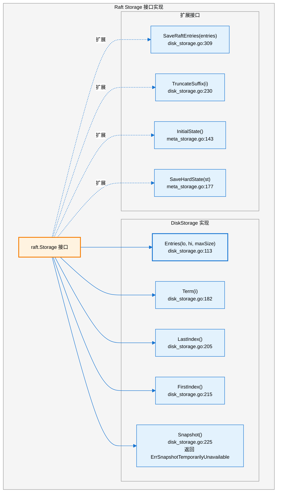

---

## 8. Raft 配置参数

### 8.1 Raft 配置结构

```go
// etcd/raft.Config 配置项（server/server.go:465-476）
c := &etcdraft.Config{
    ID:                        uint64(id),
    ElectionTick:              int(cfg.ElectionTimeoutMs / cfg.HeartbeatMs),
    HeartbeatTick:             1,
    Storage:                   store,
    MaxSizePerMsg:             cfg.MaxRequestBytes,
    MaxInflightMsgs:           512,  // maxInflightMsgs
    CheckQuorum:               true,
    PreVote:                   cfg.PreVote,
    DisableProposalForwarding: true,
    Logger:                    &LoggerAdapter{log.Log},
}
```

### 8.2 配置参数说明

| **参数** | **配置位置** | **默认值** | **说明** |
|---------|-------------|-----------|---------|
| `ElectionTimeoutMs` | config.yaml | 1000ms | 选举超时时间 |
| `HeartbeatMs` | config.yaml | 100ms | 心跳间隔 |
| `MaxRequestBytes` | config.yaml | 1.5MB | 单条消息最大大小 |
| `PreVote` | config.yaml | true | 启用 PreVote 优化 |
| `MaxInflightMsgs` | 硬编码 | 512 | 最大在途消息数 |
| `CheckQuorum` | 硬编码 | true | 检查 Quorum |

---

## 9. 数据类型与编码

### 9.1 Entry Data 类型

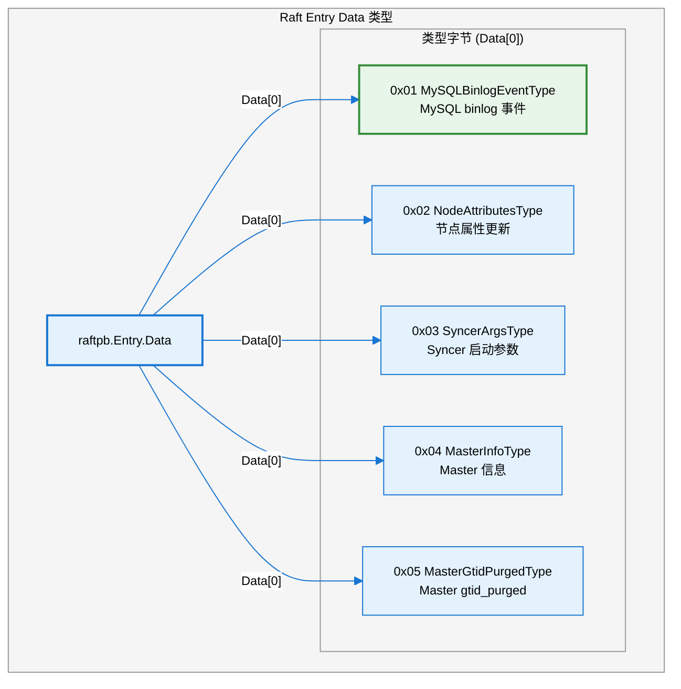

### 9.2 编码格式

```
Raft Entry Data 格式：
+--------+------------------+
| 1 byte |    N bytes       |
+--------+------------------+
|  Type  |  Payload (JSON/  |
|        |  Protobuf)       |
+--------+------------------+

Type:
  - 0x01: BinlogEvent (Protobuf)
  - 0x02: NodeAttributes (JSON)
  - 0x03: SyncerArgs (JSON)
  - 0x04: MasterInfo (JSON)
  - 0x05: MasterGtidPurged (JSON)
```

---

## 10. Leader 选举与故障转移

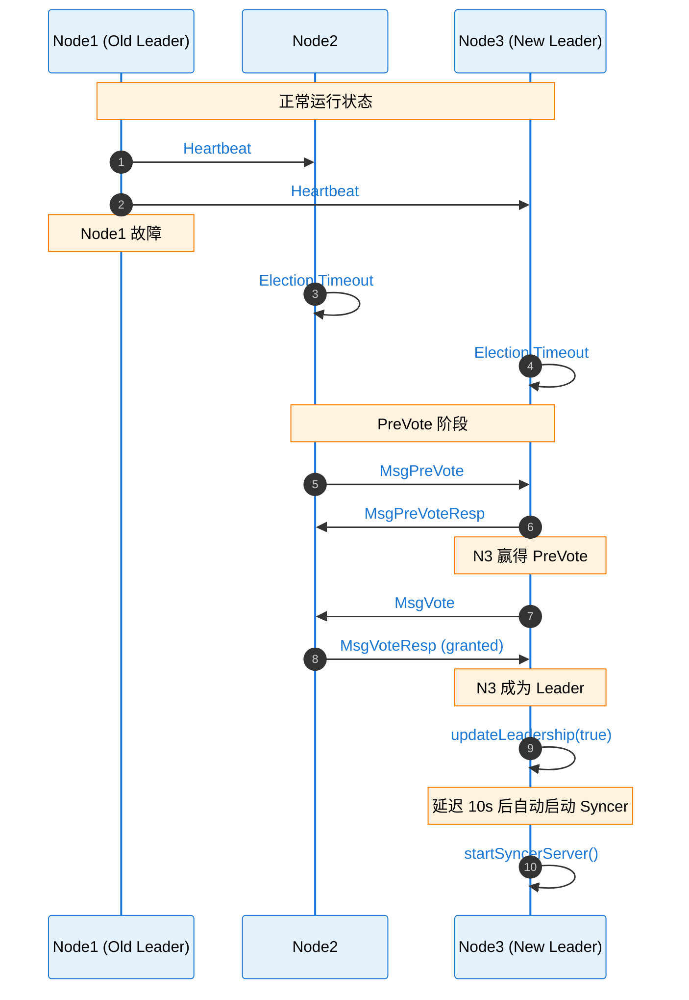

### 10.1 Leader 变更处理

```go
// server/server.go:329-378
func (s *KingbusServer) updateLeadership(leadChange bool) {
    // 非 Leader 时停止 Syncer
    if s.IsLeader() == false && s.IsSyncerStarted() {
        s.StopServer(config.SyncerServerType)
        return
    }

    // 成为新 Leader 后，延迟 10s 自动启动 Syncer
    if leadChange && s.IsLeader() {
        go func() {
            <-time.After(time.Second * 10)
            // 从存储读取 SyncerArgs
            value, _ := s.store.Get(SyncerArgsKey)
            if value != nil {
                s.StartServer(config.SyncerServerType, &syncerArgs)
            }
        }()
    }
}
```

---

## 11. 依赖关系

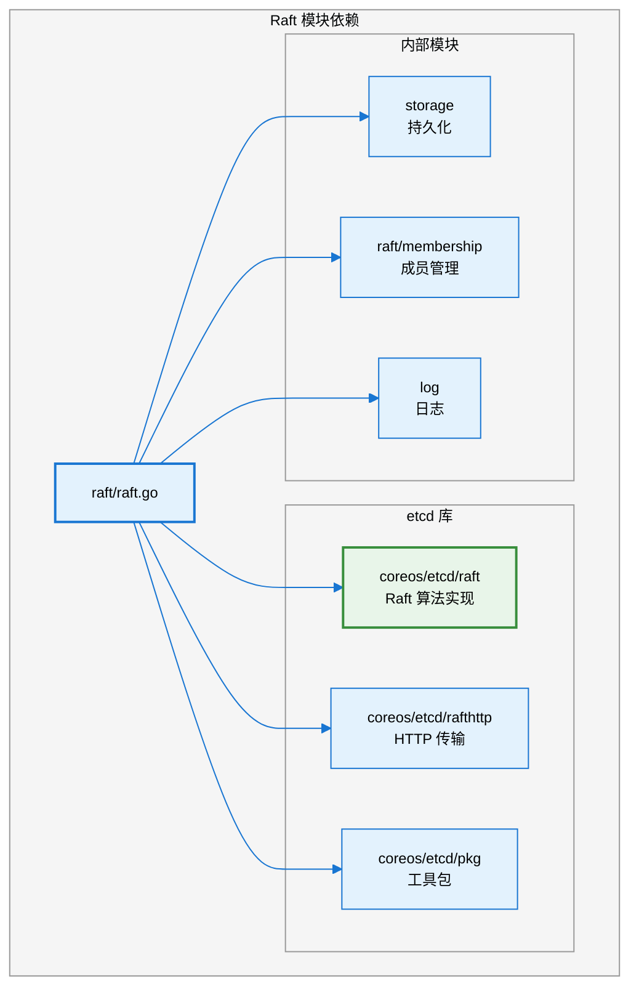

