# Kingbus 资源需求与连接管理分析

## 概述

本文档深入分析 Kingbus 系统的资源需求，包括 CPU、内存、磁盘的最小/最大需求，连接管理机制，内存结构（特别是 mmap 的使用），以及资源超售场景下的指标设计。

## 1. 资源需求分析

### 1.1 资源需求总览

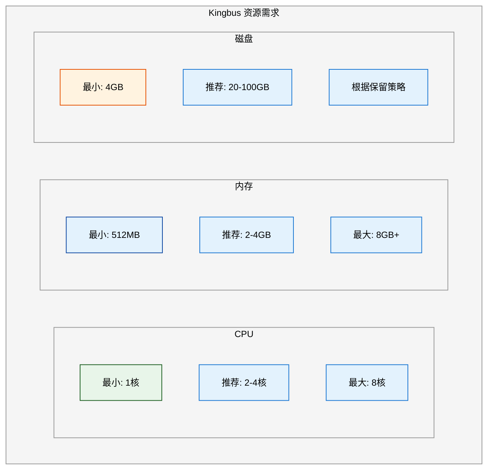

### 1.2 详细资源分析

#### 1.2.1 CPU需求

| 场景 | CPU需求 | 主要消耗点 |
|-----|--------|-----------|
| **最小配置** | 1核 | 单节点测试环境 |
| **轻负载** | 2核 | 低binlog流量(<100 TPS) |
| **中等负载** | 4核 | 中等binlog流量(100-1000 TPS) |
| **高负载** | 8核 | 高binlog流量(>1000 TPS)，多Slave连接 |

**CPU消耗点分析**：

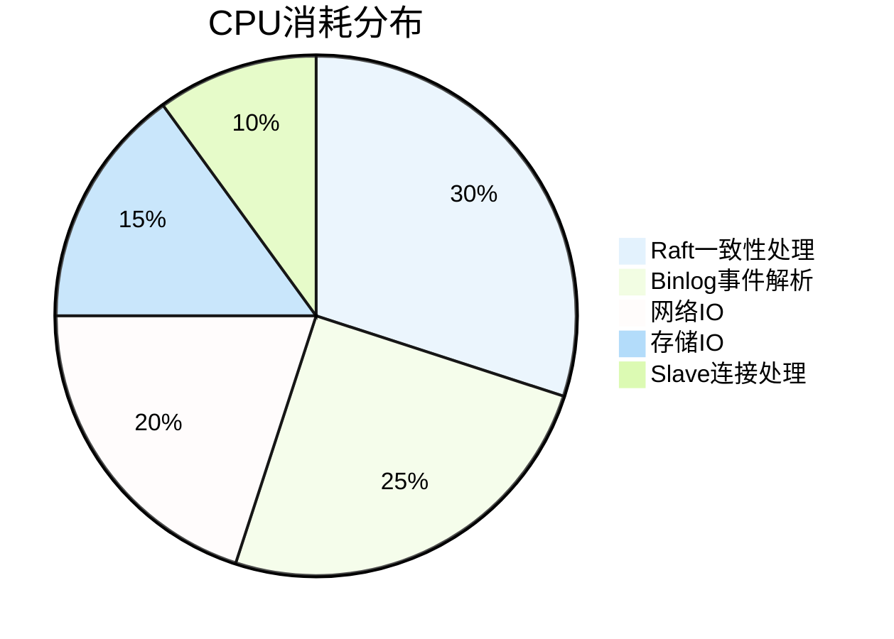

#### 1.2.2 内存需求

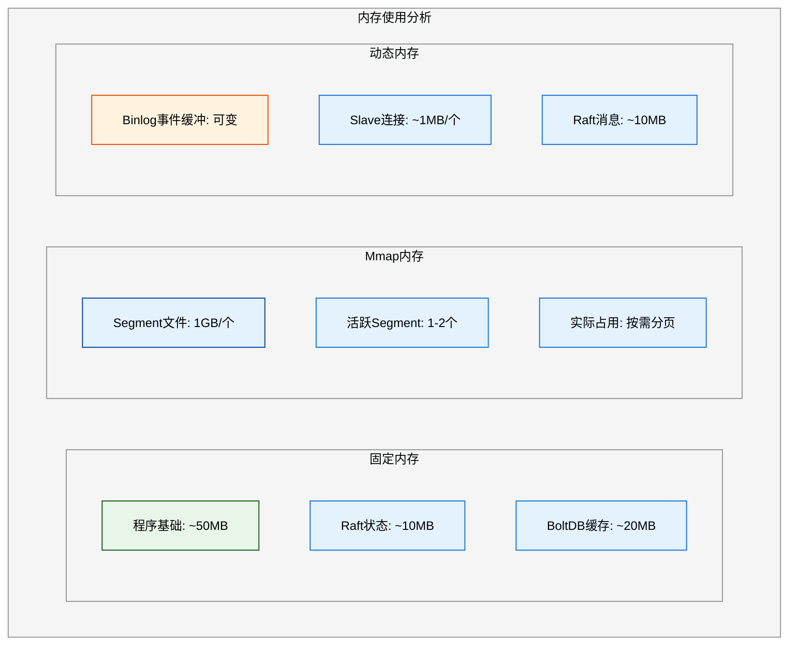

**内存计算公式**：

```
最小内存 = 基础内存(~100MB) + 活跃mmap页面(~200MB) + 缓冲区(~200MB)
        ≈ 500MB

推荐内存 = 基础内存(~100MB) + mmap(~1GB) + 缓冲区(~500MB) + Slave连接(N*1MB)
        ≈ 2-4GB

最大内存 = 取决于Slave数量和binlog流量
        ≈ 4-8GB+
```

#### 1.2.3 磁盘需求

```go
// 源码中的磁盘配置
const (
    SegmentSize = 1GB  // 每个Segment文件大小
)

// 配置参数
// kingbus.yaml
reserve-data-size: 20  // 保留20GB数据，最小4GB
```

| 配置 | 磁盘需求 | Segment数量 |
|-----|---------|-------------|
| **最小** | 4GB | 4个Segment |
| **推荐** | 20-50GB | 20-50个Segment |
| **大规模** | 100GB+ | 100+个Segment |

**磁盘使用计算**：

```
磁盘使用 = reserve-data-size(GB) + 元数据(~100MB) + 索引文件(~Segment数*12MB)
```

## 2. 连接管理分析

### 2.1 连接架构

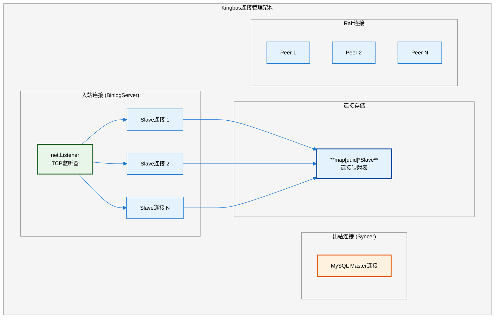

### 2.2 Slave连接管理

```go
// server/binlog_server.go
type BinlogServer struct {
    started *atomic.Bool
    cfg     *config.BinlogServerConfig
    
    listener net.Listener
    errch    chan error
    
    l      sync.RWMutex
    slaves map[string]*mysql.Slave  // key是UUID，没有数量限制
    
    broadcast   *utils.Broadcast
    kingbusInfo KingbusInfo
    store       storage.Storage
}
```

#### 2.2.1 连接数量限制

**当前实现: 无硬性连接数限制**

```go
// BinlogServer.Start() - 接受连接循环
func (s *BinlogServer) Start() {
    go func() {
        for s.started.Load() {
            select {
            case err := <-s.errch:
                s.Stop()
                return
            default:
                conn, err := s.listener.Accept()  // 无连接数限制
                if err != nil {
                    continue
                }
                go s.onConn(conn)  // 每个连接一个goroutine
            }
        }
    }()
}
```

#### 2.2.2 单连接资源占用

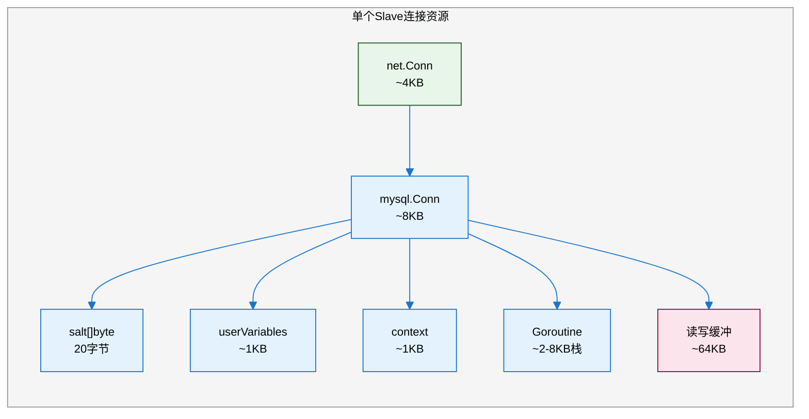

**单连接内存估算**:

```
单连接内存 = net.Conn(4KB) + mysql.Conn结构(10KB) + Goroutine栈(2-8KB) + 读写缓冲(64KB)
          ≈ 80-90KB (空闲)
          ≈ 1MB (活跃传输时)
```

### 2.3 最大连接数分析

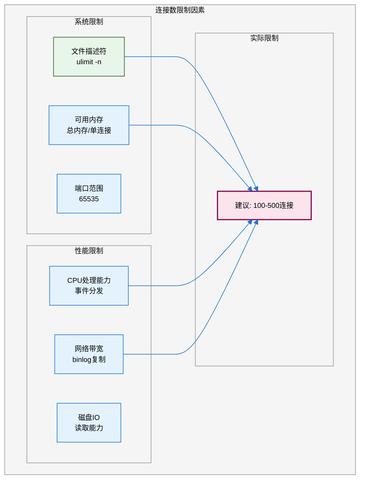

**连接数估算公式**:

```
理论最大连接 = min(
    文件描述符限制 - 预留(100),
    可用内存(MB) / 单连接内存(1MB),
    CPU核数 * 100  # 经验值
)

实际建议:
- 4核/4GB: 最多 100-200 连接
- 8核/8GB: 最多 300-500 连接
- 16核/16GB: 最多 500-1000 连接
```

## 3. 内存结构分析 (Mmap使用)

### 3.1 Mmap使用场景

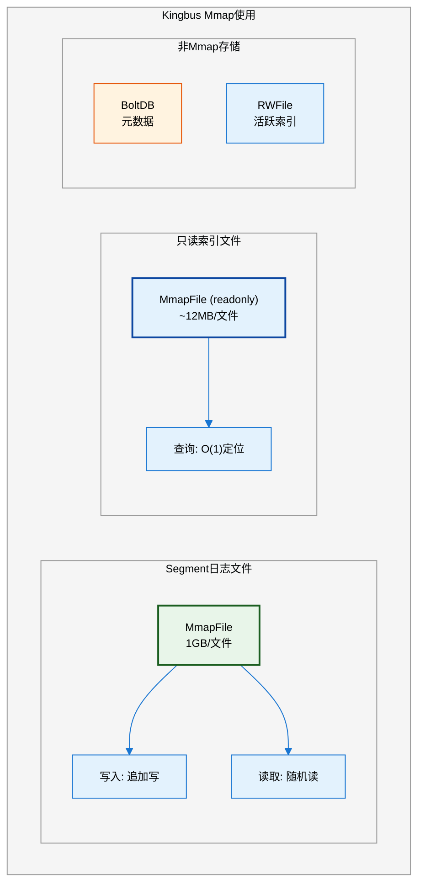

### 3.2 Mmap实现细节

```go
// storage/mmap_file.go
type MmapFile struct {
    file          *os.File
    filePath      string
    mappedData    []byte      // mmap映射的内存区域
    writePosition int
    syncPosition  int
    maxBytes      int         // = SegmentSize (1GB)
}

// 创建新的mmap文件
func newMmapFile(dir string, name string, fileSize int64) *MmapFile {
    // 1. 预分配文件空间
    fileutil.Preallocate(f.file, fileSize, true)
    
    // 2. 创建mmap映射
    f.mappedData, _ = syscall.Mmap(
        int(f.file.Fd()), 
        0, 
        int(fileSize),
        syscall.PROT_READ|syscall.PROT_WRITE,  // 读写权限
        syscall.MAP_SHARED|syscall.MAP_NORESERVE, // 共享映射，不预留swap
    )
    return f
}
```

### 3.3 Mmap内存特点

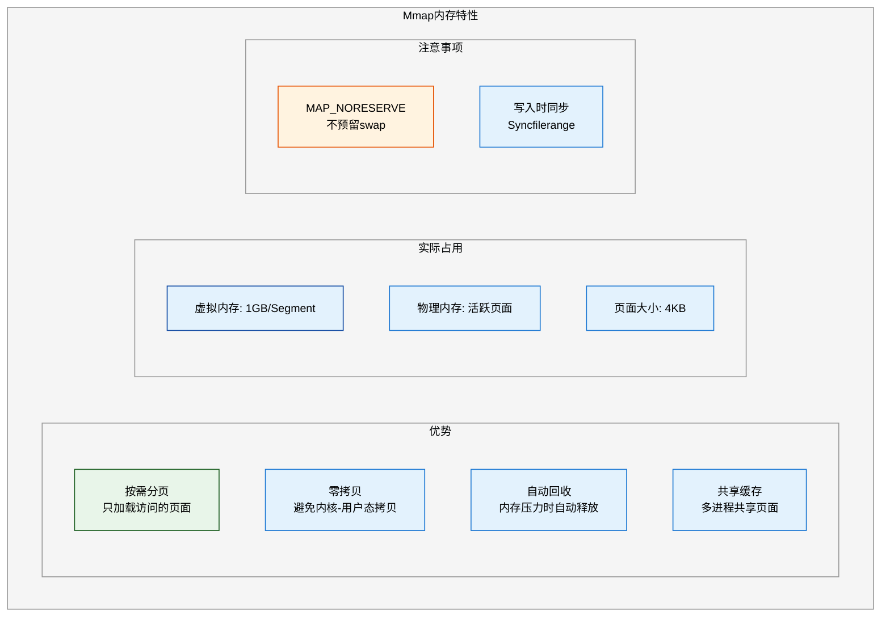

**关键代码**:

```go
// 写入时不立即刷盘
func (f *MmapFile) append(data []byte) (int, error) {
    startPos := f.writePosition
    copy(f.mappedData[startPos:startPos+len(data)], data)  // 直接复制到mmap区域
    f.writePosition += len(data)
    return startPos, nil
}

// 显式同步到磁盘
func (f *MmapFile) sync() error {
    return utils.Syncfilerange(
        f.file.Fd(),
        int64(f.syncPosition),
        int64(f.writePosition-f.syncPosition),
        utils.SYNC_FILE_RANGE_WAIT_BEFORE|utils.SYNC_FILE_RANGE_WRITE|utils.SYNC_FILE_RANGE_WAIT_AFTER,
    )
}
```

### 3.4 内存使用总结

| 组件 | 是否Mmap | 大小 | 说明 |
|-----|---------|------|------|
| **Segment日志** | ✅ | 1GB/文件 | 按需分页，实际占用远小于1GB |
| **只读索引** | ✅ | ~12MB/文件 | 只读mmap，查询高效 |
| **活跃索引** | ❌ | ~12MB | 内存数组 + 缓冲写入 |
| **BoltDB** | ❌ | ~20MB | 自带缓存管理 |
| **Raft日志缓冲** | ❌ | ~10MB | 待提交的entries |
| **Binlog事件** | ❌ | 可变 | 1000个事件通道 |

## 4. 资源超售与监控指标设计

### 4.1 资源超售场景

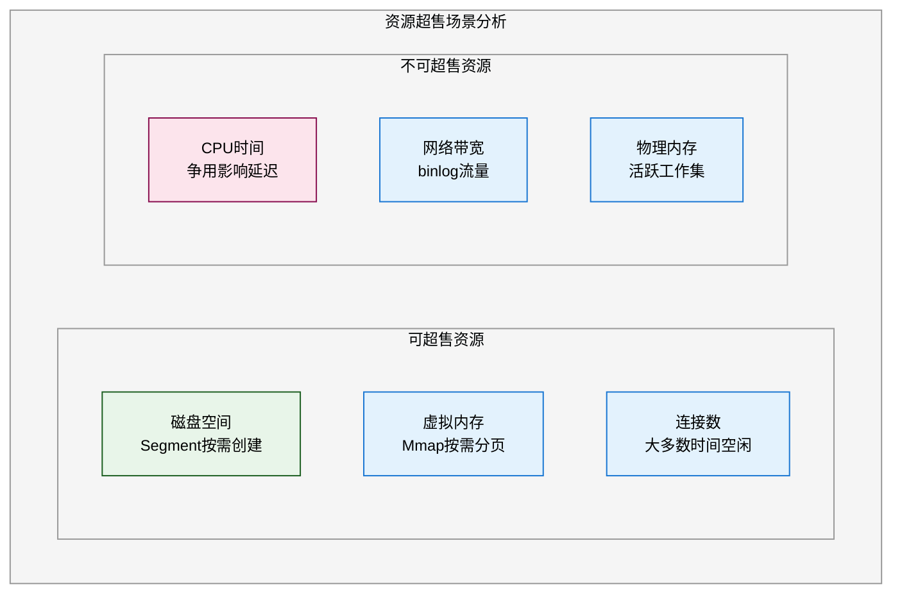

### 4.2 核心监控指标

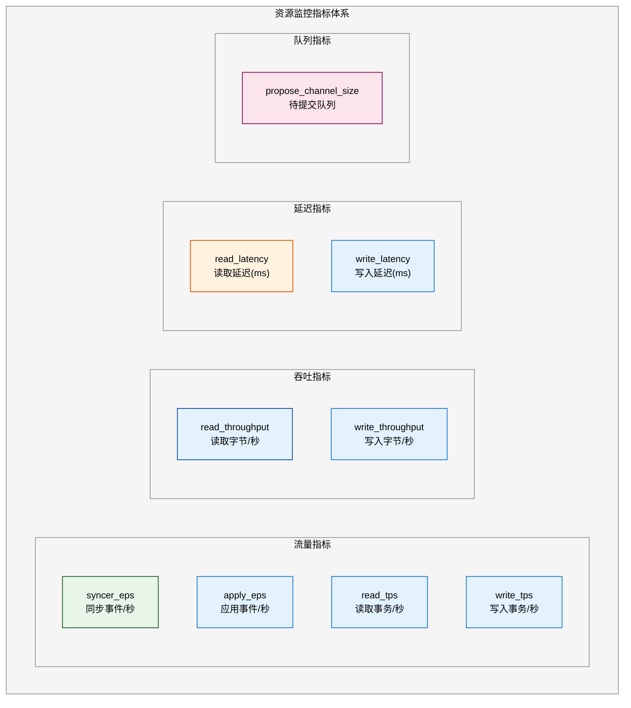

### 4.3 超售决策指标设计

#### 4.3.1 需要暴露的新指标

```go
// 建议添加的监控指标
var (
    // 连接相关
    slaveConnectionCount  = metrics.NewGauge()   // 当前Slave连接数
    slaveConnectionMax    = metrics.NewGauge()   // 最大Slave连接数
    activeSlaveCount      = metrics.NewGauge()   // 活跃传输的Slave数
    
    // 内存相关
    mmapVirtualMemory     = metrics.NewGauge()   // mmap虚拟内存总量
    mmapResidentMemory    = metrics.NewGauge()   // mmap常驻物理内存
    heapMemory            = metrics.NewGauge()   // Go堆内存使用
    
    // 存储相关
    segmentCount          = metrics.NewGauge()   // Segment文件数量
    segmentTotalSize      = metrics.NewGauge()   // Segment总大小
    diskUsagePercent      = metrics.NewGauge()   // 磁盘使用率
    
    // Raft相关
    raftLag               = metrics.NewGauge()   // committed - applied
    leaderChanges         = metrics.NewCounter() // Leader切换次数
    
    // 复制延迟
    replicationLag        = metrics.NewGauge()   // 与Master的延迟(秒)
    slaveReplicationLag   = metrics.NewHistogram() // 各Slave的延迟分布
)
```

#### 4.3.2 机器学习预估模型输入

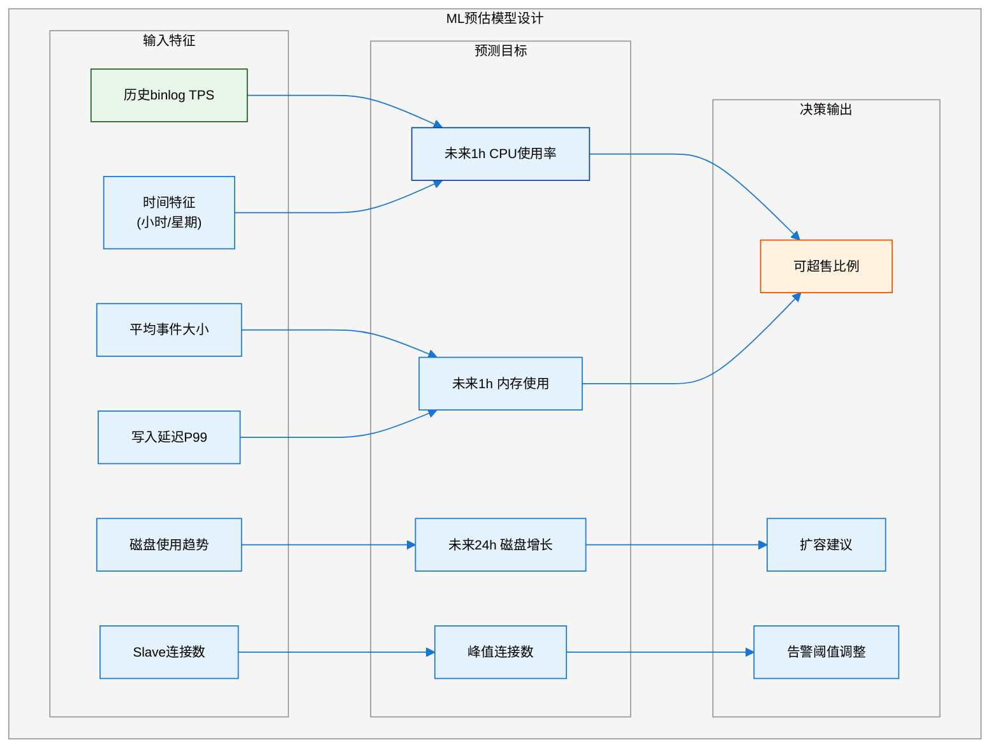

### 4.4 超售决策规则

#### 4.4.1 安全超售比例

| 资源类型 | 安全超售比例 | 依据 |
|---------|-------------|------|
| **磁盘** | 1.5-2x | Segment按需创建，可预测增长 |
| **虚拟内存** | 3-5x | Mmap按需分页，大部分不常驻 |
| **连接数** | 2-3x | 大多数连接空闲时间长 |
| **CPU** | 1.2-1.5x | 允许短期突发 |
| **物理内存** | 1.0-1.2x | 不建议过度超售 |

#### 4.4.2 告警阈值设计

```yaml
# 资源超售告警规则
alerts:
  # CPU告警
  - name: HighCPUUsage
    condition: cpu_usage > 80%
    duration: 5m
    action: 考虑扩容或减少超售
    
  # 内存告警
  - name: HighMemoryUsage
    condition: memory_usage > 85%
    duration: 5m
    action: 检查mmap页面回收
    
  # 磁盘告警
  - name: DiskSpaceWarning
    condition: disk_usage > 75%
    duration: 1h
    action: 检查日志清理策略
    
  # 连接告警
  - name: HighConnectionCount
    condition: slave_count > max_recommended * 0.8
    duration: 10m
    action: 考虑扩容或负载均衡
    
  # 复制延迟告警
  - name: ReplicationLag
    condition: replication_lag > 10s
    duration: 1m
    action: 检查网络/磁盘IO
```

### 4.5 Prometheus指标实现建议

```go
// 建议添加到 server/metrics.go

import (
    "github.com/prometheus/client_golang/prometheus"
)

var (
    // 连接指标
    SlaveConnections = prometheus.NewGauge(prometheus.GaugeOpts{
        Name: "kingbus_slave_connections",
        Help: "Current number of slave connections",
    })
    
    ActiveSlaves = prometheus.NewGauge(prometheus.GaugeOpts{
        Name: "kingbus_active_slaves",
        Help: "Number of slaves actively receiving data",
    })
    
    // 内存指标
    MmapVirtualBytes = prometheus.NewGauge(prometheus.GaugeOpts{
        Name: "kingbus_mmap_virtual_bytes",
        Help: "Total mmap virtual memory in bytes",
    })
    
    MmapResidentBytes = prometheus.NewGauge(prometheus.GaugeOpts{
        Name: "kingbus_mmap_resident_bytes",
        Help: "Mmap resident memory in bytes",
    })
    
    // 存储指标
    SegmentCount = prometheus.NewGauge(prometheus.GaugeOpts{
        Name: "kingbus_segment_count",
        Help: "Number of segment files",
    })
    
    // 复制延迟
    ReplicationLag = prometheus.NewGauge(prometheus.GaugeOpts{
        Name: "kingbus_replication_lag_seconds",
        Help: "Replication lag from MySQL master in seconds",
    })
    
    // Raft延迟
    RaftApplyLag = prometheus.NewGauge(prometheus.GaugeOpts{
        Name: "kingbus_raft_apply_lag",
        Help: "Difference between committed and applied index",
    })
)

func init() {
    prometheus.MustRegister(SlaveConnections)
    prometheus.MustRegister(ActiveSlaves)
    prometheus.MustRegister(MmapVirtualBytes)
    prometheus.MustRegister(MmapResidentBytes)
    prometheus.MustRegister(SegmentCount)
    prometheus.MustRegister(ReplicationLag)
    prometheus.MustRegister(RaftApplyLag)
}
```

## 5. 资源容量规划

### 5.1 容量规划公式

```
=== CPU规划 ===
所需CPU核数 = max(
    binlog_tps / 1000,           # 每1000 TPS约需1核
    slave_count / 50,            # 每50个Slave约需1核
    2                            # 最小2核
)

=== 内存规划 ===
所需内存(GB) = 
    0.5                          # 基础内存
    + active_segment_count * 0.5 # 活跃Segment页面
    + slave_count * 0.001        # Slave连接
    + binlog_buffer / 1024       # 事件缓冲

=== 磁盘规划 ===
所需磁盘(GB) = 
    daily_binlog_size * retention_days  # 保留天数的binlog
    + 索引开销(约10%)
    + 安全余量(20%)
```

### 5.2 配置建议

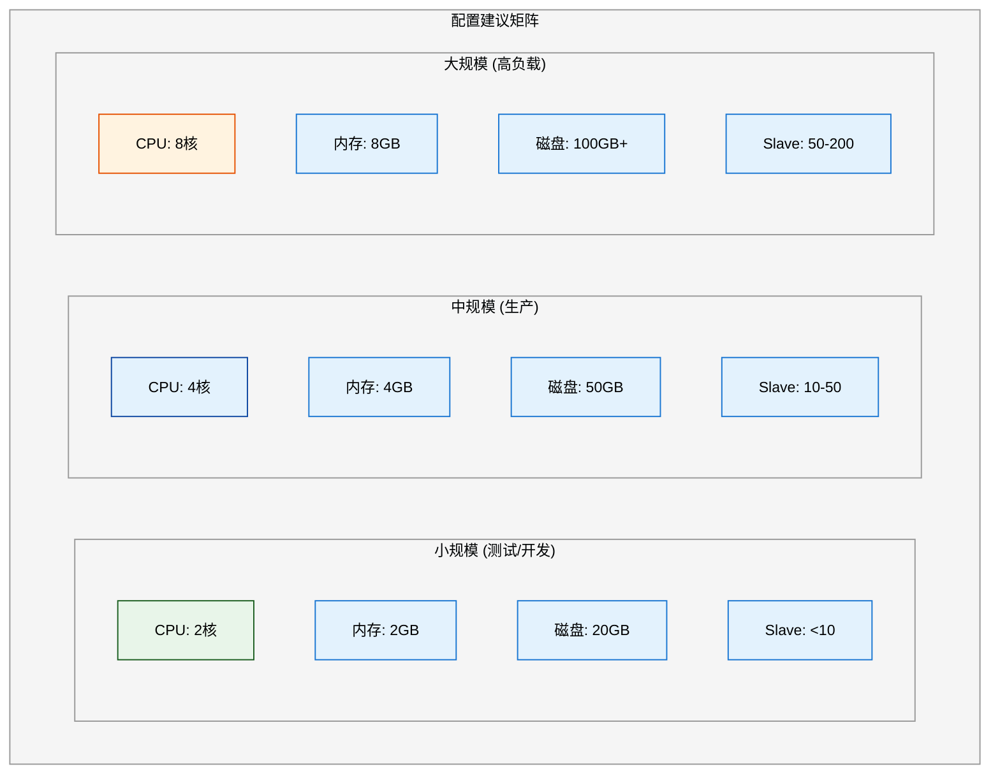

## 6. 总结

### 6.1 资源特性总结

| 特性 | 描述 |
|-----|------|
| **Mmap优势** | 按需分页，虚拟内存远大于物理占用 |
| **连接无限制** | 代码未设硬限制，取决于系统资源 |
| **可超售资源** | 磁盘、虚拟内存、连接数 |
| **不可超售** | CPU、物理内存、网络带宽 |

### 6.2 监控重点

1. **必监控指标**: syncer_eps, apply_eps, write_latency, propose_channel_size
2. **建议添加**: slave_connections, mmap_resident_bytes, replication_lag
3. **ML预估输入**: 历史TPS, 事件大小, 连接数, 时间特征

### 6.3 超售建议

- **保守策略**: CPU 1.2x, 内存 1.0x, 磁盘 1.5x
- **激进策略**: CPU 1.5x, 内存 1.2x, 磁盘 2.0x
- **前提条件**: 完善的监控告警体系

