# Kingbus 存储管理深度分析

## 概述

本文档深入分析 Kingbus 的存储管理机制，包括 Segment 文件管理、数据生命周期、以及关于 S3 存储的说明和扩展设计。

## 1. 存储架构总览

### 1.1 存储层次结构

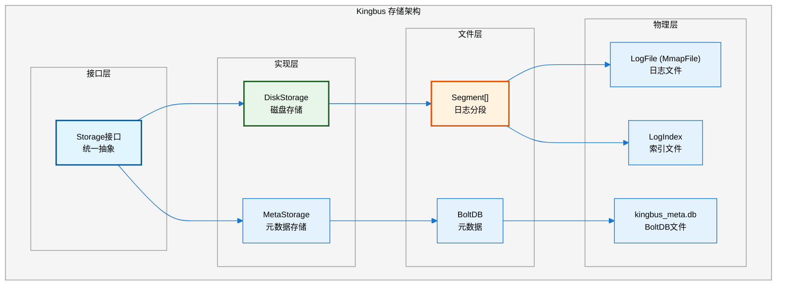

### 1.2 关于S3存储的说明

**重要说明：Kingbus 当前版本（源码分析结果）并未实现 S3 存储。**

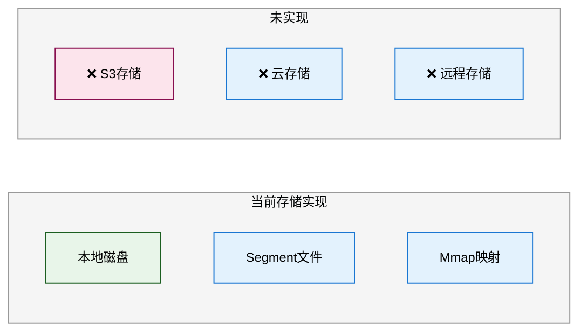

如果文档中提到 S3，可能是指：
1. 未来规划的功能
2. 用户自行扩展的方向
3. 其他分支或 fork 的实现

本文档后续会提供 S3 扩展的设计方案。

## 2. Segment 管理详解

### 2.1 Segment 结构

```go
// storage/segment.go
type Segment struct {
    Mu         sync.RWMutex
    FirstIndex uint64        // 第一个Raft索引
    LastIndex  uint64        // 最后一个Raft索引
    
    LogFile  *MmapFile      // 日志文件 (1GB mmap)
    LogIndex *Index         // 索引文件
    Status   SegmentStatus  // 状态: ReadOnly/RDWR/Closed
}
```

### 2.2 Segment 文件命名规则

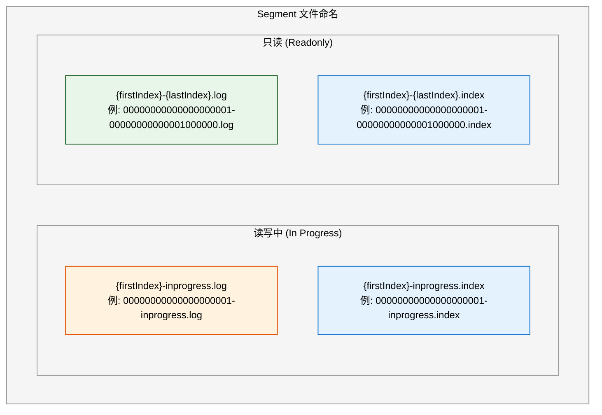

**命名规则代码**：

```go
const (
    ReadonlySegmentPattern  = "%020d-%020d.log"       // 只读Segment
    ReadonlyIndexPattern    = "%020d-%020d.index"     // 只读索引
    ReadWriteSegmentPattern = "%020d-inprogress.log"  // 读写Segment
    ReadWriteIndexPattern   = "%020d-inprogress.index"// 读写索引
)
```

### 2.3 Segment 生命周期

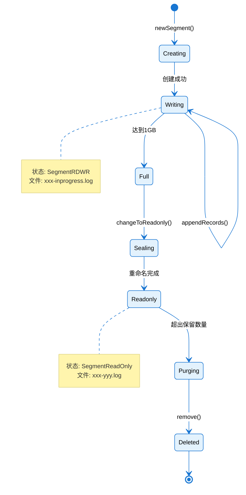

### 2.4 Segment 创建与写入

#### 2.4.1 创建新 Segment

```go
// storage/segment.go
func newSegment(dir string, name string) *Segment {
    s := new(Segment)
    
    s.FirstIndex = 0
    s.LastIndex = 0
    s.LogFile = newMmapFile(dir, name, SegmentSize)  // 1GB mmap
    
    indexFileName := utils.GetIndexName(name)
    s.LogIndex = newIndex(dir, indexFileName)
    s.Status = SegmentRDWR
    return s
}
```

#### 2.4.2 Mmap 文件创建

```go
// storage/mmap_file.go
func newMmapFile(dir string, name string, fileSize int64) *MmapFile {
    f := new(MmapFile)
    
    // 1. 创建文件
    f.file, _ = os.OpenFile(filePath, os.O_RDWR|os.O_CREATE|os.O_EXCL, FileMode)
    
    // 2. 预分配空间 (1GB)
    fileutil.Preallocate(f.file, fileSize, true)
    
    // 3. 创建 mmap 映射
    f.mappedData, _ = syscall.Mmap(
        int(f.file.Fd()), 
        0, 
        int(fileSize),
        syscall.PROT_READ|syscall.PROT_WRITE,
        syscall.MAP_SHARED|syscall.MAP_NORESERVE,
    )
    
    return f
}
```

#### 2.4.3 写入流程

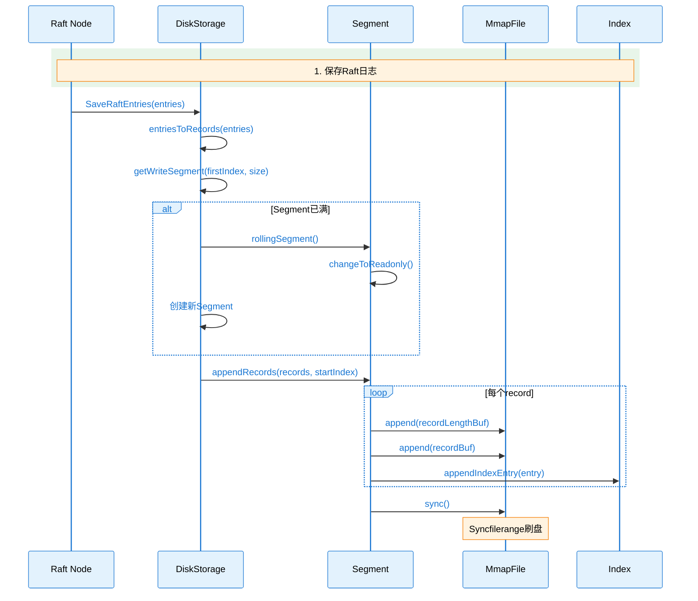

**写入代码详解**：

```go
// storage/segment.go
func (s *Segment) appendRecords(records []*storagepb.Record, startIndex uint64) error {
    s.Mu.Lock()
    defer s.Mu.Unlock()
    
    // 检查连续性
    if s.LastIndex != 0 && s.LastIndex+1 != startIndex {
        return ErrNotContinuous
    }
    
    // 逐个写入record
    for i := 0; i < len(records); i++ {
        err = s.appendRecord(records[i], startIndex+uint64(i))
        if err != nil {
            return err
        }
    }
    
    // 同步到磁盘
    err = s.LogFile.sync()
    if err != nil {
        return err
    }
    
    // 更新索引范围
    if s.FirstIndex == 0 {
        s.FirstIndex = startIndex
    }
    s.LastIndex = startIndex + uint64(len(records)-1)
    
    return nil
}

func (s *Segment) appendRecord(record *storagepb.Record, raftIndex uint64) error {
    recordBuf, _ := record.Marshal()
    
    // 写入记录长度 (4字节)
    recordLengthBuf := make([]byte, RecordLengthSize)
    binary.LittleEndian.PutUint32(recordLengthBuf, uint32(record.Size()))
    startPos, _ := s.LogFile.append(recordLengthBuf)
    
    // 写入记录内容
    s.LogFile.append(recordBuf)
    
    // 写入索引条目
    indexEntry := &IndexEntry{
        RaftIndex:    raftIndex,
        FilePosition: uint32(startPos),
    }
    return s.LogIndex.appendIndexEntry(indexEntry)
}
```

### 2.5 Segment 滚动 (Rolling)

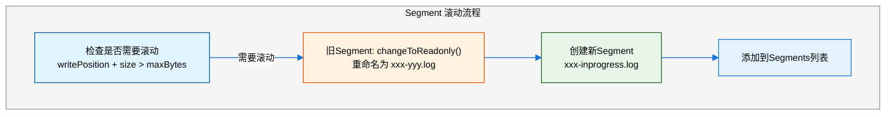

**滚动触发条件**：

```go
// storage/segment.go
func (s *Segment) needRolling(size int) bool {
    s.Mu.RLock()
    defer s.Mu.RUnlock()
    return s.LogFile.writePosition+size > s.LogFile.maxBytes  // maxBytes = 1GB
}

// storage/disk_storage.go
func (s *DiskStorage) rollingSegment(prevLastSegment *Segment, firstIndex uint64) (*Segment, error) {
    // 1. 将旧Segment变为只读
    if prevLastSegment != nil {
        prevLastSegment.changeToReadonly()
    }
    
    // 2. 创建新Segment
    newSegmentName := fmt.Sprintf(ReadWriteSegmentPattern, firstIndex)
    segment := newSegment(s.Dir, newSegmentName)
    
    return segment, nil
}
```

## 3. 日志清理 (Purge) 机制

### 3.1 清理策略

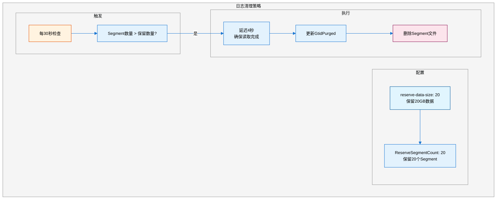

### 3.2 清理流程代码

```go
// storage/disk_storage.go
func (s *DiskStorage) StartPurgeLog() {
    s.purgeStarted.Store(true)
    timer := time.NewTimer(time.Second * 30)  // 每30秒检查
    
    var deleteSegments []*Segment
    for {
        select {
        case <-s.purgeCtx.Done():
            return
        case <-timer.C:
            s.Mu.Lock()
            // 检查是否超出保留数量
            if s.ReserveSegmentCount < len(s.Segments) {
                deleteCount := len(s.Segments) - s.ReserveSegmentCount
                deleteSegments = s.Segments[:deleteCount]
                s.Segments = s.Segments[deleteCount:]
            }
            s.Mu.Unlock()
            
            if len(deleteSegments) > 0 {
                s.purgeSegments(deleteSegments, true)  // delay=true
            }
        }
    }
}

func (s *DiskStorage) purgeSegments(segments []*Segment, delay bool) error {
    if delay {
        <-time.After(time.Second * 4)  // 延迟4秒
    }
    
    // 更新元数据
    firstIndex, _ := s.FirstIndex()
    s.MetaStorage.UpdatePugedGtidset(firstIndex)
    
    // 删除文件
    for i := 0; i < len(segments); i++ {
        segments[i].remove()
    }
    
    return nil
}
```

### 3.3 清理与 GTID 的关联

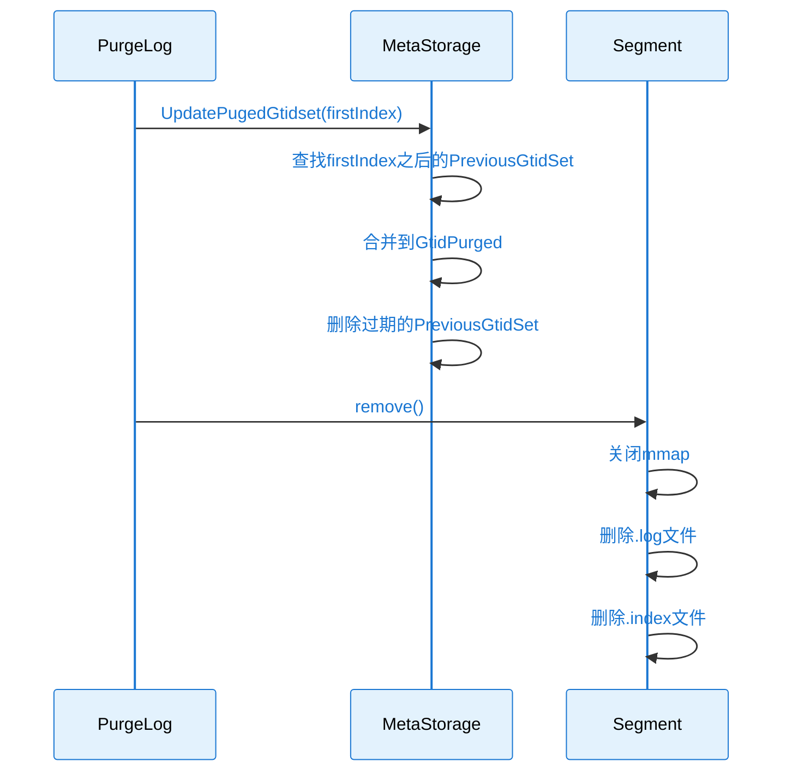

## 4. 读取与索引

### 4.1 索引结构

```go
// storage/index.go
type IndexEntry struct {
    RaftIndex    uint64  // Raft日志索引
    FilePosition uint32  // 在Segment文件中的位置
}

const IndexEntrySize = 12  // 8 + 4 字节

type Index struct {
    readonly  *MmapFile  // 只读索引: mmap方式
    readWrite *RWFile    // 读写索引: 内存数组 + 缓冲写入
}
```

### 4.2 读取流程

```mermaid
%%{init: {'theme': 'base', 'themeVariables': { 'fontSize': '12px', 'fontFamily': 'Arial', 'primaryColor': '#e3f2fd', 'primaryTextColor': '#000000', 'primaryBorderColor': '#1976d2', 'lineColor': '#1976d2', 'background': '#ffffff', 'clusterBkg': '#f5f5f5', 'clusterBorder': '#999999', 'edgeLabelBackground': '#ffffff'}}}%%
graph TB
    subgraph "Raft Entry 读取流程"
        
        A["Entries(lo, hi, maxSize)"]
        B["checkRaftIndex(lo, hi)<br/>检查范围有效性"]
        C["getReadSegments(lo, hi)<br/>找到覆盖的Segment"]
        D["readSegments()<br/>从Segment读取"]
        E["Index.getRaftEntryPosition()<br/>O(1)定位"]
        F["MmapFile.readRaftEntry()<br/>读取数据"]
        G["cutRaftEntries(maxSize)<br/>按大小截断"]
    end
    
    A --> B
    B --> C
    C --> D
    D --> E
    E --> F
    F --> G

    style A fill:#e1f5fe,stroke:#01579b
    style E fill:#e8f5e9,stroke:#1b5e20
    style F fill:#fff3e0,stroke:#e65100
```

**索引定位 O(1)**：

```go
// storage/index.go
func (d *Index) getRaftEntryPosition(i uint64, firstIndex uint64, status SegmentStatus) (int, error) {
    if i < firstIndex {
        return 0, ErrOutOfBound
    }
    
    // O(1) 计算位置
    position := int(i-firstIndex) * IndexEntrySize
    
    if status == SegmentReadOnly {
        // 从mmap中读取
        indexEntry = d.readonly.readIndexEntry(position)
    } else {
        // 从内存数组读取
        indexEntry = d.readWrite.entries[int(i-firstIndex)]
    }
    
    return int(indexEntry.FilePosition), nil
}
```

## 5. 并发控制

### 5.1 锁机制

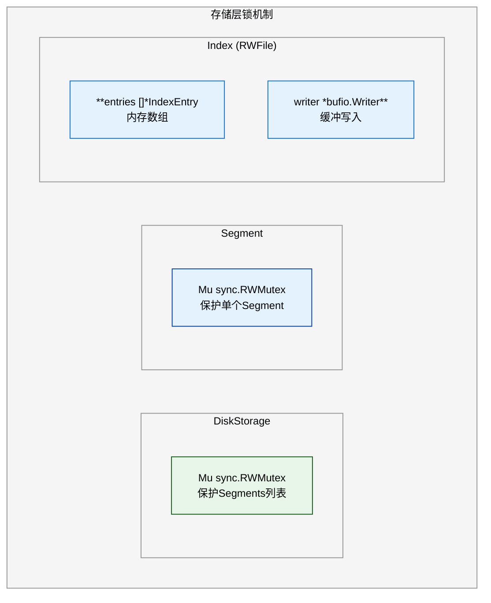

### 5.2 并发安全保证

| 操作 | 锁类型 | 说明 |
|-----|-------|------|
| **读取Entries** | RLock(DiskStorage) + RLock(Segment) | 允许并发读 |
| **写入Entries** | Lock(Segment) | 串行写入同一Segment |
| **滚动Segment** | Lock(DiskStorage) | 修改Segments列表 |
| **清理Segment** | Lock(DiskStorage) | 从列表移除 |

```go
// 读取 - 使用读锁
func (s *DiskStorage) Entries(lo, hi, maxSize uint64) ([]raftpb.Entry, error) {
    s.Mu.RLock()  // 读锁保护Segments列表
    // ...查找Segment
    s.Mu.RUnlock()
    
    // 读取每个Segment时使用Segment的读锁
    for _, seg := range segments {
        seg.Mu.RLock()
        // 读取entries
        seg.Mu.RUnlock()
    }
}

// 写入 - 使用写锁
func (s *Segment) appendRecords(records []*storagepb.Record, startIndex uint64) error {
    s.Mu.Lock()  // 写锁保护
    defer s.Mu.Unlock()
    // ...写入
}
```

## 6. S3 存储扩展设计

虽然当前 Kingbus 未实现 S3 存储，以下是一个可行的扩展设计方案。

### 6.1 设计目标

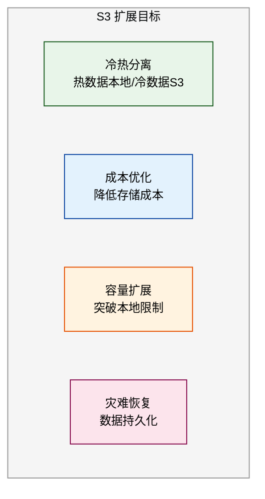

### 6.2 架构设计

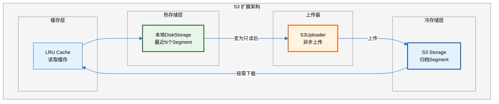

### 6.3 核心组件设计

#### 6.3.1 S3Uploader

```go
// 新增: storage/s3_uploader.go
type S3Uploader struct {
    client     *s3.Client
    bucket     string
    prefix     string
    
    uploadQueue chan *UploadTask
    workers     int
    
    // 分段上传配置
    partSize   int64  // 5MB
    concurrent int    // 并发分段数
}

type UploadTask struct {
    Segment    *Segment
    LocalPath  string
    S3Key      string
    RetryCount int
}

// 创建上传器
func NewS3Uploader(cfg *S3Config) *S3Uploader {
    u := &S3Uploader{
        client:     s3.NewFromConfig(cfg.AWSConfig),
        bucket:     cfg.Bucket,
        prefix:     cfg.Prefix,
        uploadQueue: make(chan *UploadTask, 100),
        workers:    cfg.Workers,
        partSize:   5 * 1024 * 1024,  // 5MB
        concurrent: 4,
    }
    
    // 启动工作协程
    for i := 0; i < u.workers; i++ {
        go u.worker()
    }
    
    return u
}
```

#### 6.3.2 分段上传逻辑

```go
// 分段上传实现
func (u *S3Uploader) uploadMultipart(task *UploadTask) error {
    file, _ := os.Open(task.LocalPath)
    defer file.Close()
    
    fileInfo, _ := file.Stat()
    fileSize := fileInfo.Size()
    
    // 1. 创建分段上传
    createResp, _ := u.client.CreateMultipartUpload(ctx, &s3.CreateMultipartUploadInput{
        Bucket: aws.String(u.bucket),
        Key:    aws.String(task.S3Key),
    })
    uploadId := createResp.UploadId
    
    // 2. 并发上传分段
    var wg sync.WaitGroup
    partsCh := make(chan *s3.CompletedPart, 100)
    sem := make(chan struct{}, u.concurrent)  // 并发控制
    
    partNumber := int32(1)
    for offset := int64(0); offset < fileSize; offset += u.partSize {
        wg.Add(1)
        sem <- struct{}{}
        
        go func(pn int32, off int64) {
            defer wg.Done()
            defer func() { <-sem }()
            
            size := min(u.partSize, fileSize-off)
            buffer := make([]byte, size)
            file.ReadAt(buffer, off)
            
            resp, _ := u.client.UploadPart(ctx, &s3.UploadPartInput{
                Bucket:     aws.String(u.bucket),
                Key:        aws.String(task.S3Key),
                UploadId:   uploadId,
                PartNumber: aws.Int32(pn),
                Body:       bytes.NewReader(buffer),
            })
            
            partsCh <- &s3.CompletedPart{
                ETag:       resp.ETag,
                PartNumber: aws.Int32(pn),
            }
        }(partNumber, offset)
        
        partNumber++
    }
    
    go func() {
        wg.Wait()
        close(partsCh)
    }()
    
    // 3. 收集分段结果
    var completedParts []s3.CompletedPart
    for part := range partsCh {
        completedParts = append(completedParts, *part)
    }
    
    // 按PartNumber排序
    sort.Slice(completedParts, func(i, j int) bool {
        return *completedParts[i].PartNumber < *completedParts[j].PartNumber
    })
    
    // 4. 完成上传
    _, err := u.client.CompleteMultipartUpload(ctx, &s3.CompleteMultipartUploadInput{
        Bucket:          aws.String(u.bucket),
        Key:             aws.String(task.S3Key),
        UploadId:        uploadId,
        MultipartUpload: &s3.CompletedMultipartUpload{Parts: completedParts},
    })
    
    return err
}
```

### 6.4 上传触发时机

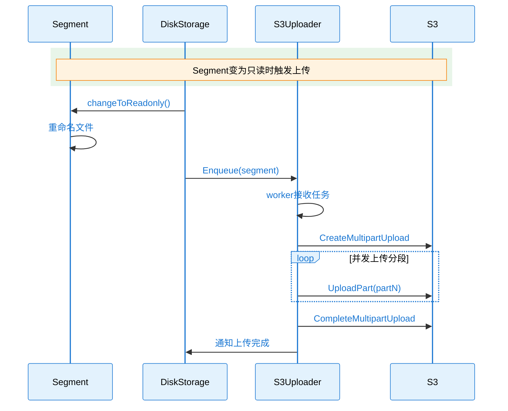

### 6.5 读取时的缓存策略

```go
// 新增: storage/s3_cache.go
type S3Cache struct {
    lru       *lru.Cache
    maxSize   int64
    s3Client  *S3Uploader
    localDir  string
}

// 获取Segment (带缓存)
func (c *S3Cache) GetSegment(segmentKey string) (*Segment, error) {
    // 1. 检查缓存
    if seg, ok := c.lru.Get(segmentKey); ok {
        return seg.(*Segment), nil
    }
    
    // 2. 从S3下载
    localPath := filepath.Join(c.localDir, segmentKey)
    err := c.s3Client.Download(segmentKey, localPath)
    if err != nil {
        return nil, err
    }
    
    // 3. 打开Segment
    seg := openSegment(c.localDir, segmentKey, SegmentReadOnly, false)
    
    // 4. 加入缓存
    c.lru.Add(segmentKey, seg)
    
    return seg, nil
}
```

### 6.6 配置示例

```yaml
# kingbus.yaml S3扩展配置
s3:
  enabled: true
  bucket: "kingbus-binlog"
  region: "us-east-1"
  prefix: "cluster-1/"
  
  # 上传配置
  upload:
    workers: 4            # 上传工作协程数
    part_size: 5MB        # 分段大小
    concurrent_parts: 4   # 并发分段数
    retry_count: 3        # 重试次数
    
  # 缓存配置
  cache:
    enabled: true
    max_size: 10GB        # 本地缓存大小
    cache_dir: /tmp/kingbus-cache
    
  # 生命周期
  lifecycle:
    upload_delay: 1h      # 变为只读后等待上传时间
    delete_after_upload: true  # 上传后删除本地
```

## 7. 总结

### 7.1 当前存储特性

| 特性 | 说明 |
|-----|------|
| **存储方式** | 本地磁盘 Segment 文件 |
| **文件格式** | 1GB mmap 文件 + 索引文件 |
| **并发控制** | 读写锁保护 |
| **清理策略** | 基于保留数量，定时清理 |
| **S3支持** | 当前未实现 |

### 7.2 Segment 管理要点

1. **创建**: 首次写入或滚动时创建新 Segment
2. **写入**: 追加写入 + mmap同步
3. **滚动**: 达到1GB时滚动，旧Segment变只读
4. **清理**: 超出保留数量时删除最旧Segment
5. **读取**: O(1)索引定位 + mmap读取

### 7.3 S3 扩展建议

如需实现 S3 存储：
1. 实现异步上传器，Segment变只读后触发
2. 使用分段上传提高大文件上传效率
3. 实现本地 LRU 缓存减少 S3 读取
4. 考虑压缩 Segment 减少存储成本

